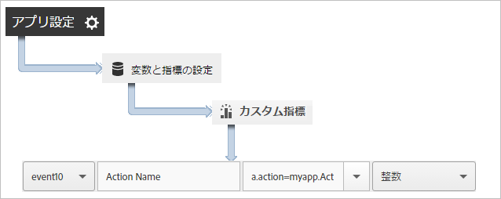
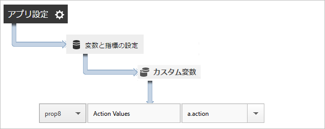
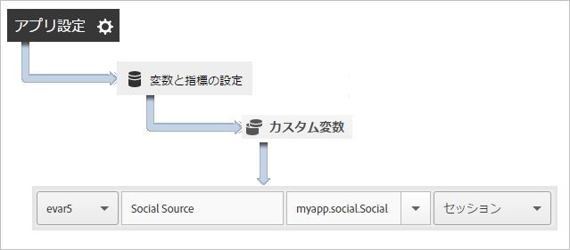

# アプリのアクションの追跡 {#track-app-actions}

アクションは、測定する Android アプリ内で発生するイベントです。

各アクションは、イベントが発生するたびに増分される、1 つ以上の対応する指標を持ちます。例えば、新規サブスクリプションごとに、記事が表示されるたびに、レベルが完了するたびに、`trackAction` 呼び出しを送信します。アクションは自動的には追跡されないので、追跡するイベントが発生したときに `trackAction` を呼び出し、アクションをカスタムイベントにマップする必要があります。

## Tracking actions {#section_380DF56C4EE4432A823940E4AE4C9E91}

1. ライブラリをプロジェクトに追加し、ライフサイクルを実装します。

   詳しくは、コア実装および *ライフサイクル* で [、"SDKおよび設定ファイルのIntelliJ IDEAまたはEclipseプロジェクトへの追加」を参照](/help/android/getting-started/dev-qs.md)してください。

1. ライブラリをインポートします。

   ```java
   import com.adobe.mobile.*;
   ```

1. 追跡するアクションがアプリで発生したら、`trackAction` を呼び出して、このアクションのヒットを送信します。

   ```java
   Analytics.trackAction("myapp.ActionName", null);
   ```

1. In the Adobe Mobile Services UI, select your app and click **[!UICONTROL Manage App Settings]**.
1. 「**[!UICONTROL 変数と指標の設定]**」をクリックし、「**カスタム指標[!UICONTROL 」タブをクリックします。]**

1. コードに定義されているコンテキストデータ名（例えば、`myapp.ActionName`）をカスタムイベントにマップします。

   

You can also set a prop to hold all action values by mapping a custom prop with a name like **[!UICONTROL Custom Actions]** and setting the value to `a.action`.



## Sending additional data {#section_3EBE813E54A24F6FB669B2478B5661F9}

アクション名に加え、各 trackAction コールとともに追加のコンテキストデータを送信できます。

```java
HashMap<String, Object> exampleContextData = new HashMap<String, Object>(); 
exampleContextData.put("myapp.social.SocialSource", "Twitter"); 
Analytics.trackAction("myapp.SocialShare", exampleContextData);
```

コンテキストデータ値は、Adobe Mobile Services のカスタム変数にマッピングする必要があります。



## Action reporting {#section_0F6A54AB7A3F42C9BB042D86A0FC4630}

| インターフェイス | レポート |
|--- |--- |
| Adobe Mobile Services | ****&#x200B;アクションパスレポート.  アプリでアクションが発生する順序を表示します。任意のレポートで「**[!UICONTROL カスタマイズ]」をクリックすると、ランク付け、トレンド表示または分類レポートでアクションを表示したり、フィルターを適用して特定のセグメントのアクションを表示したりできます。** |
| Marketing reports &amp; analytics | **[!UICONTROL カスタムイベント]**&#x200B;レポート。アクションがカスタムイベントにマップされた後、他のすべての Analytics イベントと同様にモバイルイベントを表示できます。 |
| ad hoc analysis | **[!UICONTROL カスタムイベント]**&#x200B;レポート。アクションがカスタムイベントにマップされた後、他のすべての Analytics イベントと同様にモバイルイベントを表示できます。 |

