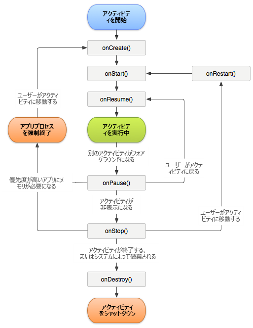

# アプリのクラッシュの追跡 {#track-app-crashes}

この情報は、クラッシュの追跡方法と、誤ったクラッシュを処理するためのベストプラクティスを理解する場合に役立ちます。

>[!TIP]
>
>アプリのクラッシュは、ライフサイクル指標の一部として追跡されます。クラッシュを追跡する前に、プロジェクトにライブラリを追加し、ライフサイクルを実装します。詳しくは、[コア実装とライフサイクル](/help/android/getting-started/dev-qs.md)の「*IntelliJ IDEA または Eclipse プロジェクトへの SDK と設定ファイルの追加*」を参照してください。

ライフサイクル指標を実装すると、各アクティビティの `Config.collectLifecycleData` メソッドで `OnResume` が呼び出されます。`onPause` メソッドでは、`Config.pauseCollectingLifeCycleData` が呼び出されます。

`pauseCollectingLifeCycleData` の内部では、正常終了を示すフラグが設定されます。アプリが再起動または再開されると、`collectLifecycleData` がこのフラグをチェックします。アプリがフラグステータスのとおり正常に終了しなかった場合は、次の呼び出しで `a.CrashEvent` コンテキストデータが送信され、クラッシュイベントがレポートされます。

正確なクラッシュレポートが生成されるようにするには、各アクティビティの `pauseCollectingLifeCycleData` メソッド内で `onPause` を呼び出す必要があります。次の Android アクティビティのライフサイクル図を参照してください。この呼び出しが重要である理由がわかります。



Android アクティビティのライフサイクルについて詳しくは、「[アクティビティ](https://developer.android.com/guide/components/activities.html)」を参照してください。

*この Android のライフサイクルの図は、[Android Open Source Project](https://source.android.com/)によって作成および共有され、[Creative Commons 2.5 Attribution License](https://creativecommons.org/licenses/by/2.5/)の条項に従って使用されています。*

## 誤ったクラッシュがレポートされる原因

1. Android Studio などの IDE を使用してデバッグしている場合、アプリがフォアグラウンドにあるときに IDE からアプリを再度起動するとクラッシュが発生します。

   >[!TIP]
   >
   >このクラッシュを回避するには、IDE から再度起動する前にアプリをバックグラウンドに移行します。

1. アプリの最後のフォアグラウンドアクティビティがバックグラウンドに移行され、 で `onPause` で `Config.pauseCollectingLifecycleData();` が呼び出されず、アプリを手動で終了するかまたはアプリが OS によって強制終了された場合、次回の起動時にクラッシュが発生します。

## フラグメントの処理方法

フラグメントには、アクティビティと同様のアプリケーションライフサイクルイベントがあります。ただし、フラグメントをアクティブにするには、アクティビティに添付する必要があります。

>[!IMPORTANT]
>
>収容アクティビティがコードを実行できるライフサイクルイベントを利用する必要があります。これはフラグメントの親ビューで処理されます。

## （オプション）アクティビティライフサイクルコールバックの実装

API レベル 14 以降、Android では、アクティビティに対するグローバルライフサイクルコールバックが許可されます。詳しくは、「[アプリケーション](https://developer.android.com/reference/android/app/Application)」を参照してください。

これらのコールバックを使用して、すべてのアクティビティで `collectLifecycleData()` および `pauseCollectingLifecycleData()` が正しく呼び出されるようにすることができます。このコードは、メインのアクティビティと、アプリを起動する他のアクティビティにのみ追加する必要があります。

```js
import com.adobe.mobile.Config; 
  
public class MainActivity extends Activity { 
... 
    @Override 
    protected void onCreate(Bundle savedInstanceState) { 
        super.onCreate(savedInstanceState); 
        setContentView(R.layout.activity_main); 
  
        getApplication().registerActivityLifecycleCallbacks(new Application.ActivityLifecycleCallbacks() { 
            @Override 
            public void onActivityResumed(Activity activity) { 
                Config.setContext(activity.getApplicationContext()); 
                Config.collectLifecycleData(activity); 
            } 
  
            @Override 
            public void onActivityPaused(Activity activity) {     
                Config.pauseCollectingLifecycleData(); 
            } 
    
            // the following methods aren't needed for our lifecycle purposes, but are required to be implemented 
            // by the ActivityLifecycleCallbacks object 
            @Override 
            public void onActivityCreated(Activity activity, Bundle savedInstanceState) {} 
            @Override 
            public void onActivityStarted(Activity activity) {} 
            @Override 
            public void onActivityStopped(Activity activity) {} 
            @Override 
            public void onActivitySaveInstanceState(Activity activity, Bundle outState) {} 
            @Override 
            public void onActivityDestroyed(Activity activity) {} 
        }); 
    } 
... 
}
```

`Config.collectLifecycleData(Activity activity`、`Map<String`、`Object> contextData)` を使用してライフサイクル呼び出しで追加のコンテキストデータを送信するには、そのアクティビティの `onResume` メソッドをオーバーライドし、`collectLifecycleData` を手動で呼び出した後で `super.onResume()` を呼び出す必要があります。

```js
@Override 
protected void onResume() { 
    HashMap<String, Object> cdata = new HashMap<>(); 
    cdata.put("someKey", "someValue"); 
    Config.collectLifecycleData(this, cdata); 
  
    super.onResume(); 
}
```

