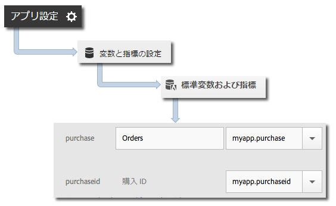

# products 変数 {#products-variable}

products 変数は、処理ルールを使用して設定することはできません。Mobile SDK では、コンテキストデータパラメーターで特殊な構文を使用して、サーバーコールで製品を設定する必要があります。

*product* 変数を設定するには、コンテキストデータキーを `"&&products"` に設定し、*products* 変数用に定義された構文を使用して値を設定します。

```java
cdata.put("&&products", "Category;Product;Quantity;Price[,Category;Product;Quantity;Price]");
```

以下に例を示します。

```java
//create a context data dictionary 
HashMap cdata = new HashMap<String, Object>(); 
 
// add products, a purchase id, a purchase context data key, and any other data you want to collect. 
// Note the special syntax for products 
cdata.put("&&products", ";Running Shoes;1;69.95,;Running Socks;10;29.99"); 
cdata.put("myapp.purchase", "1"); 
cdata.put("myapp.purchaseid", "1234567890"); 
 
// send the tracking call - use either a trackAction or TrackState call. 
// trackAction example: 
Analytics.trackAction("purchase", cdata); 
// trackState example: 
Analytics.trackState("Order Confirmation", cdata);
```

*products* 変数はイメージリクエストで設定されています。また、他の変数はコンテキストデータとして設定されています。すべてのコンテキストデータ変数は、処理ルールを使用してマッピングする必要があります。



処理ルールを使用して&#x200B;*products* 変数をマッピングする必要はありません。この変数が SDK によってイメージリクエストで直接設定されるからです。
