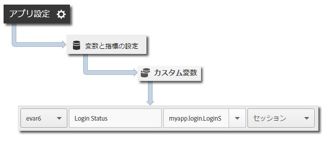

# アプリの状態の追跡 {#track-app-states}

状態とは、アプリケーションの様々な画面またはビューのことです。

アプリケーションで新しい状態が表示されるたびに（例えば、ユーザーがホームページからニュースフィードに移動する場合）、`trackState` 呼び出しが送信されます。Android では通常、`trackState` は、新しいアクティビティが読み込まれるたびに呼び出されます。

## 状態の追跡 {#section_380DF56C4EE4432A823940E4AE4C9E91}

1. ライブラリをプロジェクトに追加し、ライフサイクルを実装します。

   詳しくは、[コア実装とライフサイクル](/help/android/getting-started/dev-qs.md)の「*IntelliJ IDEA または Eclipse プロジェクトへの SDK と設定ファイルの追加*」を参照してください。

1. ライブラリをインポートします。

   ```java
   import com.adobe.mobile.*;
   ```

1. `onCreate` 関数で、`trackState` を呼び出して、この状態ビューのヒットを送信します。

   ```java
   @Override 
   public void onCreate(Bundle savedInstanceState) { 
       super.onCreate(savedInstanceState); 
       setContentView(R.layout.main); 
   
       // Adobe - track when this state loads 
       Analytics.trackState("State Name", null); 
   }
   ```

「`"State Name"`」は、Adobe Mobile Services の `View State` 変数でレポートされます。また、ビューは、`trackState` 呼び出しごとに記録されます。その他の Analytics インターフェイスでは、`View State` は `Page Name` としてレポートされ、`state views` は `page views` としてレポートされます。

## 追加データの送信 {#section_CFDB4F944496401786A145C209AB387C}

`"State Name"` に加えて、各アクション追跡呼び出しを使用して追加のコンテキストデータを送信することができます。

```java
@Override 
public void onCreate(Bundle savedInstanceState) { 
    super.onCreate(savedInstanceState); 
    setContentView(R.layout.main); 
  
    // Adobe - track when this state loads 
    HashMap<String, Object> exampleContextData = new HashMap<String, Object>(); 
    exampleContextData.put("myapp.login.LoginStatus", "logged in"); 
    Analytics.trackState("Home Screen", exampleContextData); 
}
```

コンテキストデータ値は、Adobe Mobile Services のカスタム変数にマッピングする必要があります。



## アプリの状態のレポート {#section_0F6A54AB7A3F42C9BB042D86A0FC4630}

状態を確認するには、通常、パスレポートを使用します。このレポートでは、ユーザーがアプリ内をどのように移動したかや、最も頻繁に表示されたのはどの状態であるかがわかります。

|  |  |
|--- |--- |
| Adobe Mobile Services | **[!UICONTROL 画面遷移]**&#x200B;レポート。このレポートは、ユーザーがアプリケーション内でたどったパスに基づきます。パスの例：**[!UICONTROL ホーム]**／**[!UICONTROL 設定]**／**[!UICONTROL フィード]**。 |
| Adobe Analytics | 状態は、**[!UICONTROL ページ]**&#x200B;レポート、**[!UICONTROL ページビュー数]**&#x200B;レポート、**[!UICONTROL パス]**&#x200B;レポートなど、ページを確認できる場所であればどこでも確認できます。 |
| ad hoc analysis | 状態は、**[!UICONTROL ページ]**&#x200B;ディメンション、**[!UICONTROL ページビュー数]**&#x200B;指標、**[!UICONTROL パス]**&#x200B;レポートを使用してページを確認できる場所であればどこでも確認できます。 |


