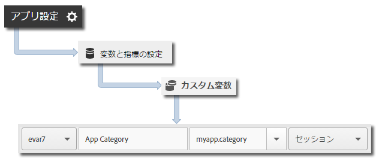

# コア実装とライフサイクル{#core-implementation-and-lifecycle}

この情報は、Android ライブラリを実装し、ライフサイクル指標（起動、アップグレード、セッション、アクションを実行したユーザーなど）を収集する場合に役立ちます。

## SDK のダウンロード {#section_99FE1A17A36D4A2C943939023CF6265C}

>[!IMPORTANT]
>
>SDK をダウンロードするには、Android 2.2 以降を使用する必要があります。

1. 以下の節に示す手順を実行して、開発レポートスイートを設定し、事前に構成された設定ファイルをダウンロードします。

   * [レポートスイートの作成](/help/android/getting-started/requirements.md)
   * [SDK のダウンロード](/help/android/getting-started/requirements.md)

1. `[Your_App_Name_]AdobeMobileLibrary-4.*-Android.zip` ファイルをダウンロードして展開し、次のソフトウェアコンポーネントが存在することを確認します。

   * `adobeMobileLibrary.jar`：Android デバイスおよびシミュレーターで使用されるライブラリ。

   * `ADBMobileConfig.json`：アプリ用にカスタマイズされた SDK 設定ファイル。
   >[!IMPORTANT]
   >
   >SDK を Adobe Mobile Services UI 以外でダウンロードした場合は、`ADBMobileConfig.json` ファイルを手動で設定する必要があります。Analytics と Mobile SDK を使い始めたばかりのユーザーが開発レポートスイートを設定して、事前に構成された設定ファイルをダウンロードする場合は、「[事前準備](/help/android/getting-started/requirements.md)」を参照してください。

## IntelliJ IDEA または Eclipse プロジェクトへの SDK と設定ファイルの追加 {#section_B89510FBB4C646AEA73A185B966E54D3}

**IntelliJ IDEA プロジェクト**

SDK と設定ファイルをプロジェクトに追加するには、以下のようにします。

1. `ADBMobileConfig.json` ファイルをプロジェクトの `assets` フォルダーに追加します。

1. プロジェクトナビゲーションパネルで、プロジェクトを右クリックします。
1. **[!UICONTROL モジュール設定を開く]**&#x200B;を選択します。
1. **[!UICONTROL プロジェクト設定]**&#x200B;で、**[!UICONTROL ライブラリ]**&#x200B;を選択します。
1. **[!UICONTROL +]**&#x200B;アイコンをクリックし、新しいライブラリを追加します。
1. **[!UICONTROL Java]**&#x200B;を選択し、`adobeMobileLibrary.jar` ファイルに移動します。
1. モバイルライブラリを使用する予定のモジュールを選択します。
1. **[!UICONTROL 適用]**&#x200B;をクリックしてから&#x200B;**[!UICONTROL OK]**&#x200B;をクリックして、モジュール設定ウィンドウを閉じます。

**Eclipse プロジェクト**

SDK と設定ファイルをプロジェクトに追加するには、以下のようにします。

1. `ADBMobileConfig.json` ファイルをプロジェクトの `assets` フォルダーに追加します。
1. **[!UICONTROL Eclipse IDE]** で、プロジェクト名を右クリックします。
1. **[!UICONTROL Build Path（ビルドパス）]**／**[!UICONTROL Add External Archives（外部アーカイブの追加）]**&#x200B;をクリックします。
1. `adobeMobileLibrary.jar` を選択します。
1. **[!UICONTROL Open（開く）]**&#x200B;をクリックします。
1. プロジェクトを再度右クリックし、**[!UICONTROL Build Path（ビルドパス）]**／**[!UICONTROL Configure Build Path（ビルドパスを設定）]**&#x200B;を選択します。
1. **[!UICONTROL Order and Export（並べ替えとエクスポート）]**&#x200B;タブで、**`adobeMobileLibrary.jar`** が選択されていることを確認します。

## アプリの権限の追加 {#section_2EAF73ABF6424647B219A63B33B02CD5}

AppMeasurement ライブラリでは、データの送信とオフラインのトラッキングコールの記録のために、次の権限が必要です。

* `INTERNET`
* `ACCESS_NETWORK_STATE`

これらの権限を追加するには、アプリケーションのプロジェクトディレクトリにある `AndroidManifest.xml` ファイルに以下の行を追加します。

```java
<uses-permission android:name="android.permission.INTERNET" /> 
<uses-permission android:name="android.permission.ACCESS_NETWORK_STATE" />
```

## アプリケーションコンテキストの設定 {#set-application-context}

メインアクティビティの `onCreate` メソッドで、次のコードを追加する必要があります。

```java
   @Override
   public void onCreate(BundlesavedInstanceState){
     super.onCreate(savedInstanceState)
     setContentView(R.layout.main);
     Config.setContext(this.getApplicationContext());
   }
````

## ライフサイクル指標の実装 {#section_BA686C09021F474AADDE8690BBB910F7}

ライフサイクルを有効にすると、アプリが起動されるたびに、1 件のヒットが送信されて、起動、アップグレード、セッション、アクションを実行したユーザー、その他の多くの指標が測定されます。詳しくは、「[ライフサイクル指標](/help/android/metrics.md)」を参照してください。

**アプリケーションの各アクティビティで次の手順を実行します。**

1. ライブラリをインポートします。

   ```java
   import com.adobe.mobile.*;
   ```

1. `onResume` 関数で、ライフサイクルデータの収集を開始します。

   ```java
   @Override 
   public void onResume() { 
       Config.collectLifecycleData(this); 
       // -or- Config.collectLifecycleData(this, contextData); 
   }
   ```

1. `onPause` 関数で、ライフサイクルデータの収集を一時停止します。

   ```java
   @Override 
   public void onPause() { 
       Config.pauseCollectingLifecycleData(); 
   }
   ```

>[!IMPORTANT]
>
>正確なクラッシュレポートが生成されるようにするには、これらの呼び出しをすべてのアクティビティに追加する必要があります。詳しくは、「[アプリのクラッシュの追跡](/help/android/analytics-main/crashes.md)」を参照してください。

## ライフサイクル呼び出しで追加のデータを含める

追加のデータをライフサイクル指標呼び出しで含めるには、コンテキストデータを含む追加のパラメーターを `collectLifecycleData` に渡します。

```java
@Override 
public void onResume() {
    HashMap<String, Object> contextData = new HashMap<String, Object>(); 
    contextData.put("myapp.category", "Game"); 
    Config.collectLifecycleData(this, contextData); 
}
```

`collectLifecycleData` で送信される追加のコンテキストデータ値は、Adobe Mobile Services のカスタム変数にマッピングする必要があります。



その他のライフサイクル指標は自動的に収集されます。詳しくは、「[ライフサイクル指標](/help/android/metrics.md)」を参照してください。

## 次の作業 {#section_BF709684E1DD40EA9169BC1D0D4B37C2}

次のタスクを実行します。

* [アプリの状態の追跡](/help/android/analytics-main/states.md)
* [アプリのアクションの追跡](/help/android/analytics-main/actions.md)

