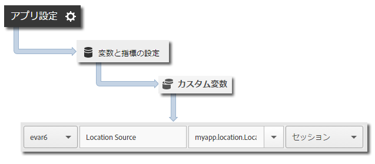

# 位置情報と目標地点{#geo-location-and-points-of-interest}

位置情報は、緯度と経度に加え、事前定義された目標地点を使用して Android アプリで位置データを測定する場合に役立ちます。

各 `trackLocation` 呼び出しでは、次の情報が送信されます。

* Adobe Mobile Services UI で定義されている目標地点（POI）の緯度、経度および位置。

   この情報がモバイルソリューション変数に渡され、自動的にレポートが作成されます。

* コンテキストデータとして渡された中心からの距離と精度。

   これらの変数は、自動ではキャプチャされません。これらのコンテキストデータ変数は、以下の「*追加データの送信*」の節の手順に従ってマッピングする必要があります。

## POI の動的更新 {#section_3747B310DD5147E2AAE915E762997712}

バージョン 4.2 以降、POI は Adobe Mobile UI で定義され、アプリ設定ファイルに動的に同期されます。この同期をおこなうには、[ADBMobile JSON 設定](/help/android/configuration/json-config/json-config.md) で `analytics.poi` 設定をおこなう必要があります。

```js
“analytics.poi”: “https://assets.adobedtm.com/…/yourfile.json”,
```

これを設定しない場合、`ADBMobile.json` ファイルの更新バージョンをダウンロードし、アプリに追加する必要があります。詳しくは、「[SDK およびテストツールのダウウンロード](/help/android/getting-started/requirements.md)」を参照してください。

## 位置情報と POI の追跡 {#section_B1616E400A7548F9A672F97FEC75AE27}

1. ライブラリをプロジェクトに追加し、ライフサイクルを実装します。

   詳しくは、[コア実装とライフサイクル](/help/android/getting-started/dev-qs.md)の「*IntelliJ IDEA または Eclipse プロジェクトへの SDK と設定ファイルの追加*」を参照してください。

1. ライブラリをインポートします。

   ```java
   import com.adobe.mobile.*;
   ```

1. `trackLocation` を呼び出して、現在の位置を追跡します。

   ```java
   Location currentLocation = new Location("my location here"); 
   Analytics.trackLocation(currentLocation, null);
   ```

   >[!TIP]
   >
   >いつでも `trackLocation` を呼び出すことができます。

   ロケーション戦略を使用すると、`trackLocation` 呼び出しに渡される位置を特定することができます。詳しくは、「[Android Location Strategies（Android のロケーション戦略）](https://developer.android.com/guide/topics/location/strategies.html)」を参照してください。

さらに、その位置が定義された POI 半径内にあると判断された場合、`a.loc.poi` コンテキストデータ変数が `trackLocation` ヒットと共に送信され、**[!UICONTROL ロケーション分類]**&#x200B;レポートで POI としてレポートされます。`a.loc.dist` コンテキスト変数も、定義された座標からの距離（メートル単位）と共に送信されます。

## 追加データの送信 {#section_3EBE813E54A24F6FB669B2478B5661F9}

位置データに加えて、各位置追跡呼び出しで追加のコンテキストデータを送信することができます。

```java
HashMap<String, Object> locationContextData = new HashMap<String, Object>(); 
locationContextData.put("myapp.location.LocationSource", "GPS"); 
 
Location currentLocation = new Location("my location here"); 
Analytics.trackLocation(currentLocation, locationContextData);
```

コンテキストデータ値は、Adobe Mobile Services UI でカスタム変数にマップする必要があります。



## 位置コンテキストデータ {#section_FFB71E6653F9410A89CC6ACC0C9164A9}

緯度と経度は、3 つの異なるコンテキストデータパラメーターを使用して送信されます。各パラメーターは、異なるレベルの精度を表し、合計で 6 つのコンテキストデータパラメーターがあります。

例えば、1 m の精度で位置を表す lat = 40.93231、long = -111.93152 という座標があるとします。この位置は、次の変数に応じて様々なレベルの精度に分割されます。

`a.loc.lat.a`= 040.9

`a.loc.lat.b` = 32

`a.loc.lat.c` = 31

`a.loc.lon.a` = -111.9

`a.loc.lon.b` = 31

`a.loc.lon.c` = 52

現在の位置の精度によっては、一部の精度レベルが `00` と表示されることがあります。例えば、位置の現在の精度が 100 m である場合は、`a.loc.lat.c` と `a.loc.lon.c` に `00` が設定されます。

次の情報に留意してください。

* `trackLocation` リクエストは、`trackAction` 呼び出しに相当するものを送信します。

* POI は一般的な `trackAction` および `trackState` 呼び出しの一部として渡されないので、POI を追跡するには `trackLocation` 呼び出しを使用する必要があります。

* `trackLocation` を必要に応じて呼び出し、ロケーションと POI を追跡してください。

   `trackLocation` は、アプリの起動時に呼び出し、その後はアプリの要件に応じて必要なときに呼び出すことをお勧めします。

* POI は、アプリケーションの設定ファイルで定義された後にのみ設定されます。

   POI は、以前に送信された履歴の `trackLocation` 呼び出しには適用されません。
* `trackLocation` 呼び出しでは、`trackAction` 呼び出しと同様の追加コンテキストデータの送信がサポートされます。

* 2 つの POI の直径が重なっている場合は、現在のロケーションを含む最初の POI が使用されます。

   POI が重複している場合は、粒度の大きい順に POI のリストを並べ替えて、粒度の最も大きい POI がレポートされるようにする必要があります。

