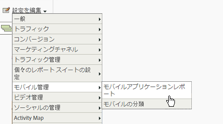

# Analytics {#analytics}

プロジェクトにライブラリを追加した後、アプリ内の任意の場所で Analytics メソッドを呼び出すことができます（必ず ADBMobile.h をクラスに読み込んでください）。

## Analytics でのモバイルアプリレポートの有効化 {#task_3DA1354942CF4BF4B11B9CC97588A9ED}

コードを追加する前に、Analytics 管理者に次の手順を完了させて、モバイルアプリのライフサイクル追跡を有効にしてもらいます。 これらのアクションにより、開発を開始する際に、レポートスイートで指標をキャプチャする準備が整います。

1. **[!UICONTROL 管理ツール]** / **[!UICONTROL レポートスイート]** を開き、モバイルレポートスイートを選択します。
1. **[!UICONTROL 設定を編集]** / **[!UICONTROL モバイル管理]** / **[!UICONTROL モバイルアプリケーションレポート]** をクリックします。

   

1. 「**[!UICONTROL 最新のアプリレポートを有効にする]**」をクリックします。

   必要に応じて、「**[!UICONTROL モバイルロケーションの追跡を有効にする]**」および「**[!UICONTROL バックグラウンドヒットの従来のレポートと属性を有効にする]**」をクリックすることもできます。

   

これで、ライフサイクル指標を取り込む準備が整い、モバイルアプリケーションレポートがマーケティングレポートインターフェイスの **[!UICONTROL レポート]** メニューに表示されます。

## ライフサイクル指標の収集 {#task_25D469C62DF84573AEB5E8E950B96205}

1. アプリでライフサイクル指標を収集するには、`ApplicationUI` コンストラクターで `collectLifecycleData()` を呼び出します。

   以下に例を示します。

   ```java
   ApplicationUI::ApplicationUI(bb::cascades::Application *app): QObject(app) { 
   //... 
   ADBMobile::collectLifecycleData(); 
   } 
   ```

   `collectLifecycleData()` が同じセッションで 2 回呼び出された場合、最初の呼び出しの後、アプリケーションは呼び出しごとにクラッシュを報告します。 アプリケーションがシャットダウンされると、SDK は終了が成功したことを示すフラグを設定します。 このフラグが設定されていない場合、`collectLifecyleData()` はクラッシュを報告します。

## event、prop、eVar  {#concept_B885D5A71A5D45129CE7C1C3426A7D28}

[ADBMobile クラスとメソッドのリファレンス ](/help/blackberry/methods.md) を見てみると、イベント、eVar、prop、heir、リストを設定する場所がわかるでしょう。 バージョン 4 では、これらのタイプの変数を直接アプリに割り当てることができなくなりました。 代わりに、SDK は、コンテキストデータと処理ルールを使用して、レポート用にアプリデータを Analytics 変数へとマッピングします。

処理ルールには、次のようないくつかの利点があります。

* アプリストアにアップデートを送信しなくてもデータマッピングを変更できます。
* データには、レポートスイートに固有の変数を設定する代わりに、意味のある名前を付けることができます。
* 追加のデータを送信しても、影響はほとんどありません。これらの値は、処理ルールを使用してマッピングされるまで、レポートに表示されません。

変数に直接代入していた値は、代わりに `data` HashMap に追加する必要があります。

## 処理ルール {#concept_3EA4CD602AF4488A896B0EDD3BA2D969}

処理ルールは、コンテキストデータ変数で送信したデータを、レポート用に eVar、prop およびその他の変数にコピーするために使用します。

[処理ルール](https://experienceleague.adobe.com/docs/analytics/admin/admin-tools/processing-rules/processing-rules.html)

Adobeでは、論理的な順序を維持するのに役立つように、「名前空間」を使用してコンテキストデータ変数をグループ化することをお勧めします。 例えば、製品に関する情報を収集する場合、次の変数を定義できます。

```js
"product.type":"hat";
"product.team":"mariners";
"product.color":"blue";
```

コンテキストデータ変数は、処理ルールインターフェイスでアルファベット順に並べ替えられるので、名前空間を使用すると、同じ名前空間にある変数をすばやく確認できます。

また、eVarや prop 番号を使用してコンテキストデータキーに名前を付ける方もいると聞きました。

```js
"eVar1":"jimbo";
```

これにより、処理ルールで 1 回限りのマッピングを実行すると *少し* の方が簡単になりますが、コードが読みにくくなるので、デバッグや将来のコード更新が困難になる可能性があります。 代わりに、キーと値にはわかりやすい名前を使用することを強くお勧めします。

```js
"username":"jimbo";
```

カウンターイベントを定義するコンテキスト変数は、同じキーと値を持つことができます。

```js
"logon":"logon";
```

増分イベントを定義するコンテキストデータ変数は、キーとしてイベントを持ち、値として増分する量を持つことができます。

```js
"levels completed":"6";
```

>[!TIP]
>
>アドビは名前空間「`a.`」を予約します。この小さな制限に加え、コンテキストデータ変数は、衝突を回避するために、ログイン会社内で一意である必要があります。

## オフライン追跡を有効にする {#concept_402F4ECE240B4CA1B779322A7BFCB8DE}

デバイスがオフラインの場合にヒットを保存するには、必要に応じて `ADBMobileConfig.json` ファイルでオフライン追跡を有効にできます。

オフライン追跡を有効にする前に、設定ファイルのリファレンスで説明されているタイムスタンプ要件に十分注意してください。

## Analytics メソッド

BlackBerry で使用可能な Analytics メソッドの一覧については、[Adobeモバイルクラスとメソッドリファレンス ](/help/blackberry/methods.md) の *Analytics メソッド* を参照してください。
