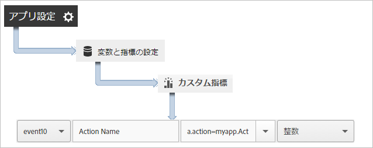
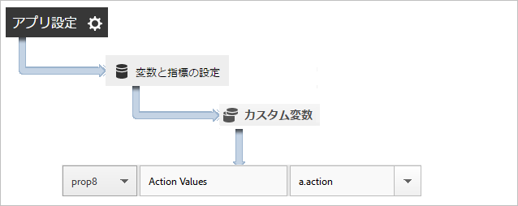
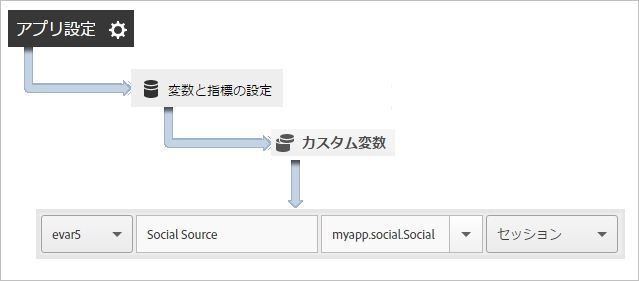

# アプリのアクションの追跡 {#track-app-actions}

アクションは、測定するアプリ内で発生するイベントです。各アクションは、イベントが発生するたびに増分される、1 つ以上の対応する指標を持ちます。例えば、新規サブスクリプション、記事の表示またはレベルの完了を追跡できます。これらのイベントに対応する指標は、購読数、読まれた記事の数、完了したレベルの数として設定されます。

アクションは自動的には追跡されません。そのため、イベントを追跡するには、`trackAction` を呼び出す必要があります。

## Tracking actions {#section_380DF56C4EE4432A823940E4AE4C9E91}

1. ライブラリをプロジェクトに追加し、ライフサイクルを実装します。

   詳しくは、コア実装および *ライフサイクル* で [プロジェクトにSDKおよび設定ファイルを追加を参照](/help/ios/getting-started/dev-qs.md)してください。
1. ライブラリをインポートします。

   ```objective-c
   #import "ADBMobile.h"
   ```

1. 追跡するアクションがアプリ内で発生したら、`trackAction` を呼び出して、このアクションのヒットを送信します。

   ```objective-c
   [ADBMobile trackAction:@"myapp.ActionName"  
                     data:nil];
   ```

   >[!TIP]
   >
   >If the code where you are adding this call might run while the app is in the background, call `trackActionFromBackground` instead of `trackAction`.

1. In the Adobe Mobile services UI, select your app and click **[!UICONTROL Manage App Settings]**.

1. 「**[!UICONTROL 変数と指標の設定]**」をクリックし、「**カスタム指標[!UICONTROL 」タブをクリックします。]**

1. コードに定義されているコンテキストデータ名（例えば、`a.action=myapp.ActionName`）をカスタムイベントにマップします。

   

You can also set a prop to hold all action values by mapping a custom prop with a name like **[!UICONTROL Custom Actions]** and setting the value to `a.action`.



## Sending additional data {#section_3EBE813E54A24F6FB669B2478B5661F9}

アクション名に加えて、各アクション追跡呼び出しで追加のコンテキストデータを送信することができます。

```objective-c
NSMutableDictionary *contextData = [NSMutableDictionary dictionary]; 
[contextData setObject:@"Twitter" forKey:@"myapp.social.SocialSource"]; 
[ADBMobile trackAction:@"myapp.SocialShare" data:contextData];
```

コンテキストデータ値は、カスタム変数にマップする必要があります。



## Tracking background actions {#section_AC13013F207D4FBAAF27E4412034251E}

アプリがバックグラウンドになっているときに実行される可能性があるコードのアクションを追跡する場合は、`trackActionFromBackground` ではなく `trackAction` を呼び出します。`trackActionFromBackground` には、実行すべきではないときにライフサイクルコールを実行しないようにする、いくつかの追加ロジックが含まれています。

## Action reporting {#section_0F6A54AB7A3F42C9BB042D86A0FC4630}

| インターフェイス | レポート |
|--- |--- |
| Adobe Mobile Services | ****&#x200B;アクションパスレポート. アプリでアクションが発生する順序を表示します。任意のレポートで「**[!UICONTROL カスタマイズ]」をクリックすると、ランク付け、トレンド表示または分類レポートでアクションを表示したり、フィルターを適用して特定のセグメントのアクションを表示したりできます。** |
| Reports &amp; Analytics | **[!UICONTROL カスタムイベント]**&#x200B;レポート。アクションがカスタムイベントにマップされた後、他のすべての Analytics イベントと同様にモバイルイベントを表示できます。 |
| ad hoc analysis | **[!UICONTROL カスタムイベント]**&#x200B;レポート。アクションがカスタムイベントにマップされた後、他のすべての Analytics イベントと同様にモバイルイベントを表示できます。 |