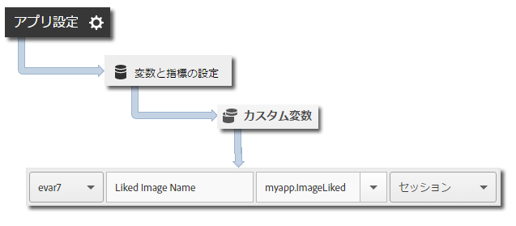

# 訪問者のライフタイム値 {#visitor-lifetime-value}

ライフタイム値を使用して、各ユーザーのライフタイム値を測定し、ターゲットを設定できます。

`trackLifetimeValueIncrease` で値を送信するたびに、その値が既存の値に追加されます。ライフタイム値はデバイス上に保存され、`lifetimeValue` を呼び出していつでも取得することができます。この値を使用して、全期間の購入、広告ビュー、ビデオ完了、ソーシャル共有、写真のアップロードなどを保存できます。

## 訪問者のライフタイム値の追跡 {#section_390943A49AF841F2941E65D6DF2B3F5A}

1. ライブラリをプロジェクトに追加し、ライフサイクルを実装します。

   詳しくは、[コア実装とライフサイクル](/help/ios/getting-started/dev-qs.md)の「*プロジェクトへの SDK と設定ファイルの追加*」を参照してください。
1. ライブラリをインポートします。

   ```objective-c
   import com.adobe.mobile.*;
   ```

1. 値の増分量を指定して `trackLifetimeValueIncrease` を呼び出します。

   ```objective-c
   [ADBMobile trackLifetimeValueIncrease:increaseAmount data:nil];
   ```

## 追加データの送信 {#section_3EBE813E54A24F6FB669B2478B5661F9}

ライフタイム値に加え、各 trackAction コールとともに追加のコンテキストデータを送信できます。

```objective-c
NSMutableDictionary *contextData = [NSMutableDictionary dictionary]; 
[contextData setObject:imageName forKey:@"myapp.ImageLiked"]; 
[ADBMobile trackLifetimeValueIncrease:increaseAmount data:contextData];
```

コンテキストデータ値は、カスタム変数にマッピングする必要があります。


