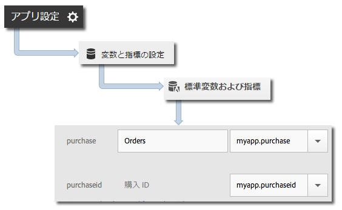

# Products variable {#products-variable}

products 変数は、処理ルールを使用して設定することができません。iOS 4.x SDK では、コンテキストデータパラメーターに特別な構文を使用して、サーバーコールに直接 products を設定する必要があります。

To set the *`products`* variable, set a context data key to `"&&products"`, and set the value by using the syntax that is defined for the *`products`* variable:

```objective-c
[contextData setObject:@"Category;Product;Quantity;Price[,Category;Product;Quantity;Price]" forKey:@"&&products"];
```

以下に例を示します。

```objective-c
//create a context data dictionary 
NSMutableDictionary *contextData = [NSMutableDictionary dictionary]; 
 
// add products, a purchase id, a purchase context data key, and any other data you want to collect. 
// Note the special syntax for products 
[contextData setObject:@";Running Shoes;1;69.95,;Running Socks;10;29.99" forKey:@"&&products"]; 
[contextData setObject:@"1234567890" forKey:@"m.purchaseid"]; 
[contextData setObject:@"1" forKey:@"m.purchase"]; 
 
// send the tracking call - use either a trackAction or TrackState call. 
// trackAction example: 
[ADBMobile trackAction:@"purchase" data:contextData]; 
// trackState example: 
[ADBMobile trackState:@"Order Confirmation" data:contextData]; 
```

*`products`* がイメージリクエストに直接設定され、その他の変数がコンテキストデータとして設定されます。 すべてのコンテキストデータ変数は、処理ルールを使用してマッピングする必要があります。



Folio Builder *`products`*&#x200B;変数をマッピングする必要はありません。画像リクエストに直接設定されるからです。
