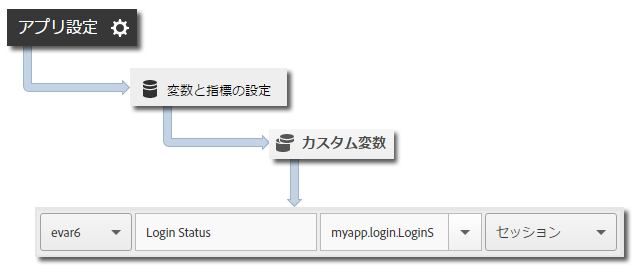

# アプリの状態の追跡 {#track-app-states}

状態とは、アプリケーションの様々な画面またはビューのことです。例えば、ユーザーがホームページからニュースフィードに移動する場合など、アプリケーションに新しい状態が表示されるたびに、track state呼び出しが送信されます。 iOSでは、状態は通常、各表示のviewDidLoadメソッドで追跡されます。

>[!TIP]
>
>状態を追跡するには、`trackState` を呼び出します。状態は、自動的には追跡されません。

## 状態の追跡 {#section_380DF56C4EE4432A823940E4AE4C9E91}

1. ライブラリをプロジェクトに追加し、ライフサイクルを実装します。

   詳しくは、[コア実装とライフサイクル](/help/ios/getting-started/dev-qs.md)の「*プロジェクトへの SDK と設定ファイルの追加*」を参照してください。
1. ライブラリをインポートします。

   ```objective-c
   #import "ADBMobile.h"
   ```

1. `trackState` を呼び出して、この状態ビューのヒットを送信します。

   ```objective-c
   [ADBMobile trackState:@"Login Screen"  
                    data:nil];
   ```

Adobe Mobile Services では、**[!UICONTROL 状態名]**&#x200B;は、*`View State`* 変数で報告され、ビューは `trackState` 呼び出しごとに記録されます。その他の Analytics インターフェイスでは、**[!UICONTROL View State]** は **[!UICONTROL Page Name]** としてレポートされ、state views は page views としてレポートされます。

## 追加データの送信 {#section_CFDB4F944496401786A145C209AB387C}

**[!UICONTROL State Name]** に加えて、各アクション追跡呼び出しを使用して追加のコンテキストデータを送信することができます。

```objective-c
NSMutableDictionary *contextData = [NSMutableDictionary dictionary]; 
[contextData setObject:@"logged in" forKey:@"myapp.login.LoginStatus"]; 
[ADBMobile trackState:@"Home Screen" data:contextData];
```

コンテキストデータ値は、カスタム変数にマッピングする必要があります。



## アプリの状態のレポート {#section_0F6A54AB7A3F42C9BB042D86A0FC4630}

通常、州はパスレポートを使用して表示されるので、ユーザーがアプリ内をどのように移動し、どの州が最も多く閲覧されたかを確認できます。

|  |  |
|--- |--- |
| Adobe Mobile Services | **[!UICONTROL 画面遷移]**&#x200B;レポート。このレポートは、ユーザーがアプリケーション内でたどったパスに基づきます。A sample path is  **[!UICONTROL Home]**  >  **[!UICONTROL Settings]**  > **[!UICONTROL Feed]**. |
| Adobe Analytics | 状態は、**[!UICONTROL ページ]**&#x200B;レポート、**[!UICONTROL ページビュー数]**&#x200B;レポート、**[!UICONTROL パス]**&#x200B;レポートなど、ページを確認できる場所であればどこでも確認できます。 |
| ad hoc analysis | 状態は、**[!UICONTROL ページ]**&#x200B;ディメンション、**[!UICONTROL ページビュー数]**&#x200B;指標、**[!UICONTROL パス]**&#x200B;レポートを使用してページを確認できる場所であればどこでも確認できます。 |
