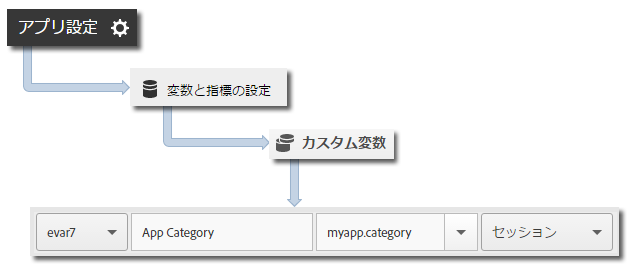

# コア実装とライフサイクル {#core-implementation-and-lifecycle}

iOS ライブラリの実装や、起動、アップグレード、セッション、関与ユーザーといったライフサイクル指標の収集に役立つ情報です。

## SDK のダウンロード {#section_99FE1A17A36D4A2C943939023CF6265C}

>[!IMPORTANT]
>
>SDK をダウンロードするには、iOS 6 以降を使用する&#x200B;**必要があります**。

**前提条件**

SDK をダウンロードする前に、「[コア実装およびライフサイクル](/help/ios/getting-started/requirements.md)」の「*レポートスイートの作成*」の手順を実行して、開発レポートスイートを設定し、設定ファイルの事前入力バージョンをダウンロードします。

SDK をダウンロードするには

1. `[Your_App_Name_]AdobeMobileLibrary-4.*-iOS.zip`ファイルをダウンロードして展開し、以下のソフトウェアコンポーネントがあることを確認します。

   * `ADBMobile.h`：iOS AppMeasurement に使用する Objective-C ヘッダーファイル。
   * `ADBMobileConfig.json`：アプリ用にカスタマイズされた SDK 設定ファイル。
   * `AdobeMobileLibrary.a`：iOS デバイス用のライブラリビルド（armv7、armv7s、arm64）とシミュレーター（i386 および x86_64）を含む、ビットコード対応のファットバイナリ。

      ターゲットが iOS アプリを対象としている場合は、このファットバイナリがリンクされている必要があります。

   * `AdobeMobileLibrary_Extension.a`：iOS デバイス用のライブラリビルド（armv7、armv7s、arm64）とシミュレーター（i386 および x86_64）を含む、ビットコード対応のファットバイナリ。

      ターゲットが iOS エクステンションを対象としている場合は、このファットバイナリがリンクされている必要があります。

   * `AdobeMobileLibrary_Watch.a`：Apple Watch デバイス用のライブラリビルド（armv7k）とシミュレーター（i386 および x86_64）を含む、ビットコード対応のファットバイナリ。

      ターゲットが Apple Watch（watchOS 2）エクステンションアプリを対象としている場合は、このファットバイナリがリンクされている必要があります。

   * `AdobeMobileLibrary_TV.a`：新しい Apple TV デバイス用のライブラリビルド（arm64）とシミュレーター（x86_64）を含む、ビットコード対応のファットバイナリ。

      ターゲットが Apple TV（tvOS）アプリを対象としている場合は、このファットバイナリがリンクされている必要があります。

>[!IMPORTANT]
>
>SDK を Adobe Mobile Services UI 以外でダウンロードした場合は、`ADBMobileConfig.json` ファイルを手動で設定する必要があります。Analytics と Mobile SDK を使い始めたばかりのユーザーが開発レポートスイートを設定して、事前に構成された設定ファイルをダウンロードする場合は、「[事前準備](/help/ios/getting-started/requirements.md)」を参照してください。

## プロジェクトへの SDK と設定ファイルの追加 {#section_93C25D893B4A4CD3B996CF3C5590C8DC}

1. Xcode IDE を起動して、アプリを開きます。
1. プロジェクトナビゲーターで、`AdobeMobileLibrary` フォルダーをドラッグして、プロジェクトにドロップします。
1. 以下を確認します。

   * **[!UICONTROL Copy Items if Needed]**&#x200B;チェックボックスがオンになっている。
   * **[!UICONTROL Create Groups]**&#x200B;がオンになっている。
   * **[!UICONTROL Add to targets]**&#x200B;セクションのチェックボックスがすべてオフになっている。

   

1. **[!UICONTROL Finish]**&#x200B;をクリックします。
1. **[!UICONTROL プロジェクトナビゲーター]**&#x200B;で、**`ADBMobileConfig.json`**&#x200B;を選択します。
1. **[!UICONTROL ファイルインスペクター]**&#x200B;で、Adobe SDK を使用するプロジェクト内の任意のターゲットにこの JSON ファイルを追加します。

   

1. **[!UICONTROL プロジェクトナビゲーター]**&#x200B;で、以下の手順を実行します。

   1. アプリをクリックします。
   1. **[!UICONTROL General]**&#x200B;タブで、ターゲットを選択し、**[!UICONTROL Linked Frameworks]**&#x200B;および&#x200B;**[!UICONTROL Libraries]**&#x200B;セクションで、必要なフレームワークおよびライブラリをリンクします。
   * **iOS App Targets**
      * `SystemConfiguration.framework`
      * `WebKit.framework`
      * `libsqlite3.0.tbd`
      * `AdobeMobileLibrary.a`
      * `CoreLocation.framework`（オプション、ただしジオトラッキング機能に必要）
   * **iOS エクステンションのターゲット**

      * `SystemConfiguration.framework`
      * `libsqlite3.0.tbd`
      * `AdobeMobileLibrary\_Extension.a`
   * **Apple Watch（watchOS 2）のターゲット**

      * `libsqlite3.0.tbd`
      * `AdobeMobileLibrary\_Watch.a`
   * **Apple TV（tvOS）のターゲット**

      * `SystemConfiguration.framework`
      * `libsqlite3.0.tbd`
      * `AdobeMobileLibrary\_TV.a`

   >[!CAUTION]
   >
   > 同じターゲット内で複数の `AdobeMobileLibrary*.a` ファイルをリンクすると、予期せぬ動作が発生したり、ビルドできなくなったりすることがあります。

1. アプリがエラーなくビルドされることを確認します。

## ライフサイクル指標の実装 {#section_532702562A7A43809407C9A2CBA80E1E}

>[!IMPORTANT]
>
>iOS では、`collectlifecycledata` の呼び出しの有無にかかわらず、ライフサイクル情報を送信します。`collectlifecycledata` は、アプリケーションがシーケンスを起動するより前にライフサイクルを開始するための唯一の手段です。

ライフサイクルを有効にすると、アプリが起動されるたびに、1 件のヒットが送信されて、起動、アップグレード、セッション、アクションを実行したユーザー、その他の多くの[ライフサイクル指標](/help/ios/metrics.md)が測定されます。

`application:didFinishLaunchingWithOptions` に `collectLifecycleData`／`collectLifecycleDataWithAdditionalData` 呼び出しを追加します。

```objective-c
- (BOOL)application:(UIApplication *)application didFinishLaunchingWithOptions:(NSDictionary *)launchOptions { 
 [ADBMobile collectLifecycleData]; 
    return YES; 
}
```

### ライフサイクル呼び出しで追加のデータを含める

追加データをライフサイクル指標コールに含めるには、`collectLifecycleDataWithAdditionalData` を使用します。

>[!IMPORTANT]
>
>`collectLifecycleDataWithAdditionalData:` を使用して SDK に渡されたデータはすべて、SDK によって `NSUserDefaults` に保持されます。SDK は、`NSDictionary` 型または `NSString` 型ではない `NSNumber` パラメーターの値を削除します。

```objective-c
- (BOOL)application:(UIApplication *)application didFinishLaunchingWithOptions:(NSDictionary *)launchOptions { 
    NSMutableDictionary *contextData = [NSMutableDictionary dictionary]; 
    [contextData setObject:@"Game" forKey:@"myapp.category"]; 
    [ADBMobile collectLifecycleDataWithAdditionalData:contextData]; 
    return YES; 
}
```

`collectLifecycleDataWithAdditionalData` で送信される追加のコンテキストデータ値は、Adobe Mobile Services のカスタム変数にマッピングする必要があります。



その他のライフサイクル指標は自動的に収集されます。詳しくは、「[ライフサイクル指標](/help/ios/metrics.md)」を参照してください。

## 次の作業 {#section_A24DC703359D4B5C8F493D6421306FD3}

次のタスクを実行します。

* [アプリの状態の追跡](/help/ios/analytics-main/states.md)
* [アプリのアクションの追跡](/help/ios/analytics-main/actions.md)
