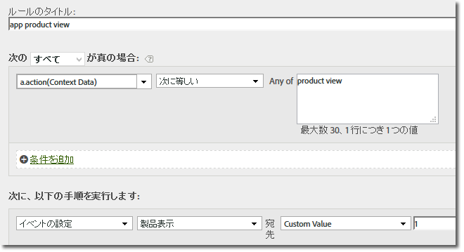

# 4.x iOS ライブラリへの移行{#migrating-to-the-x-ios-library}

iOS ライブラリのバージョン 3.x または 2.x からバージョン 4.x への移行に役立つ情報です。

>[!IMPORTANT]
>
>SDK では、ユニークユーザー数の計算に必要なデータ、ライフサイクル指標、SDK の中心機能に関連するその他のデータを保存するために、`NSUserDefaults` が使用されます。SDK で想定されている `NSUserDefaults` の値を変更または削除すると予期しない動作が発生し、データの不整合が生じる可能性があります。

バージョン 4.x の iOS SDK ライブラリでは、パブリックメソッドが 1 つのヘッダーに統合されています。また、クラスレベルのメソッドから機能にアクセスできるようになり、ポインター、インスタンスまたはシングルトンを追跡する必要がなくなりました。

## event、prop、eVar  {#section_76EA6F5611184C5CAE6E62956D84D7B6}

バージョン 4 では、イベント、eVar、prop、heir、リストなどの変数を直接アプリに割り当てることができなくなりました。代わりに、SDK は、コンテキストデータと処理ルールを使用して、レポート用にアプリデータを Analytics 変数へとマッピングします。

処理ルールには次の利点があります。

* アプリストアにアップデートを送信しなくてもデータマッピングを変更できます。
* データには、レポートスイートに固有の変数を設定する代わりに、意味のある名前を付けることができます。
* 追加のデータを送信しても、影響はほとんどありません。

   これらの値は、処理ルールを使用してマッピングされるまで、レポートに表示されません。

>[!TIP]
>
>変数に直接割り当てていた値は、`data` NSDictionary に追加することが必要になりました。

## 使用されないプロパティの削除 {#section_145222EAA20F4CC2977DD883FDDBBFC5}

新しい `ADBMobileConfig.json` ファイルには、アプリケーション固有のグローバル設定が含まれています。以前のバージョンで使用されていた設定変数のほとんどは置き換えられています。`ADBMobileConfig.json` ファイルの例を次に示します。

```js
{ 
    "version" : "1.0", 
    "analytics" : { 
        "rsids" : "coolApp", 
        "server" : "my.CoolApp.com", 
        "charset" : "UTF-8", 
        "ssl" : true, 
        "offlineEnabled" : true, 
        "lifecycleTimeout" : 5, 
        "privacyDefault" : "optedin", 
        "poi" : [ 
                    ["san francisco",37.757144,-122.44812,7000], 
                    ["santa cruz",36.972935,-122.01725,600] 
                ] 
    }, 
 "target" : { 
  "clientCode" : "myTargetClientCode", 
  "timeout" : 5 
 }, 
 "audienceManager" : { 
  "server" : "myServer.demdex.com" 
 } 
}
```


### 設定ファイルの移動

設定ファイルを移動するには、次の手順を実行します。

1. 1 列目の変数に設定されている値を 2 列目の変数に移動します。
1. コードから古い設定変数を削除します。

### 移行情報

次の表に、設定ファイルに移動する必要がある設定変数を示します。

#### バージョン 3.x からの移行

1 列目の値を 2 列目の変数に移動します。

| 設定変数 | `ADBMobileConfig.json` ファイル内の変数 |
|--- |--- |
| offlineTrackingEnabled | &quot;offlineEnabled&quot; |
| offlineHitLimit | &quot;batchLimit&quot; |
| reportSuiteIDs | &quot;rsids&quot; |
| trackingServer | &quot;server&quot; |
| charSet | &quot;charset&quot; |
| currencyCode | &quot;currency&quot; |
| ssl | &quot;ssl&quot; |
| linkTrackVars | 削除（使用終了） |
| linkTrackEvents | 削除（使用終了） |


#### バージョン 2.x からの移行

1 列目の値を 2 列目の変数に移動します。

| 設定変数 | `ADBMobileConfig.json` ファイル内の変数 |
|--- |--- |
| trackOffline | &quot;offlineEnabled&quot; |
| offlineLimit | &quot;batchLimit&quot; |
| account | &quot;rsids&quot; |
| trackingServer | &quot;server&quot;（`"https://"` プレフィックスを削除）。&quot;ssl&quot; 設定に基づいて、プロトコルプレフィックスが自動的に追加されます。 |
| trackingServerSecure | 削除。セキュア接続の場合は、&quot;server&quot; を定義してから &quot;ssl&quot; を有効にします。 |
| charSet | &quot;charset&quot; |
| currencyCode | &quot;currency&quot; |
| ssl | &quot;ssl&quot; |
| linkTrackVars | 削除（使用終了） |
| linkTrackEvents | 削除（使用終了） |
| timestamp | 削除（設定不可） |
| dc | 削除（使用終了） |
| userAgent | 削除（設定不可） |
| dynamicVariablePrefix | 削除（使用終了） |
| visitorNamespace | 削除（使用終了） |
| usePlugins | 削除（使用終了） |
| useBestPractices チャーン測定に対するすべての呼び出し（getChurnInstance） | 削除（ライフサイクル指標に置き換えられました）詳しくは、「[ライフサイクル指標](/help/ios/metrics.md)」を参照してください。 |


## トラッキングコールとトラッキング変数の更新 {#section_96E7D9B3CDAC444789503B7E7F139AB9}

バージョン 4 の SDK では、Web に焦点を当てた `track` コールと `trackLink` コールを使用する代わりに、次のメソッドを使用します。

* `trackState:data:`状態とは、アプリで使用可能なビューのことで、`home dashboard`、`app settings`、`cart` などがあります。

   これらの状態は Web サイト上のページによく似ており、`trackState` コールにより、ページビュー数が増分されます。

* `trackAction:data:`：アプリ内で発生する `logons`、`banner taps`、`feed subscriptions` などのアクションと、その他の指標を測定します。

どちらのメソッドも `data` パラメーターを使用しますが、これは、コンテキストデータとして送信される名前と値のペアを含む `NSDictionary` です。

### event、prop、eVar

バージョン 4 では、イベント、eVar、prop、heir、リストなどの変数を直接アプリに割り当てることができなくなりました。SDK は、コンテキストデータと処理ルールを使用して、レポート用にアプリデータを Analytics 変数へとマッピングするようになりました。

処理ルールには次の利点があります。

* アプリストアにアップデートを送信しなくてもデータマッピングを変更できます。
* データには、レポートスイートに固有の変数を設定する代わりに、意味のある名前を付けることができます。
* 追加のデータを送信しても、影響はほとんどありません。

   これらの値は、処理ルールを使用してマッピングされるまで、レポートに表示されません。詳しくは、「[処理ルールとコンテキストデータ](/help/ios/getting-started/proc-rules.md)」を参照してください。

代わりに、変数に直接割り当てた値を `data` `NSDictionary` に追加する必要があります。つまり、`setProp` および `setEvar` への呼び出しと、持続コンテキストデータへの割り当てをすべて削除して、値を `data` パラメーターに追加する必要があります。

### AppSection／server、GeoZip、トランザクション ID、Campaign、その他の標準的な変数

上記の変数など、測定オブジェクトに設定していたデータを代わりに `data` `NSDictionary` に追加する必要があります。`trackState` または `trackAction` 呼び出しで送信されるデータは、`data` パラメーターのペイロードのみです。

### トラッキングコールの置き換え

コードで、次のメソッドを `trackState` または `trackAction` の呼び出しで置き換えます。

#### バージョン 3.x からの移行

* `trackAppState (trackState)`
* `trackEvents (trackAction)`
* `track (trackAction)`
* `trackWithContextData (trackAction)`
* `trackLinkURL (trackAction)`

#### バージョン 2.x からの移行

* `track (trackState)`
* `trackLink (trackAction)`

## カスタム訪問者 ID {#section_2CF930C13BA64F04959846E578B608F3}

`visitorID` 変数を `setUserIdentifier:` の呼び出しで置き換えます。

## オフライントラッキング {#section_5D4CD8CD1BE041A79A8657E31C0D24C6}

オフライントラッキング は `ADBMobileConfig.json` で有効に設定されます。他のすべてのオフライン設定は自動的におこなわれます。

コード内の次のメソッドの呼び出しを削除します。

### バージョン 3.x

* `setOnline`
* `setOffline`

### バージョン 2.x

* `forceOffline`
* `forceOnline`

## products 変数 {#section_AFBA36F3718C44D29AF81B9E1056A1B4}

 変数は処理ルールでは使用できないので、以下の構文を使用して `products` を設定することができます。

```objective-c
//create a processing rule to set the corresponding product event. 
// for example, set prodView event when context data a.action = "product view" 
[ADBMobile trackAction:@"LikeButtonClicked"  
                  data:@{@"&&products" : @";Cool Shoe"}];
```


