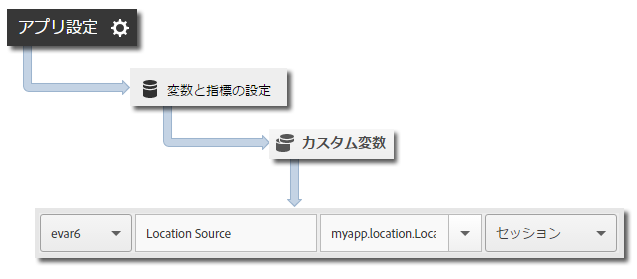

# 位置情報と目標地点 {#geo-location-and-points-of-interest}

位置情報を利用すると、緯度と経度およびアプリ内にあらかじめ定義されている目標地点を用いてロケーションデータを測定することができます。

各 `trackLocation` コールが以下の情報を送信します。

* 緯度、経度および Adobe Mobile Services で定義されている目標地点（POI）のロケーション。

   この情報は、自動レポート用としてモバイルソリューション変数に渡されます。

* 中心からの距離と、コンテキストデータとして渡される精度。

   これらの変数は、自動ではキャプチャされません。これらのコンテキストデータ変数は、以下の「*追加データの送信*」の節の手順に従ってマップする必要があります。

## POI の動的更新 {#section_3747B310DD5147E2AAE915E762997712}

バージョン 4.2 以降、POI は Adobe Mobile インターフェイスで定義され、アプリ設定ファイルに動的に同期されます。この同期をおこなうには、`ADBMobile.json` ファイルの `analytics.poi` 設定が必要です。

```js
“analytics.poi”: “https://assets.adobedtm.com/…/yourfile.json”,
```

詳しくは、「[ADBMobile JSON の設定](/help/ios/configuration/json-config/json-config.md)」を参照してください。

この設定がない場合は、更新されたバージョンの `ADBMobile.json` ファイルをダウンロードして、アプリに追加する必要があります。詳しい情報と手順については、「[事前準備](/help/ios/getting-started/requirements.md)」の「*SDK およびテストツールのダウウンロード*」を参照してください。

## 位置情報と POI の追跡 {#section_B1616E400A7548F9A672F97FEC75AE27}

1. ライブラリをプロジェクトに追加し、ライフサイクルを実装します。

   詳しくは、[コア実装とライフサイクル](/help/ios/getting-started/dev-qs.md)の「*プロジェクトへの SDK と設定ファイルの追加*」を参照してください。
1. ライブラリをインポートします。

   ```objective-c
   #import "ADBMobile.h"
   ```

1. `trackLocation` を呼び出して、現在の位置を追跡します。

   ```objective-c
   CLLocation *currentLocation = location; 
   [ADBMobile trackLocation: currentLocation data: nil]; 
   ```

   >[!TIP]
   >
   >いつでも `trackLocation` を呼び出すことができます。

   `trackLocation` 呼び出しに渡されるロケーションを判断するには、「[Getting the User’s Location（ユーザーのロケーションを取得する）](https://developer.apple.com/Library/ios/documentation/UserExperience/Conceptual/LocationAwarenessPG/CoreLocation/CoreLocation.html)」を参照してください。

さらに、ロケーションが定義済みの POI 半径内にあると判断された場合は、`a.loc.poi` コンテキストデータ変数が `trackLocation` ヒットとともに送信され、ロケーションレポートに POI としてレポートされます。`a.loc.dist` コンテキスト変数も、定義された座標からの距離（メートル単位）と共に送信されます。

## 追加データの送信 {#section_3EBE813E54A24F6FB669B2478B5661F9}

位置データに加えて、各位置追跡呼び出しで追加のコンテキストデータを送信することができます。

```objective-c
NSMutableDictionary *contextData = [NSMutableDictionary dictionary]; 
[contextData setObject:@"GPS" forKey:@"myapp.location.LocationSource"]; 
[ADBMobile trackLocation: currentLocation data:contextData];
```

コンテキストデータ値は、カスタム変数にマッピングする必要があります。



## 位置コンテキストデータ {#section_FFB71E6653F9410A89CC6ACC0C9164A9}

合計 6 つのコンテキストデータパラメーターに対し、緯度と経度はそれぞれ 3 つの異なるコンテキストデータパラメータを使用して送信されます。各パラメーターは異なる精度を表します。

例えば、座標「lat = 40.93231, lon = -111.93152」は、1 mの精度で位置を表します。この場所は、次の変数の精度のレベルに従って分割されます。

* `a.loc.lat.a`= 040.9
* `a.loc.lat.b` = 32
* `a.loc.lat.c` = 31
* `a.loc.lon.a` = -111.9
* `a.loc.lon.b` = 31
* `a.loc.lon.c` = 52

一部の精度は、現在のロケーションの正確さに応じて、「00」と表示されることがあります。例えば、ロケーションの現在の精度が 100 m の場合、`a.loc.lat.c` および `a.loc.lon.c` は「00」と設定されます。

## 追加情報 {#section_931AC1E0D88147E29FE1B6E3CC1E9550}

次の情報に留意してください。

* `trackLocation` リクエストは、`trackAction` 呼び出しに相当するものを送信します。

* POI は、通常の `trackAction` 呼び出しおよび `trackState` 呼び出しの一部としては送信されないので、POI を追跡するには `trackLocation` 呼び出しを使用する必要があります。

* `trackLocation` を必要に応じて呼び出し、ロケーションと POI を追跡してください。

   アプリが開始するときと、アプリケーションの要件で必要になったときに、`trackLocation` を呼び出すことをお勧めします。

* POI が設定されるのは、アプリの設定ファイル内に定義された後のみです。

   以前送信したこれまでの `trackLocation` 呼び出しに対し、POI は適用されません。
* `trackLocation` 呼び出しでは、`trackAction` 呼び出しと同様の追加コンテキストデータの送信がサポートされます。

* 2 つの POI の直径が重なっている場合は、現在のロケーションを含む最初の POI が使用されます。

   POI が重複する場合、最も精度の高い POI が確実に報告されるように、POI を精度の高いものから精度の低いものへとリストする必要があります。
