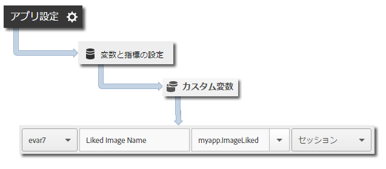

# iBeacon トラッキング {#ibeacon-tracking}

iBeacon トラッキングにより、iBeacon と Low Energy Bluetooth を使用してマイクロロケーションを測定し、ターゲットを設定することができます。

`trackBeacon` が呼び出されると、次のビーコンデータが Analytics と Target に送信されます。

* `a.beacon.uuid` - ビーコンの ProximityUUID
* `a.beacon.major` - 店舗番号など、ビーコンのメジャー番号
* `a.beacon.minor` - 店舗内の一意の番号など、ビーコンのマイナー番号
* `a.beacon.prox` - 以下の値でユーザーとビーコンの距離を表します。

   * `0` - 不明
   * `1` - 直近
   * `2` - 近い
   * `3` - 遠い

## iBeacon の追跡 {#section_FC3F213545944A468B1E6D5D5C8E2F1F}

1. ライブラリをプロジェクトに追加し、ライフサイクルを実装します。

   詳しくは、[コア実装とライフサイクル](/help/ios/getting-started/dev-qs.md)の「*プロジェクトへの SDK と設定ファイルの追加*」を参照してください。
1. ライブラリをインポートします。

   ```objective-c
   #import "ADBMobile.h"
   ```

1. デバイスがビーコンの Proximity (圏内) に入ったら、`trackBeacon` を呼び出します。

   ```objective-c
   [ADBMobile trackBeacon:beacon data:nil];
   ```

1. ユーザーがビーコンの Proximity から立ち去ったら、現在のビーコンをクリアします。

   ```objective-c
   [ADBMobile trackingClearCurrentBeacon];
   ```

## 追加データの送信 {#section_3EBE813E54A24F6FB669B2478B5661F9}

各 trackAction コールで、時間指定イベント名に加え、追加のコンテキストデータを送信できます。

```objective-c
[ADBMobile trackBeacon:beacon data:@{@"myapp.ImageLiked" : imageName}];
```

コンテキストデータ値は、カスタム変数にマッピングする必要があります。



## 例 {#section_9749238BCBC148998CB18E97D7670D19}

```objective-c
- (void)locationManager:(CLLocationManager *)manager didRangeBeacons:(NSArray *)beacons inRegion:(CLBeaconRegion *)region { 
    if (beacons.count > 0) { 
        CLBeacon *beacon = beacons[0]; 
        // Adobe - track when in range of a beacon 
        [ADBMobile trackBeacon:beacon data:@{@"sampleContextData" : @"sampleContextDataVal"}]; 
    } 
} 
 
// When the user leaves the proximity of the beacon, clear the current beacon 
[ADBMobile trackingClearCurrentBeacon];
```
