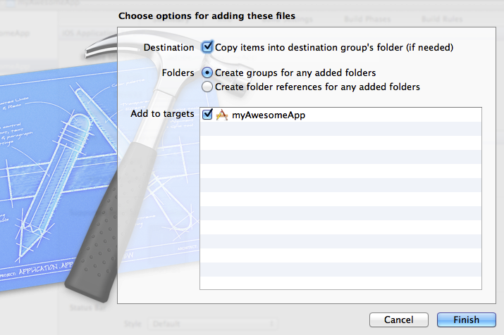

# PhoneGap プラグイン{#phonegap-plug-in}

このプラグインを使用すると、PhoneGap プロジェクトから iOS AppMeasurement コールを送信できます。

## 新しい Adobe Experience Platform Mobile SDK リリース

Adobe Experience Platform Mobile SDK に関する情報やドキュメントをお探しの場合[こちら](https://aep-sdks.gitbook.io/docs/)をクリックし、最新のドキュメントを参照してください。

2018 年 9 月に、SDK の新しいメジャーバージョンをリリースしました。これらの新しい Adobe Experience Platform Mobile SDK は、[Experience Platform Launch](https://www.adobe.com/jp/experience-platform/launch.html) から設定できます。

* 開始するには、Adobe Experience Platform Launch に移動します。
* Experience Platform SDK リポジトリの内容については、[Github: Adobe Experience Platform SDK](https://github.com/Adobe-Marketing-Cloud/acp-sdks) を参照してください。


## PhoneGap プロジェクトの作成

PhoneGap プロジェクトを作成するには、[PhoneGap](https://helpx.adobe.com/jp/experience-manager/6-4/mobile/using/phonegap.html) を参照してください。

## npm を使用したプラグインのインストール: {#section_43229E57C16944C0B51531CB92089189}

1. 次のコマンドを実行します。

   ```
   cordova plugin add adobe-mobile-services
   ```

## 手動でのプラグインのインストール {#section_D53BA60D488C4DB8AD2BDF90439C180A}

### AppMeasurement ライブラリの取り込み

AppMeasurement を取り込むには：

1. `ADBMobile_PhoneGap.h` と `ADBMobile_PhoneGap.m` を Xcode プロジェクトの **[!UICONTROL Plugins]** フォルダーにドラッグします。
1. 以下の設定を実行します。

   1. **[!UICONTROL Copy items into destination group&#39;s folder (if needed)（必要に応じて保存先グループのフォルダーにアイテムをコピーする）]**&#x200B;を選択します。
   1. AppMeasurement コードを使用するターゲットを選択します。

1. `ADB_Helper.js` をプロジェクトの `www` フォルダーにドラッグします。
1. `res/xml` フォルダーで、`config.xml` を開き、以下の行を追加して新しいプラグインを登録します。

   ```
   <feature name="ADBMobile_PhoneGap"> 
     <param name="ios-package" value="ADBMobile_PhoneGap" /> 
   </feature>
   ```

### アプリの権限の追加

AppMeasurementライブラリには、以下が必要です。

1. Xcode IDE を起動して、アプリを開きます。
1. **[!UICONTROL Adobe Mobile]** フォルダーを Xcode プロジェクトにドラッグして、以下の設定を実行します。

   1. **[!UICONTROL Copy items into destination group&#39;s folder (if needed)（必要に応じて保存先グループのフォルダーにアイテムをコピーする）]**&#x200B;を選択します。
   1. **[!UICONTROL Create groups for any added folders（追加されたフォルダーに対してグループを再帰的に作成する）]**&#x200B;を選択します。
   1. AppMeasurement コードを使用するターゲットを選択して、**[!UICONTROL Finish]**&#x200B;をクリックします。

   {width=&quot;672&quot;}

1. プロジェクトのターゲットの&#x200B;**[!UICONTROL Build Phases]**&#x200B;タブで、**[!UICONTROL Link Binary with Libraries]**&#x200B;セクションを展開して、以下のライブラリを追加します。

   * `libsqlite3.dylib`
   * `SystemConfiguration.framework`

1. アプリが予期せぬエラーなくビルドされることを確認します。

## カスタムトラッキングの実装 {#section_FD102B3CDAA4492FB04E56BF17E28663}

トラッキングを使用する `html` ファイル内で、以下を `<head>` タグに追加します。

```html
<script type="text/javascript" charset="utf-8" src="ADB_Helper.js"></script>
```

