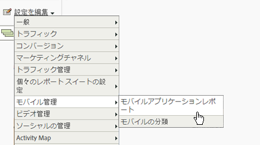
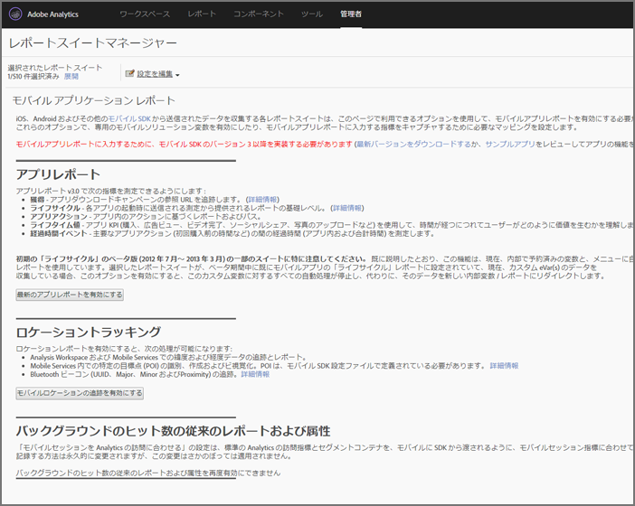

# Analytics {#analytics}

After you add the library to your project, you can make any of the Analytics method calls anywhere in your app.

>[!TIP]
>
>Ensure that you import  to your class.`ADBMobile.h`

## Enable mobile application reports in Analytics {#section_F2F9234009184F20BA36B5CDE872B424}

コードを追加する前に、次の手順を完了してモバイルアプリケーションのライフサイクル追跡を有効にするよう Analytics 管理者に依頼してください。この手順を完了すると、開発を開始する際にレポートスイートで指標を収集できるようになります。

1. Open **[!UICONTROL Admin Tools]** &gt; **[!UICONTROL Report Suites]** and select your mobile report suite(s).

1. Click **[!UICONTROL Edit Settings]** &gt; **[!UICONTROL Mobile Management]** &gt; **[!UICONTROL Mobile Application Reporting]**.

   

1. Click **[!UICONTROL Enable Latest App Reports]**.

   Optionally, you can also click **[!UICONTROL Enable Mobile Location Tracking]** or **[!UICONTROL Enable Legacy Reporting and Attribution for background hits]**.

   

これで、ライフサイクル指標を収集する準備が整い、「モバイルアプリケーションレポート」がマーケティングレポートインターフェイスの&#x200B;**レポート**&#x200B;メニューに表示されます。

### New versions

モバイルアプリケーションレポートの新しいバージョンは定期的にリリースされます。新しいバージョンは自動的にレポートスイートに適用されないので、これらの手順を繰り返してアップグレードを実行する必要があります。新しい Experience Cloud 機能をアプリケーションに追加する際には、毎回これらの手順を繰り返して最新の設定が適用されるようにすることをお勧めします。

## Lifecycle metrics {#section_532702562A7A43809407C9A2CBA80E1E}

ライフサイクル指標をアプリケーションで収集するには、次の例のように、アプリケーションがアクティベートされる部分に呼び出しを追加します。

### WinJS in default.js

```js
app.onactivated = function (args) { 
  if (args.detail.kind === activation.ActivationKind.launch) { 
   ... 
   // launched and resumed stuff  
   ADBMobile.Config.collectLifecycleData(); 
  } 
}; 
app.oncheckpoint = function (args) { 
  ADBMobile.Config.pauseCollectingLifecycleData(); 
}
```

### C# in App.xaml.cs

```js
public App() 
{ 
    this.InitializeComponent(); 
    this.Resuming += OnResuming; 
    this.Suspending += OnSuspending; 
} 
protected override void OnLaunched(LaunchActivatedEventArgs e) 
{   ... 
    ADBMobile.Config.CollectLifecycleData(); 
    ... 
} 
private void OnResuming(object sender, object e) 
{ 
    ... 
    ADBMobile.Config.CollectLifecycleData(); 
    ... 
} 
private void OnSuspending(object sender, SuspendingEventArgs e) 
{ 
    ... 
    ADBMobile.Config.PauseCollectingLifecycleData(); 
    ... 
}
```

### App.xaml.cpp 内の C++/CX

```js
App::App() 
{ 
 InitializeComponent(); 
 Resuming += ref new EventHandler<Object ^>(this, &App::OnResuming); 
 Suspending += ref new SuspendingEventHandler(this, &App::OnSuspending); 
} 
void App::OnResuming(Object ^sender, Object ^args) 
{ 
 ... 
 ADBMobile::Config::CollectLifecycleData(); 
 ... 
} 
void App::OnSuspending(Object^ sender, SuspendingEventArgs^ e) 
{ 
 ... 
 ADBMobile::Config::PauseCollectingLifecycleData(); 
 ... 
} 
void App::OnLaunched(Windows::ApplicationModel::Activation::LaunchActivatedEventArgs^ e) 
{ 
 ... 
 ADBMobile::Config::CollectLifecycleData(); 
 ... 
}
```

If `CollectLifecycleData()` is called twice in the same session, your application reports a crash on every call after the first. アプリケーションがシャットダウンされると、正常終了を示すフラグが SDK によって設定されます。If this flag is not set, `CollectLifecyleData()` reports a crash.

## Events, props, and eVars {#section_76EA6F5611184C5CAE6E62956D84D7B6}

If you've looked at [SDK methods](/help/universal-windows/c-configuration/methods.md), you are probably wondering where to set events, eVars, props, heirs, and lists. バージョン 4 では、これらの種類の変数をアプリケーション内で直接割り当てられなくなっています。代わりに、SDK は、コンテキストデータと処理ルールを使用して、レポート用にアプリデータを Analytics 変数にマップします。

処理ルールには次の利点があります。

* App Store に更新を提出することなく、データマッピングを変更することができます。
* レポートスイートに固有の変数を設定する代わりに、意味のある名前をデータに使用できます。
* 追加のデータの送信にはほとんど影響しません。これらの値は、処理ルールを使用してマップされるまではレポートに表示されません。

変数に直接代入していた値をコンテキストデータに追加する必要があります。

## 処理ルール {#section_66EE762EEA5E4728864166201617DEBF}

処理ルールは、コンテキストデータ変数で送信したデータを、レポート用に eVar や prop などの変数にコピーするために使用します。

[処理ルールのトレーニング](https://tv.adobe.com/embed/1181/16506/)（Summit 2013）

[処理ルールのヘルプ](https://docs.adobe.com/content/help/en/analytics/admin/admin-tools/processing-rules/processing-rules.html)

[処理ルールを使用するための承認の取得](https://helpx.adobe.com/analytics/kb/processing-rules-authorization.html)

「名前空間」を使用してコンテキストデータ変数をグループ化することをお勧めします。これにより論理的な順序を維持できます。例えば、ある製品に関する情報を収集する場合、以下の変数を定義できます。

```javascript
"product.type":"hat" 
"product.team":"mariners" 
"product.color":"blue"
```

コンテキストデータ変数は、処理ルールインターフェイスでアルファベット順に並べ替えられます。そのため、名前空間を使用することで、同じ名前空間に属している変数がすぐにわかります。

また、コンテキストデータキーの名前に evar や prop の番号が使用されている場合もあるとの報告があります。

```js
"eVar1":"jimbo"
```

この命名方法を使用すると、処理ルールで 1 回限りのマッピングを実行するときの手間は若干減りますが、コードが読みにくくなるので、デバッグや将来のコード更新が困難になる可能性があります。**&#x200B;そのため、キーと値にはわかりやすい名前を付けることを強くお勧めします。

```js
"username":"jimbo"
```

カウンターイベントを定義するコンテキスト変数の値は「1」に設定します。

```js
"logon":"1"
```

増分イベントを定義するコンテキストデータ変数では、増分する値を設定できます。

```js
"levels completed":"6"
```

>[!TIP]
>
>アドビは名前空間を予約しま `a.`す。 Other than this restriction, context data variables just need to be unique in your login company to avoid collisions.

## Products variable {#section_AFBA36F3718C44D29AF81B9E1056A1B4}

モバイルSDK *`products`* に設定するには、特別な構文を使用する必要があります。 詳しくは、 [Products変数を参照してください](/help/universal-windows/analytics/products.md)。

## (Optional) Enable offline tracking {#section_955B2A03EB854742BDFC4A0A3C287009}

To store hits when the device is offline, you can enable offline tracking in the [SDK methods](/help/universal-windows/c-configuration/methods.md) file. オフライン追跡を有効にする前に、設定ファイルリファレンスに記載されているタイムスタンプ要件に注意してください。

## Geo-location and points of interest {#section_BAD34A8DD013454DB355121316BD7FD4}

位置情報は位置データ（緯度と経度）に加え、事前定義された目標点を測定する場合に役立ちます。Each `TrackLocation` call sends:

* 緯度／経度および POI（`ADBMobileConfig.json` 設定ファイルで定義されている POI 内の場合）。

   これらの情報は、自動レポート作成のためにモバイルソリューション変数に渡されます。

* コンテキストデータとして渡された中心からの距離と精度。

   これらの情報を収集するには、処理ルールを使用します。

位置を追跡する方法は次のとおりです。

```js
var ADB = ADBMobile; 
ADB.Analytics.trackLocation(37.75345, -122.33207, null);
```

`ADBMobileConfig.json` 設定ファイルで次の POI が定義されている場合：

```js
"poi" : [ 
            ["San Francisco",37.757144,-122.44812,7000], 
        ]
```

When the device location is determined to be within a 7000 meter radius of the defined point, an `a.loc.poi` context data variable with the value `San Francisco` is sent in with the `TrackLocation` hit. また、`a.loc.dist` コンテキスト変数が、定義された座標からの距離（メートル単位）と共に送信されます。

## Lifetime value {#section_D2C6971545BA4D639FBE07F13EF08895}

ライフタイム値を使用して、各ユーザーのライフタイム値を測定し、ターゲットを設定できます。`TrackLifetimeValueIncrease` で値を送信するたびに、その値が既存の値に追加されます。ライフタイム値はデバイス上に保存され、`GetLifetimeValue` を呼び出していつでも取得することができます。この値を使用して、全期間の購入、広告ビュー、ビデオ完了、ソーシャル共有、写真のアップロードなどを保存できます。

```js
// Lifetime Value Example 
var ADB = ADBMobile; 
var purchasePrice = 39.95; 
var cdata = new Windows.Foundation.Collections.PropertySet(); 
cdata["ItemPurchaseEvent"] = "ItemPurchaseEvent"; 
cdata["PurchaseItem"] = "Item453"; 
cdata["PurchasePrice"] = purchasePrice; 
ADB.Analytics.trackLifetimeValueIncrease(purchasePrice, cdata);
```

## Timed actions {#section_7FF8B6A913A0460EAA4CAE835E32D8C1}

時間計測アクションを使用すると、アクションの開始から終了までのアプリ内時間と合計時間を測定できます。SDK は、アクションが完了するまでにかかる各セッションの時間と全セッションの合計時間を計算します。これを使用して、セグメントを定義し、購入までの時間、パスレベル、チェックアウトフローなどを比較することができます。

* アプリの開始から終了までの合計秒数 - 複数のセッションにまたがって計測
* 開始から終了までの合計秒数（クロックタイム）

```js
// Timed Action Start Example 
var ADB = ADBMobile; 
var cdata = new Windows.Foundation.Collections.PropertySet(); 
cdata["ExperienceName"] = experience; 
ADB.Analytics.trackTimedActionStart("TimeUntilPurchase", cdata);
```

```js
// Timed Action Update Example 
var ADB = ADBMobile; 
var cdataUpdate = new Windows.Foundation.Collections.PropertySet(); 
cdataUpdate["ImageLiked"] = imageName; 
ADB.Analytics.trackTimedActionStart("TimeUntilPurchase", cdata); 
```

```js
// Timed Action End Example 
var ADB = ADBMobile; 
ADB.Analytics.trackTimedActionEnd("TimeUntilPurchase");
```
