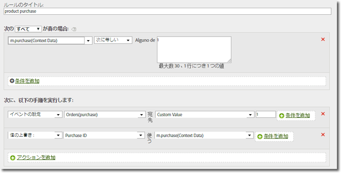

# products 変数 {#products-variable}

products変数は処理ルールを使用して設定できません。 モバイルSDKでは、コンテキストデータパラメーター内で特別な構文を使用して、サーバーコール時に製品を直接設定する必要があります。

To set the *`products`* variable, set a context data key to `"&&products"`, and set the value using the syntax defined for the *`products` variable:

```js
cdata["&&products"] = "Category;Product;Quantity;Price[,Category;Product;Quantity;Price]";
```

次に例を示します。

```js
//create a context data dictionary 
var cdata = new Windows.Foundation.Collections.PropertySet(); 
 
// add products, a purchase id, a purchase context data key, and any other data you want to collect. 
// Note the special syntax for products 
cdata["&&products"] = ";Running Shoes;1;69.95,;Running Socks;10;29.99"; 
cdata["m.purchaseid"] = "1234567890"; 
cdata["m.purchase"] = "1"; 
 
var ADB = ADBMobile; 
// send the tracking call - use either a trackAction or TrackState call. 
// trackAction example: 
ADB.Analytics.trackAction("purchase", cdata); 
// trackState example: 
ADB.Analytics.trackState("Order Confirmation", cdata);
```

The *`products`* is set directly on the image request, and the other variables are set as context data. すべてのコンテキストデータ変数は、次の処理ルールを使用してマッピングする必要があります。



処理ルールを使用して *`products`* 変数をマッピングする必要はありません。これは、変数がSDKによるイメージリクエストに直接設定されるためです。

## マーチャンダイジング eVar および製品固有のイベントを持つ products 変数 {#section_685D53AD3D064F9A8E225F995A9BA545}

An example of the *`products`* variable with Merchandising eVars and product-specific events.

```
//create a context data dictionary 
var cdata = new Windows.Foundation.Collections.PropertySet(); 
  
// add products, a purchase id, a purchase context data key, and any other data you want to collect. 
// Note the special syntax for products 
cdata["&&events"] = "event1 "; 
cdata["&&products"] = ";Running Shoes;1;69.95;event1=5.5;eVar1=Merchandising,;Running Socks;10;29.99"; 
cdata["m.purchaseid"] = "1234567890"; 
cdata["m.purchase"] = "1"; 
  
var ADB = ADBMobile; 
// send the tracking call - use either a trackAction or TrackState call. 
// trackAction example: 
ADB.Analytics.trackAction("purchase", cdata); 
// trackState example: 
ADB.Analytics.trackState("Order Confirmation", cdata);
```

>[!TIP]
>
>変数を使用して製品固有のイベントをトリガーする場合は、そのイベントを変数に設定する必要もあります。設定しない場合は、 *`&&products`**`&&events`* イベントが処理中に除外されます。

