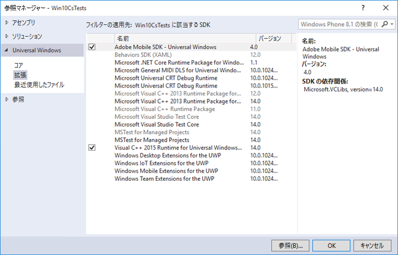

# Windows Visual Studio extensions for Experience Cloud Solutions 4.x SDK {#windows-visual-studio-extensions-for-experience-cloud-solutions-x-sdk}

この拡張機能を使用すると、Experience Cloudソリューション4.x Windows SDKの参照をプロジェクトに追加する際に、より簡単に実行できます。

## GitHubからのライブラリのインストール {#section_F55DB6241EF1475286C05FEAEBF996A3}

1. GitHubからWindows Universal SDKをダウンロードし [ます](https://github.com/Adobe-Marketing-Cloud/mobile-services/releases)。
1. ダウンロードしたファイルをローカルに解凍します。
1. ADBMobileUniversalWindowsVSIX.vsix **[!UICONTRTOL ファイルを重複クリックして]** 、インストーラーを開きます。
1. 「 **[!UICONTROL グローバルロケーション]** 」を選択し、ライブラリをインストールします。

## プロジ追加ェクトへの参照 {#section_00C14FE9243D4330BE1F4BB56FCF08B1}

1. Windows 10プロジェクトを開きます。
1. 「参照マネージャー」(Reference Manager)ダイアログボックスを開きます。

   

1. 「 **[!UICONTROL 拡張機能]** 」タブで、 **[!UICONTROL AdobeモバイルSDKを探して選択します]**。
1. Click **[!UICONTROL OK]** to save it.

   AdobeモバイルSDKがプロジェクトに追加されます。 まだ **[!UICONTROL Microsoft Visual C++ Runtime]** パッケージが追加されていない場合は、このパッケージもプロジェクトに追加されます。

1. Configuration Managerで、プラットフォームタイプを選択し、アプリのテストを開始します。

