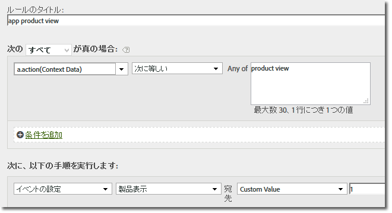

# 4.x SDKへの移行{#migrate-to-x}

この節では、WindowsモバイルSDK 3.xバージョンからUniversal Windows Platform 4.x SDK for Platform SolutionsにExperience Cloudする方法について説明します。

バージョン4.xに移行すると、すべての機能に静的メソッドを使用してアクセスできるようになります。 独自のオブジェクトを追跡する必要はなくなりました。

次の節では、バージョン3.xからバージョン4.xへの移行手順を説明します。

## 使用されないプロパティの削除 {#section_145222EAA20F4CC2977DD883FDDBBFC5}

ダウンロードに新しい `ADBMobileConfig.json` ファイルが含まれていることに気付いたかもしれません。 このファイルには、アプリケーション固有のグローバル設定が含まれ、以前のバージョンで使用されていた設定変数のほとんどが置き換えられます。

`ADBMobileConfig.json` ファイルの例を次に示します。

```js
{ 
    "version" : "1.0", 
    "analytics" : { 
        "rsids" : "coolApp", 
        "server" : "my.CoolApp.com", 
        "charset" : "UTF-8", 
        "ssl" : true, 
        "offlineEnabled" : true, 
        "lifecycleTimeout" : 300, 
        "privacyDefault" : "optedin", 
        "poi" : [ 
                    ["san francisco",37.757144,-122.44812,7000], 
                    ["santa cruz",36.972935,-122.01725,600] 
                ] 
    }, 
 "target" : { 
  "clientCode" : "myTargetClientCode", 
  "timeout" : 5 
 }, 
 "audienceManager" : { 
  "server" : "myServer.demdex.com" 
 } 
}
```

次の表に、設定ファイルに移動する必要がある設定変数を示します。1列目の変数に設定された値を2列目の変数に移動し、古い設定変数をコードから削除します。

### 3.xからの移行

次の表に、3.x SDKの変数のリストと4.x SDKの新しい名前を示します。

| 設定変数/方法 | Variable in the `ADBMobileConfig.json` file. |
|--- |--- |
| offlineTrackingEnabled | &quot;offlineEnabled&quot; |
| reportSuiteIDs | &quot;rsids&quot; |
| trackingServer | &quot;server&quot; |
| charSet | &quot;charset&quot; |
| currencyCode | &quot;currency&quot; |
| ssl | &quot;ssl&quot; |
| setOfflineHitLimit | 削除（使用終了） |
| linkTrackVars | 削除（使用終了） |
| linkTrackEvents | 削除（使用終了） |

## トラッキングコールとトラッキング変数の更新 {#section_96E7D9B3CDAC444789503B7E7F139AB9}

バージョン4 SDKでは、Web中心の呼び出し `Track``TrackLink` と呼び出しを使用する代わりに、モバイル業界で少し意味のある2つのメソッドを使用します。

* `TrackState` 状態は、「ホームダッシュボード」、「アプリ設定」、「カート」など、アプリで使用できる表示です。 これらの状態は Web サイト上のページによく似ており、`trackState` コールはページビュー数を増分します。

* `TrackAction` アクションとは、「ログオン」、「バナーのタップ」、「フィード購読」など、測定対象のアプリで発生する操作です。 これらの呼び出しでは、ページ表示は増えません。

The `contextData` parameter for both of these methods contains name-value pairs that are sent as context data.

### event、prop、eVar

SDKの [メソッドを見たことがある場合は](/help/universal-windows/c-configuration/methods.md)、イベント、eVar、prop、履歴、リストの設定場所を不思議に思っているでしょう。 バージョン4では、これらのタイプの変数を直接アプリで割り当てることはできなくなりました。 代わりに、SDKは、コンテキストデータと処理ルールを使用して、レポート用にアプリデータをAnalytics変数にマッピングします。

処理ルールには次の利点があります。

* データマッピングは、更新をApp Storeに送信しなくても変更できます。
* データには、レポートスイートに固有の変数を設定する代わりに、意味のある名前を付けることができます。
* 追加のデータを送信する場合、影響はほとんどありません。 これらの値は、処理ルールを使用してマッピングされるまで、レポートに表示されません。

詳しくは、 *Analyticsの概要の「* 処理ルール [」の節を参照してください](/help/universal-windows/analytics/analytics.md)。

変数に直接割り当てた値は、代わりにコンテキストデータに追加する必要があります。 This means that calls to `SetProp`, `SetEvar`, and assignments to persistent context data should all be removed and the values added to context data.

### AppSection／server、GeoZip、トランザクション ID、Campaign、その他の標準的な変数

測定オブジェクトに設定したその他のデータ（上記の変数を含む）は、コンテキストデータに追加する必要があります。 つまり、 `TrackState` または `TrackAction` 呼び出しで送信されるデータは、パラ `data` メーター内のペイロードのみです。

**トラッキングコールの置き換え**

Throughout your code, replace the following methods with a call to `trackState` or `trackAction`:

**3.xからの移行：**

* TrackAppState (TrackState)
* TrackEvents (TrackAction)
* Track (TrackAction)
* TrackLinkURL (TrackAction)

## カスタムIDサービス {#section_2CF930C13BA64F04959846E578B608F3}

`visitorID` 変数を `setUserIdentifier` の呼び出しで置き換えます。

## オフライン追跡 {#section_5D4CD8CD1BE041A79A8657E31C0D24C6}

Offline tracking is enabled in the `ADBMobileConfig.json` file. All other offline configuration is done automatically.

コード全体で、次のメソッドの呼び出しを削除します。

**3.xからの移行：**

* SetOnline
* SetOffline

## products 変数{#section_AFBA36F3718C44D29AF81B9E1056A1B4}

 変数は処理ルールでは使用できないので、以下の構文を使用して `products` を設定することができます。

```js
// create a processing rule to set the corresponding product event. 
// for example, set the Product Views event when context data a.action = "product view" 
var cdata = new Windows.Foundation.Collections.PropertySet(); 
cdata["&&products"] = ";Cool Shoe"; 
ADB.Analytics.trackAction("product view", cdata);
```



の値 `"&&products"` （この例では、値は「」）は、追跡するイベントのタイプに対する製品文字列の構文に従う必要があり `";Cool Shoe`ます。
