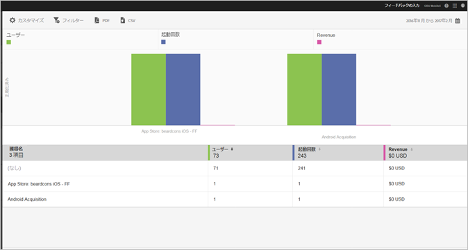

# 獲得 {#acquisition}

マーケターは、アプリをプロモーションし、アクセスを促進するトラッキングリンクを作成できます。これらのトラッキングリンクは、アプリストア、アプリ内ディープリンクおよびインタースティシャルにユーザーを導くことができ、アプリ内の行動に関連付けることができます。マーケターは、ユーザーを iOS、Android またはその他のプラットフォームに適宜ルーティングする 1 つのリンクを作成できます。

## 新しい Adobe Experience Cloud SDK リリース

Adobe Experience Platform Mobile SDK に関する情報やドキュメントをお探しの場合[こちら](https://aep-sdks.gitbook.io/docs/)をクリックし、最新のドキュメントを参照してください。

2018 年 9 月に、SDK の新しいメジャーバージョンをリリースしました。これらの新しい Adobe Experience Platform Mobile SDK は、[Experience Platform Launch](https://www.adobe.com/jp/experience-platform/launch.html) から設定できます。

* 利用を開始するには、[Launch](https://launch.adobe.com/) にアクセスしてください。
* Experience Platform SDK リポジトリの内容については、[Github: Adobe Experience Platform SDK](https://github.com/Adobe-Marketing-Cloud/acp-sdks) を参照してください。

>[!IMPORTANT]
>
> Adobe Experience Platform Mobile SDK を Adobe Launch で使用している場合、ダウンロード計測用リンクなどの機能を使用するには、Adobe Analytics Mobile Services 拡張機能もインストールする&#x200B;**必要があります**。詳しくは、「[Adobe Analytics - Mobile Services](https://aep-sdks.gitbook.io/docs/using-mobile-extensions/adobe-analytics-mobile-services)」を参照してください。Experience Cloud SDK での獲得およびマーケティングリンクの使用について詳しくは、「[獲得およびマーケティングリンク](https://aep-sdks.gitbook.io/docs/using-mobile-extensions/adobe-analytics-mobile-services#acquisition-and-marketing-links)」を参照してください。

>[!IMPORTANT]
>
>UI で機能を設定できますが、これらの機能は、生成された設定ファイルをダウンロードして、このファイルを SDK に追加するまでは機能しません。SDK のダウンロードと設定について詳しくは、本ページの *SDK ドキュメント*&#x200B;の節を参照してください。

トラッキング可能なモバイルアプリマーケティングリンクに関するレポートを作成、編集、管理および表示できます。

>[!TIP]
>
>この機能には、Adobe Analytics - Mobile Apps または Adobe Analytics Premium SKU が必要です。

次の獲得レポートで、マーケティングリンクの効果に関するインサイトを得ることができます。

* **概要**{#section_5B2BA47F22694919A472AB591101237E}

   このレポートには、ユーザーをアプリに導いた上位のキャンペーンと、他のトラッキングメタデータ（獲得参照元、メディア、期間およびコンテンツなど）でのキャンペーンの効果に関する情報が表示されます。

   

* **リンクレポート** {#section_A23A640C363B43569D9D484CF49EA277}

   このレポートには、マーケティングリンクの効果がランキング形式で表示されます。主要パフォーマンス指標と共にリンク名が表示されますが、このレポートはカスタマイズすることもできます。詳しくは、「[レポートのカスタマイズ](/help/using/usage/reports-customize/t-reports-customize.md)」を参照してください。

   次の情報に留意してください。

   * 列ヘッダーの矢印アイコンをクリックして、データを昇順または降順で並べ替えることができます。
   * データを PDF 文書に書き出すには、「**[!UICONTROL ダウンロード]**」をクリックします。
   
