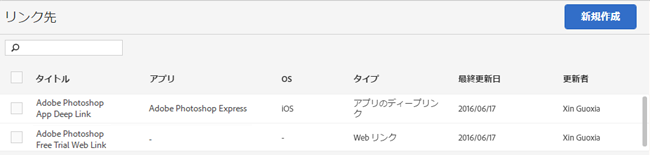

# リンク先を管理 {#manage-link-destinations}

リンク先ページを使用して、既存の宛先を編集、アーカイブ／アーカイブ解除または削除できます。

リンク先を管理ページを表示するには：

1. Mobile Services UI で、「**[!UICONTROL アプリ設定]**」をクリックします。
1. アプリの情報ページで、「**[!UICONTROL リンク先を管理]**」をクリックします。

   

1. （条件付き）適切な作業を実行します。

   * **編集**

      既存のリンク先を編集するには、リストで名前をクリックし、関連するフィールドを編集します。詳しくは、「[新しいリンク先を作成する](/help/using/acquisition-main/c-manage-link-destinations/t-create-new-app-deep-link-destination.md)」を参照してください。

      >[!IMPORTANT]
      >
      >これらの変更が有効になるまでに最長 15 分かかる場合があります。

   * **アーカイブ**

      将来の使用のために保持しておきたいが、**[!UICONTROL リンク先]**&#x200B;リストからは削除したい既存のリンク先をアーカイブします。

      リンク先をアーカイブするには、リンク名の横にある 1 つまたは複数のチェックボックスを選択して、「**[!UICONTROL 選択項目をアーカイブ]**」をクリックします。リンク先はアーカイブされ、いつでもアーカイブを解除できるので、操作を確認する必要はありません。

   * **アーカイブ解除**

      もう一度使用するためにリンク先リストに再表示したい、以前アーカイブしたリンク先をアーカイブ解除できます。

      リンク先のアーカイブを解除するには：

      1. 「**[!UICONTROL アーカイブを表示]**」をクリックします。
      1. アーカイブを解除したいリンク名の横にある 1 つ以上のチェックボックスをオンにします。
      1. 「**[!UICONTROL 選択項目のアーカイブ解除]**」をクリックします。

      「**[!UICONTROL アーカイブを表示]**」オプションは、以前リンク先をアーカイブした場合にのみ表示されます。

   * **削除**

      リンク先を削除するには、削除したいリンクの横にある 1 つまたは複数のチェックボックスを選択して、**[!UICONTROL 選択項目を削除]**／**[!UICONTROL 削除]**&#x200B;をクリックして操作を確認します。

      >[!IMPORTANT]
      >
      >リンク先の削除は&#x200B;**永続的的**&#x200B;です。リンク先を削除してもよいか不確かな場合は、アーカイブオプションを使用します。
