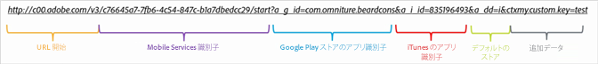
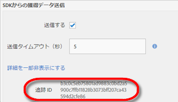

# ダウンロード計測用リンクの手動作成 {#create-acquisition-link-manually}

URLパラメーターを手動で設定することで、新しいモバイルアプリユーザーを即座に獲得するマーケティングリンクを作成できます。

>[!IMPORTANT]
>
>この機能にはSDKバージョン4.6以降が必要です。詳しくは [、獲得の前提条件](/help/using/acquisition-main/c-acquisition-prerequisites.md)を参照してください。

次の図に、手動で作成したトラッキングリンクのコンポーネントと、ダウンロード計測用リンクを手動で作成するときに適切に設定する必要がある様々なURLパラメーターを示します。

このリンクは、モバイルアプリケーションで、Google Play ストアまたは Apple App Store へのプラットフォーム専用のリダイレクトを実行するように設定されています。宛先が判断できない場合、デフォルトのストアは Apple App Store に設定されています。アプリがインストールされた後、Analytics のインストールヒットにカスタムコンテキストキー `my.custom.key:test` が追加されます。

リンクを手動で作成するには、次の URL 形式を使用します。

`http(s)://c00.adobe.com/v3/ {mobile-services-app-hash}/start? {parameters}`

>[!TIP]
>
>使用しているAndroid SDKのバージョンは、このプロセスに影響しません。

iOS の場合、次の正しいプロトコルを使用していることを確認します。

* Use **HTTP** if you are using the iOS SDKs before version 4.7.0, or if you are using iOS SDK 4.7.0 or later, and if **[!UICONTROL Use HTTPS]** is **not** selected on the Manage App Settings page.
* Use **HTTPS** if you are using iOS SDK 4.7.0 or later and **[!UICONTROL Use HTTPS]** **is** selected on the Manage App Settings page.

ここでは、次の条件が当てはまります。

* `{mobile-services-app-hash}` は、設定 `acquisition:appid ` ファイル内のアプリケーション識別子と一致します。

   You can locate `{mobile-services-app-has}` in the Manage App Settings page under Acquisition SDK Options in the Tracking ID field.

   

* `{parameters}` は、標準的な具体的なURLクエリパラメーターのリストです。

次にパラメーターのリストを示します。

* **`a_g_id`**

   Google Play ストアのアプリ識別子.

   * サンプル値: `com.adobe.beardcons`

* **`a_g_lo`**

   Google Play ストアのロケールの上書き.

   * サンプル値: `ko`

* **`a_i_id`**

   iTunes Store のアプリ識別子.

   * サンプル値: `835196493`

* **`a_i_lo`**

   iTunes Store のロケールの上書き.

   * サンプル値: `jp`

* **`a_dd`**

   自動リダイレクトのデフォルトのストア.

   * サンプル値: `i | g`

* **`a_cid`**

   カスタムIDの上書き（通常、iOSの場合はIDFA、Androidの場合はADID）。

   * サンプル値: `Any String < 255 characters (UTF-8 encoded)`

* **`ctx*`**

   Keys prefixed with `ctx` will be in the context data of the resulting launch hit.

   * サンプル値: `ctxmy.custom.key=myValue`

* **`ctxa.referrer.campaign.name`**

   獲得キャンペーン名.

   このパラメーターは、様々なダウンロード計測用リンクのパフォーマンスを比較する場合のレポートに必要です。

   * サンプル値:2015Summit Conference

* **`ctxa.referrer.campaign.trackingcode`**

   トラッキングコード

   このパラメーターは、様々なダウンロード計測用リンクのパフォーマンスを比較する場合のレポートに必要です。

   * サンプル値: `lexsxouj`

* **`ctxa.referrer.campaign.source`**

   ソースです。

   * サンプル値:広告ネットワーク

* **`ctxa.referrer.campaign.medium`**

   メディア

   * サンプル値:電子メール

* **`ctxa.referrer.campaign.content`**

   コンテンツ

   * サンプル値:画像#325689

* **`ctxa.referrer.campaign.term`**

   用語

   * サンプル値:ハイキング+ブーツ

ダウンロード計測用リンクを手動で作成するときは、次の情報を覚えておいてください。

* この表に記載されていないすべてのパラメーターは、アプリストアのリダイレクトの一部として渡されます。
* すべてのパラメーターは技術的にはオプションですが、少なくとも1つのストアIDが指定されている場合、リンクは機能しません。

   An example of a store ID is `a_g_id`/ `a_i_id`.

* 宛先のストアを自動的に判定できず、デフォルトも指定されていない場合は、404 エラーが返されます。

