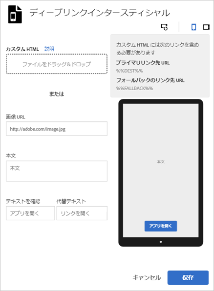

# インタースティシャル{#interstitials}

モバイルアプリをインストールしている（アプリのディープリンク）か、していない（Web サイトまたはアプリストア）かに応じてユーザーをリンク先にルーティングできます。ルーティングの選択は、ユーザーに任せるのが最適です。 マーケターは、利用可能なランディング先をユーザーに表示するインタースティシャルページを設定することで、ユーザーに選択肢を提供できます。

インタースティシャルをマーケティングリンクの作成時に設定するには、次の手順を実行します。

1. **[!UICONTROL ディープリンクインタースティシャルを編集]** をクリックします。

   

1. 次のフィールドに情報を入力します。

   * **[!UICONTROL カスタム HTML]**

      カスタムインタースティシャル HTML ページを選択します。

      カスタムインタースティシャルを使用することで、マーケターはインタースティシャルのランディングページをカスタムの HTML／CSS／JS でカスタマイズし、ページのブランディングを可能にします。

      HTMLページの要件は次のとおりです。

      * HTMLファイルである必要があります。
      * `%%DEST%%` および `%%FALLBACK%%` のプレースホルダーを含める必要があります。
      * アップロードされた HTML は、`<iframe>` で提供されます。

         リンクターゲットが親ウィンドウを指していることを確認する必要があります。`<base target="_parent" />` に `<head>` を含めるか、各 `<a/>` に個別に target プロパティを指定します。

         >[!TIP]
         >
         >カスタム HTML をアップロードする場合、この表の他の 4 つのオプションは、アップロードしたファイルを削除するまで、使用されません。
   * **[!UICONTROL 画像 URL]**

      画像アセットの URL を指定します。

   * **[!UICONTROL 本文]**

      インタースティシャルの本文テキストを指定します。

   * **[!UICONTROL テキストを確認]**

      テキストボタンのテキストを指定します。

   * **[!UICONTROL 代替テキスト]**

      表示する代替テキストを指定します。

      このフィールドは、ディープリンクに失敗した場合に、テキストボタンを更新します。 別のオプションへのフォールバックを許可する前に、ユーザーのディープリンクへの転送が試行されます。例えば、フォールバックは、アプリをダウンロードしてインストールするアプリストアへのものや、ユーザーを会社のWebサイトに導くものなどです。 代替テキストを使用すると、ユーザーは、ディープリンクが失敗した場合に、その他のオプションが利用できることを知ることができます。

1. （**オプション**）画像の上にあるアイコンをクリックして、回転した場合のインタースティシャルの見え方や他のデバイスでの見え方を確認できます。

   Mobile Services の外部で画像を変更または編集すると、異なる状況で画像が適切に表示されることを確認できます。
1. 「**[!UICONTROL 保存]**」をクリックします。
