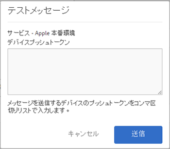

# プッシュメッセージを有効にするための前提条件 {#prerequisites-to-enable-push-messaging}

アプリケーションでプッシュメッセージを設定する前に、いくつかのタスクを完了する必要があります。

## 会社での Experience Cloud の有効化

Adobe Analytics を使用する会社では、Experience Cloud を有効にする必要があります。有効化については、アドビアカウント担当者にご確認ください。

## Mobile SDK のインストールと設定

* **Mobile SDK のインストール**

   プッシュメッセージを設定するには、Mobile SDK のバージョン 4.6 以降をダウンロードしてインストールする必要があります。詳しくは、「[SDK のダウンロード](/help/using/c-manage-app-settings/c-mob-confg-app/t-config-analytics/download-sdk.md)」を参照してください。

* **プッシュサービスの設定**

   Mobile SDK でプッシュサービスを設定する必要があります。詳しくは、以下のコンテンツを参照してください。

   * [Android でのプッシュメッセージ](/help/android/messaging-main/push-messaging/push-messaging.md)
   * [iOS でのプッシュメッセージ](/help/ios/messaging-main/push-messaging/push-messaging.md)

## Adobe ID を使用して Mobile コアサービスにログイン

>[!IMPORTANT]
>
>ユーザーがプッシュサービス機能を使用するには、Adobe ID を使用して Mobile コアサービスにログインする必要があります。また、Analytics アカウントが Adobe ID にリンクされている必要があります。ユーザーが既存の Adobe Analytics アカウントを使用してログインした場合、プッシュサービス機能は利用できません。

ユーザーが Adobe ID を持っていない場合は、次の手順に従います。

1. （**Experience Cloud 管理者**）ユーザーを Experience Cloud に招待します。

1. （**ユーザー**）Experience Cloud 管理者から受け取った手順を使用して、自分の Adobe ID を作成します。

   管理者が前述の手順を完了すると、各ユーザーに対して自動的に電子メールメッセージが送信されます。

1. （**ユーザー**）Adobe ID を使用して Mobile にログインします。

## Experience Cloud でのユーザーのアカウントのリンク

各ユーザーは、Experience Cloud 組織から Analytics ソリューションアカウントをリンクする必要があります。

1. Adobe ID を使用して Experience Cloud にサインインするには、ブラウザーで「[https://marketing.adobe.com](https://marketing.adobe.com)」と入力します。

1. 右上隅で、Analytics 会社名を選択します。

1. **[!UICONTROL 組織を追加]** をクリックして、ドロップダウンリストから **[!UICONTROL Adobe SiteCatalyst／Adobe Social]** を選択します。

1. 会社名、指定した会社の従来の資格情報を入力して、**[!UICONTROL アカウントにリンク]** をクリックします。

   これで、Adobe ID が Analytics アカウント、会社およびログイン資格情報にリンクされました。

詳しくは、[アカウントのリンクのトラブルシューティング](https://docs.adobe.com/content/help/ja-JP/core-services/interface/manage-users-and-products/organizations.html)を参照してください。

## Mobile ユーザーインターフェイスでのプッシュサービスおよび SDK ID サービスの設定

アプリに対して ID サービスを有効にする前は、**[!UICONTROL プッシュサービス]** セクションが無効になっています。ただし、ID サービスを有効にした後は、「プッシュサービス」セクションが有効になります。プッシュサービスの有効化について詳しくは、「[SDK ID サービスオプションの設定](/help/using/c-manage-app-settings/c-mob-confg-app/t-config-visitor.md)」を参照してください。

>[!IMPORTANT]
>
>「**[!UICONTROL 保存]**」をクリックして変更を保存し、プッシュサービスを更新する必要があります。
>
>各レポートスイートでは、Apple 用に 1 つのアプリ、Google 用に 1 つのアプリを設定できます。追加のアプリが必要な場合（例えば、実稼動環境用と開発環境用にアプリが必要な場合）、各環境用に新しいアプリストアアプリと新しいレポートスイートを設定する必要があります。

* **Apple** の場合、秘密鍵および／または証明書をドラッグ＆ドロップします。秘密鍵がパスワードで暗号化されている場合は、パスワードを入力します。

   * **秘密鍵**&#x200B;について、ボックスに秘密鍵ファイルをドラッグ＆ドロップします。

      **[!UICONTROL 参照]** をクリックしてファイルを選択することもできます。このファイルには、秘密鍵が含まれています。また、このファイルには、証明書も含まれている場合があります（`.p12`、`pkcs12`、`.pfx`、`.key`、`.pem`）。

   * **秘密鍵のパスワード**&#x200B;について、秘密鍵ファイルが暗号化されている場合は、パスワードを入力します。

      （条件付き）**証明書**&#x200B;について、ボックスに証明書ファイルをドラッグ＆ドロップします。**[!UICONTROL 参照]** をクリックしてファイルを選択することもできます。秘密鍵ファイルに証明書も含まれている場合、このフィールドは必要ありません（`.cert`、`.cer`、`.crt`、`.pem`）。

* **Google** の場合、アプリの API キーを指定します。

   **[!UICONTROL テスト]** をクリックして、アプリおよび Mobile Services が正しく設定されていることを確認します。このオプションは、デバッグおよびトラブルシューティングに役立ちます。

   メッセージを送信するデバイスのプッシュトークンを入力します。複数のトークンをコンマで区切って指定することで、複数のデバイスにメッセージを送信できます。

   
