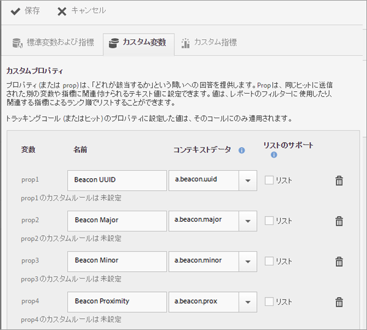
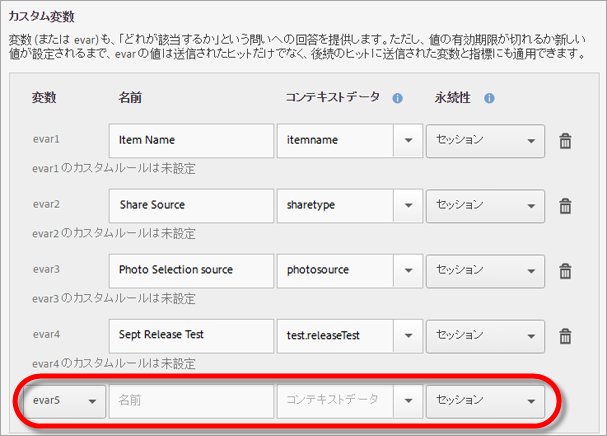

# アプリの管理 {#managing-your-app}

様々な変数および指標を設定することで、アプリから受け取ったデータを追跡および管理できます。

## 変数と指標の管理 {#section_EC2D58AC334F4ED49E764B81C2423A62}

* **標準変数および指標**

   各アプリには、買い物かごと購入アクティビティを追跡するための変数と指標が含まれています。一部の購入情報は処理ルールで処理できないので、SDK では、特別なコンテキストデータ「`"&&products"`」を提供しています。例えば、買い物かごへの追加、買い物かごからの削除、チェックアウト、注文件数などの変数を設定できます。コンテキストデータは、Adobe Analytics のデータにマッピングする必要があります。この変数がコンテキストデータからの単純なマッピングで設定される場合、マッピングのためのキーになります。変数が Analytics 管理ツールのより複雑なルールによって設定されている場合は、空のままにします。

   これらの変数および指標について詳しくは、次を参照してください。

   * [Android の製品変数](/help/android/analytics-main/products/products.md)
   * [iOS の製品変数](/help/ios/analytics-main/products/products.md)

* **カスタム変数**

   カスタム変数ページには、アプリデータを含むレポートスイート用に設定されたすべてのカスタム Analytics 変数が表示されます。このページでは、追加の変数を有効にしたり、コンテキストデータを Analytics 変数にマッピングしたりできます。

### コンテキストデータの Analytics 変数へのマッピング

**[!UICONTROL アプリ設定]**／**[!UICONTROL 変数と指標を管理]**／**[!UICONTROL カスタム変数]**&#x200B;をクリックします。

これらのマッピングは、[処理ルール](https://docs.adobe.com/content/help/ja-JP/analytics/admin/admin-tools/processing-rules/processing-rules.html)で使用したものと同じ API を呼び出します。

次に、設定できるカスタム変数のリストを示します。

* **[!UICONTROL カスタムプロパティ]**（prop）は、「どれが該当するか」という問いに対する回答を提供します。prop をテキスト値に設定し、その値を、同じヒットで送信される他の変数および指標に関連付けることができます。値は、レポートのフィルターに使用したり、関連指標のランク順に表示したりできます。

   ある値がトラッキングコール（またはヒット）のプロパティに対して設定されている場合、値はそのコールにのみ適用されます。

* **[!UICONTROL カスタム変数]**（eVar）も、「どれが該当するか」という問いに対する回答を提供します。ただし、値の有効期限が切れるか新しい値が設定されるまで、eVar の値は送信されたヒットだけでなく、後続のヒットで送信された変数と指標にも適用できます。
* **[!UICONTROL カスタムリスト変数（複数値変数）]**&#x200B;は、1 回のヒットの複数値をキャプチャできることを除いて、変数と同じように動作します。詳しくは、「[リスト変数](https://docs.adobe.com/content/help/ja-JP/analytics/implementation/javascript-implementation/variables-analytics-reporting/page-variables.html)」を参照してください。

次のマッピングは、Mobile Services で作成されたものとして Analytics で表示されます。

* **[!UICONTROL 名前]**

   データ収集変数のわかりやすい名前。

* **[!UICONTROL コンテキストデータ]**

   この変数がコンテキストデータからの単純なマッピングで設定される場合、マッピングのためのキーになります。変数が Analytics の管理ツールのより複雑なルールによって設定されている場合、このフィールドを空のままにします。

   コンテキストデータ列をクリックし、マッピングするコンテキストデータ変数を選択します。ドロップダウンリストには、過去 30 日間に受け取った変数が含まれているので、マッピングするコンテキストデータがリスト内にない場合は、その変数を入力できます。

* **[!UICONTROL 永続性（カスタム変数およびカスタムリスト変数）]**

   永続性は、カスタム変数（eVar）の値の有効期限が切れる時期、または追加のヒットと関連付けられなくなる時期を決定します。ヒットが実行される際に eVar の有効期限が切れていると、値「なし」がその eVar のヒットに関連付けられます。これは、ヒットが発生したときにアクティブな eVar 値がなかったことを意味します。

   次のいずれかのオプションを選択できます。

   * **[!UICONTROL セッション]**

      eVar の値は、Analytics の訪問の間、保持されます。

   * **[!UICONTROL コールのみ]**

      eVar の値は、トラッキングコールまたはそれが含まれるヒットの間のみ保持されます。

   * **[!UICONTROL 無期限]**

      eVar の値は、後続のすべてのトラッキングコールの間、保持されます。
   * **[!UICONTROL アドバンス]**

      Adobe Analytics には、eVar の永続性を設定するための、より高度な UI が備わっています。永続値が Mobile Services でサポートされていない eVar に対して設定されると、この値が Mobile Services UI に表示されます。

      eVar を管理するには、**[!UICONTROL Adobe Analytics Report Suite Manager]**／**[!UICONTROL コンバージョン変数 UI]** をクリックします。

   * **[!UICONTROL リストのサポート]**

      1 つのトラッキングコールでプロパティに関連付ける複数の値を渡すことが可能になります。使用する区切り文字は、1 文字にする必要があります。ゼロまたはスペースは使用できません。

   * **[!UICONTROL 区切り]**

      使用する区切り文字は、1 文字にする必要があります。ゼロまたはスペースは使用できません。

### 追加の Analytics 変数

各変数セクションの下部にあるドロップダウンリストを使用して、追加の変数を有効化できます。

未使用の変数番号を選択し、名前を入力します。オプションとして、保存するコンテキストデータ変数と追加情報を指定できます。

* **カスタム指標**

   指標（またはイベント）は、*量*&#x200B;または&#x200B;*数*&#x200B;に対する質問に回答します。イベントは、ユーザーがアクションを実行するたびに増分することも、価格などの数値を保持することもできます。カスタム指標には、アプリの作成、PDF または CSV ファイルのダウンロードまたは書き出し、キャンペーンの保存、SDK のダウンロード、レポートの実行、App Store へのリンクの追加、アプリ内メッセージのアクティブ化などのイベントが含まれます。

   次のカスタム指標タイプのいずれかを選択します。

   * **[!UICONTROL 整数]**
   * **[!UICONTROL 小数]**
   * **[!UICONTROL 通貨]**

## 目標地点の設定 {#section_990EF15E4E3B42CC807FCD9BEC8DB4C6}

目標地点では、地理的な場所を定義できます。これらの目標地点を使用して、相関関係を分析したり、アプリ内メッセージを使用してターゲット設定したりできます。目標地点でヒットが送信されると、目標地点がヒットに関連付けられます。目標地点の詳細については、「[目標地点の 管理](/help/using/location/t-manage-points.md)」を参照してください。

## リンク先を管理 {#section_F722A387E22A430187B063D358A87711}

リンク先を作成、編集、アーカイブ／アーカイブ解除および削除できます。これらのリンク先は、マーケティングリンク、プッシュ通知またはアプリ内メッセージを構築する際に呼び出すことができます。リンク先について詳しくは、「[リンク先の管理](/help/using/acquisition-main/c-manage-link-destinations/t-archive-unarchive-link-destinations.md)」を参照してください。

## ポストバックを管理 {#section_78B0A8D7AE6940E78D85AE3AB829E860}

ポストバックでは、SDK によって収集されたデータを別のサードパーティサーバーに送信できます。アプリ内メッセージを表示するために設定するのと同じ条件を活用して、カスタマイズしたデータをサードパーティのサーバーに送信するように Mobile を設定できます。ポストバックの詳細については、「[ポストバックの設定](/help/using/c-manage-app-settings/c-mob-confg-app/signals.md)」を参照してください。
