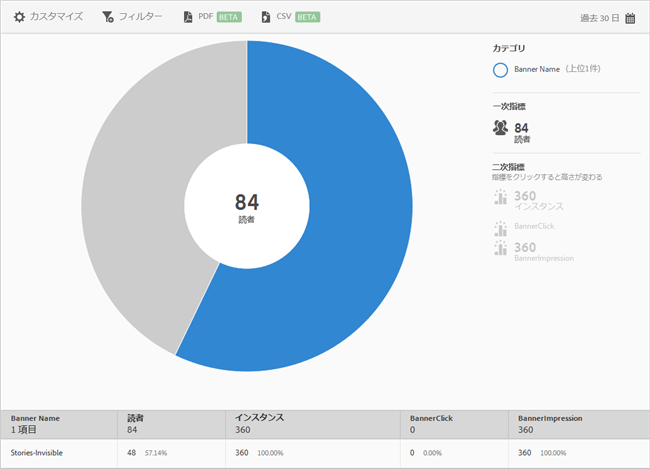

# バナー指標 {#banner-metrics}

**[!UICONTROL バナー指標]**&#x200B;レポートには、既存のデータのサンバーストチャートが表示されます。このレポートは、Digital Publishing Suite（DPS）のユーザーのみが利用できます。

デフォルトでは、このレポートには、次の指標が表示されます。

* **[!UICONTROL バナー名]**：バナーの名前です。
* **[!UICONTROL 読者]**：アプリユーザー数です。
* **[!UICONTROL バナー名インスタンス]**：バナーが参照された回数です（クリック数およびインプレッション数）。
* **[!UICONTROL バナークリック]**：ユーザーがバナーをクリックした回数です。
* **[!UICONTROL バナーインプレッション]**：バナーがブラウザーページで閲覧（または表示）された回数です。

このレポートは、**[!UICONTROL 技術]**&#x200B;レポートに似ています。サンバーストレポートのナビゲートおよび使用、分類および指標の追加、Target アクティビティの作成、共通フィルターの作成、レポートの共有の方法について詳しくは、「[用語](/help/using/usage/reports-technology.md)」を参照してください。このトピックの情報を使用して、**[!UICONTROL バナー指標]**&#x200B;レポートをカスタマイズできます。
