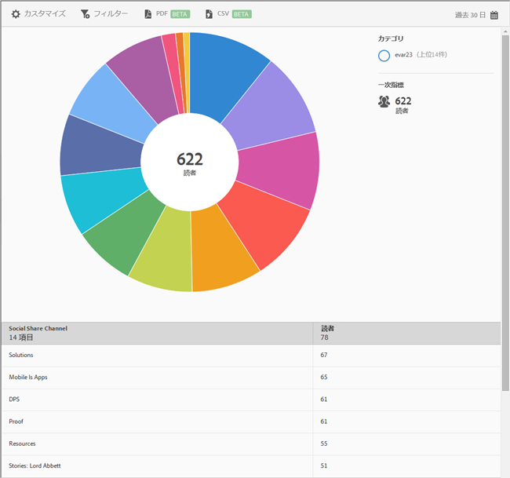

# ソーシャルシェア{#social-sharing}

**[!UICONTROL ソーシャルシェア]レポートには、既存のデータのサンバーストチャートが表示されます。**&#x200B;このレポートはDPSのお客様のみ利用できます。

デフォルトでは、このレポートには、電子メールやメッセージなど、様々なチャネルで記事を共有した読者の数が表示されます。

このレポートは、**[!UICONTROL 技術]レポートに似ています。** For information about how to navigate and use sunburst reports; add breakdowns and metrics; create target activities; create sticky filters, and share reports, see [Technology](//help/using/usage/reports-technology.md). 同トピックの情報を使用して、**[!UICONTROL ソーシャルシェア]レポートをカスタマイズできます。**
