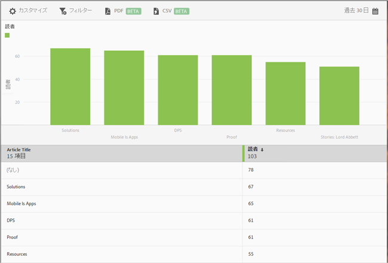

# トップ 50 の記事レポート{#top-articles}

**[!UICONTROL トップ 50 の記事]**&#x200B;レポートには、アプリを使用して最も読まれた記事を示す棒グラフとランクレポートが表示されます。このレポートは、DPS のユーザーのみが利用できます。

このレポートでは、デフォルトで過去 30 日間の読者数のデータが表示されますが、レポートはカスタマイズできます。

このレポートには、デフォルトで記事のタイトルと読者数が表示されます。

このレポートでは、次のオプションを設定できます。

* **[!UICONTROL 期間]**
**[!UICONTROL カレンダー]**&#x200B;アイコンをクリックしてカスタムの期間を選択するか、またはドロップダウンリストからあらかじめ設定されている期間を選択します。

* **[!UICONTROL カスタマイズ]**

   「**[!UICONTROL 表示方法]**」オプションを変更したり、指標およびフィルターを追加したり、追加のシリーズ（指標）を追加したりして、レポートをカスタマイズします。詳しくは、「[レポートのカスタマイズ](/help/using/usage/reports-customize/reports-customize.md)」を参照してください。

* **[!UICONTROL フィルター]**

   「**[!UICONTROL フィルター]**」をクリックし、様々なレポートにわたるフィルターを作成して、すべてのモバイルレポートにおけるセグメントのパフォーマンスを確認します。共通フィルターを定義すると、パス（画面遷移）レポート以外のすべてのレポートに適用できます。詳しくは、「[共通フィルターの追加](/help/using/usage/reports-customize/t-sticky-filter.md)」を参照してください。

* **[!UICONTROL ダウンロード]**

   「**[!UICONTROL PDF]**」または「**[!UICONTROL CSV]**」をクリックして、ドキュメントをダウンロードするか開いて Mobile Services へのアクセス権を持たないユーザーと共有したり、プレゼンテーションで使用したりします。
