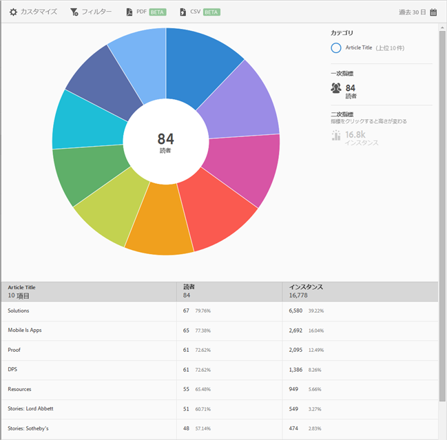

# トップ 10 の記事レポート {#top-articles}

**[!UICONTROL トップ 10]** の記事レポートには、データのサンバーストチャートが表示されます。このレポートは、DPS のユーザーのみが利用できます。

デフォルトでは、このレポートには、記事のタイトル、読者数、合計読者数に対する割合、記事タイトルインスタンスと割合が表示されます。

このレポートは、**[!UICONTROL 技術]**&#x200B;レポートに似ています。サンバーストレポートのナビゲートおよび使用、分類および指標の追加、Target アクティビティの作成、共通フィルターの作成、レポートの共有の方法について詳しくは、「[用語](/help/using/usage/reports-technology.md)」を参照してください。この情報を使用して、**[!UICONTROL トップ 10 の記事]**&#x200B;をカスタマイズできます。
