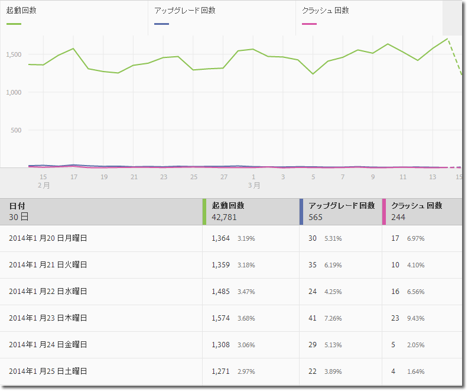
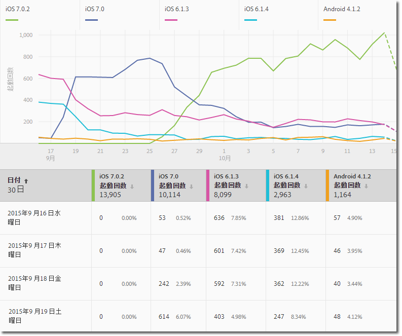
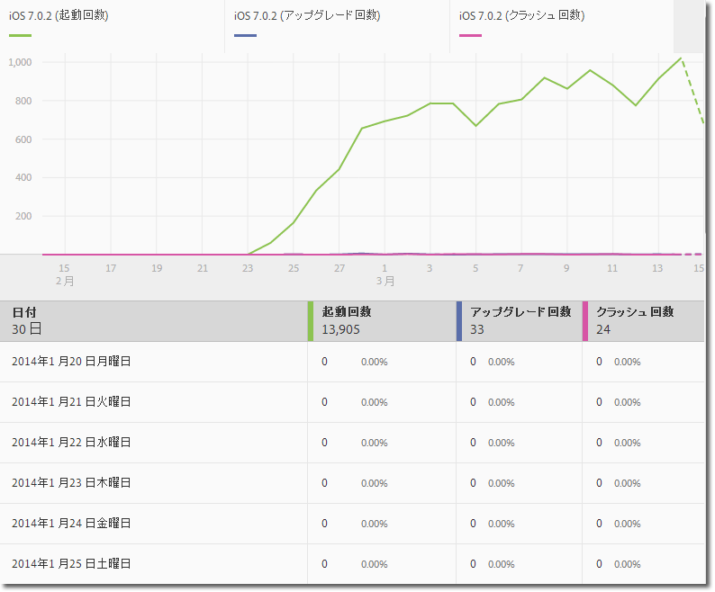
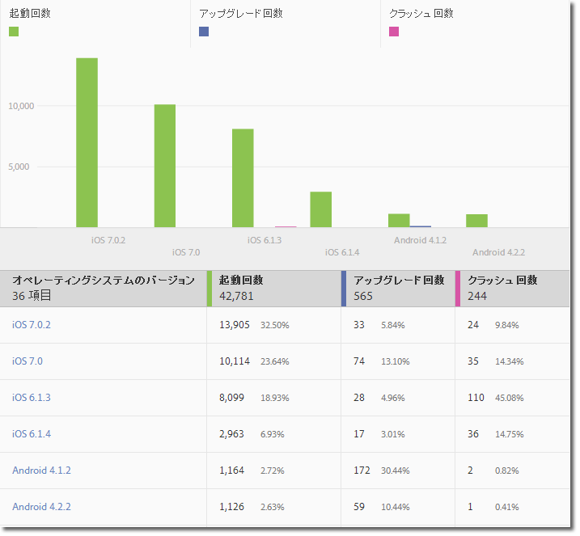
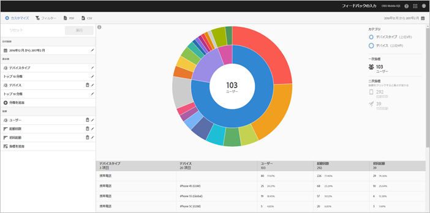
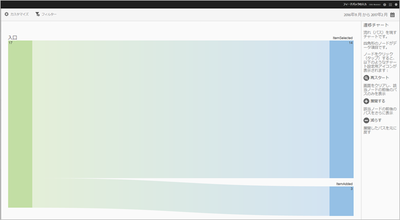
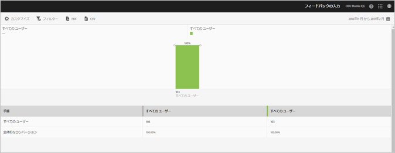

# レポートタイプ {#report-types}

{#eol}

レポートのカスタマイズは柔軟性が高いので、求めるデータを得るにはどのレポートタイプが最適なのか迷う場合があるかもしれません。

レポートをカスタマイズする前に、指標とディメンションの違いを理解する必要があります。

* 指標

   指標は、データを測定するときに使用されます。指標は、カウントおよび追加が可能な値で、アプリ内で特定のアクションが発生する頻度を確認するために使用されます。一般的な指標には、インストール数、起動回数、売上高、ライフタイム値、ログイン数があります。例えば、アプリが起動されるたびに、_launches_value は 1 ずつ増えます。

* ディメンション

   ディメンションは、データの記述に使用されます。ディメンションは、文字列、または数値に見える文字列（郵便番号など）で表され、データを整理およびセグメント化するために使用されます。一般的なディメンションの例としては、OS バージョン、キャンペーン名、製品名、携帯電話会社があります。各ディメンションには、そのディメンションに関連付けられた多数の具体的な値があります。例えば、OS バージョンのディメンションには、「_iOS 7_」や「_Android 4.1.2_」などの値が記録されます。

次に、Mobile UI で生成できるレポートのタイプを示します。

## 時系列レポート {#section_2741DA54C90C49AFB17C7B9BC7AD627D}

時系列レポートは、ある期間における指標のパフォーマンスを示し、スパイクやトレンドをすばやく特定できます。時系列レポートで開始した分析で、指標のスパイクやトレンドに影響を与えている可能性のある要因を調べるため、ドリルダウンうちに、トレンドレポートやランクレポートに移動することが頻繁にあります。

例えば、起動のスパイクがある場合、上位 5 つのオペレーティングシステムの起動を示すトレンドレポートを実行して、起動の急増に最も貢献しているオペレーティングシステムを確認できます。

時系列レポートで他の指標とディメンション値を表示するには、インスタンス指標を使用して、ディメンションフィルターを定義します。

## トレンドレポート {#section_C9BE9A2EDBFF4D938B9AF14C8AA67883}

トレンドレポートは、指標に対して最も人気のあるディメンションのパフォーマンスを確認するのに役立ちます。このレポートを使用すると、指標の変化に最も貢献した値を判断できます。

ディメンションのトレンドレポートを表示するには、同じデータを表示するために、時系列レポートに共通フィルター（オペレーティングシステム = iOS 6.0.1 など）を追加します。さらに、フィルタリングした時系列レポートには、5 つの指標を追加できます。

## フィルタリングした時系列レポート {#section_F8FAF2A4496F449CA99EF1E052C71A2D}

表示したい特定のディメンション値がある場合は、時系列レポートに共通フィルターを追加できます。次のレポートは、特定のオペレーティングシステムバージョンの 30 日分の起動回数、アップグレード回数、クラッシュ回数を示しています。

## ランクレポート {#section_C073D744A95843AF99EE74FB5B013735}

ランクレポートは、上位 50 件のディメンションが指標に貢献する頻度を示します。このレポートは、多数の値をまたいだ、ある日付範囲での合計貢献度を確認するのに役立ちます。

## サンバーストレポート {#section_17A9842039174DE094A6B1E9837E35BB}

サンバーストレポートは、例えば分類と共にベースレポートを表示します。ビジュアライゼーションでは、高さを使用して、指標や指標間のパフォーマンスの差を示します。各同心円は、その円のカテゴリー内のオーディエンスセグメントを表します。共通フィルターの適用、指標の非表示、指標の確認など、オーディエンスに対するアクションを実行できます。

サンバーストグラフの操作方法を説明する製品内チュートリアルで、レポートを表示できます。

チュートリアルを開始するには：

1. アプリ設定で、「**[!UICONTROL 使用状況]**」をクリックします。

1. **[!UICONTROL 技術]**／**[!UICONTROL 技術分類]**&#x200B;をクリックします。
1. レポートのタイトルバーの「**[!UICONTROL カスタマイズ]**」をクリックして、情報アイコンをクリックします。

### パスレポート {#section_AD400106BC684B50B27CCCD3F4497114}

パスレポートには、アプリ内のある状態から別の状態への移行時にたどったパスを表すパスチャートが表示されます。

ボックスのような形状をした各ノードは、ユーザーがアプリ内でたどったパスの状態を表しています。例えば、上の図では、一番上のノードは、アプリを起動し、ギャラリーから写真を選択したユーザーの数を表しています。

### ファネルレポート {#section_AF3B0C899D844FC3AD1F91A2C452C92F}

ファネルレポートを使用すると、顧客がモバイルアプリの操作中にマーケティングキャンペーンを放棄した地点や、定義済みのコンバージョンパスからそれた地点を特定できます。また、ファネルレポートを使用して、様々なセグメントのアクションを比較できます。

ファネルのビジュアライゼーションを使用すると、顧客がどの時点でプロセスからフォールアウトしたかを確認できます。各ステップにおける顧客の意思決定を視覚的に捉えることで、意思決定が停止した場所、たどる傾向のあるパスおよび顧客がアプリを離れたタイミングを把握できます。

