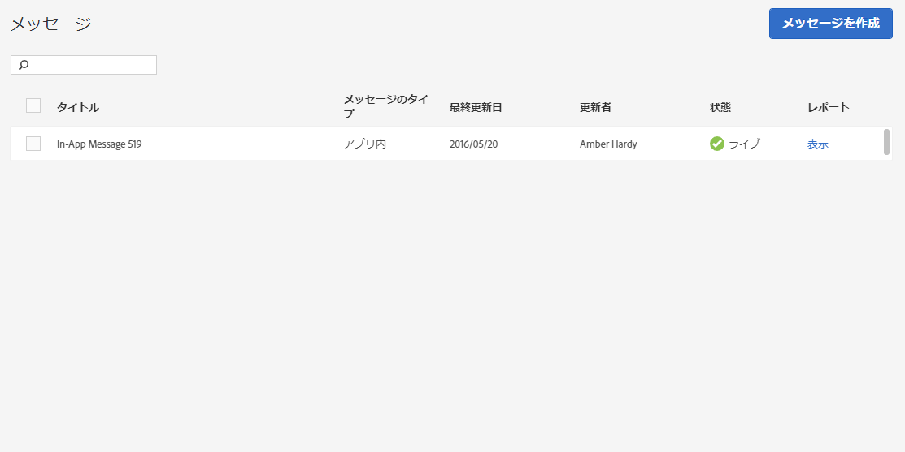

# メッセージの管理{#manage-messages}

アプリ内メッセージとプッシュメッセージのリストと、各メッセージの最終更新日時およびメッセージがライブか非アクティブかに関する詳細を表示します。

メッセージの複製、アクティブ化と非アクティブ化、アーカイブと解凍を行うことができます。また、メッセージを表示したユーザー数、メッセージをクリックスルーしたユーザー数を示すレポートも表示できます。

メッセージを管理するには、***アプリ名***／**[!UICONTROL メッセージング]**／**[!UICONTROL メッセージの管理]**&#x200B;をクリックします。

次に、メッセージを完成させる作業に関する追加情報を示します。

* **メッセージの検索とフィルター**

   リスト上部の検索ボックスを使用して、メッセージを検索し、フィルタリングします。検索ボックスに入力すると、リストから一致するメッセージが表示されます。検索は、表の列全体にわたって機能します。例えば、「`Draft`」と入力すると、このステータスを持つメッセージのみが表示されます。また、ユーザー名を入力すると、そのユーザーによって更新されたメッセージのみが表示されます。

   検索ボックスに加えて、任意の列ヘッダーをクリックして、列のコンテンツを昇順または降順で並べ替えることができます。

   例えば、**[!UICONTROL メッセージのタイプ]** 列を昇順で並べ替えると、すべてのアプリ内メッセージが、プッシュメッセージの前に表示されます。**[!UICONTROL 最終更新日]** 列を降順で並べ替えると、リストの上部に最近更新したメッセージが表示されます。

* **メッセージの複製**

   1. 1 つまたは複数のメッセージの横にあるチェックボックスを選択して、**[!UICONTROL 選択項目を複製]** をクリックします。
   1. メッセージを複製するアプリを選択します。
   1. メッセージの名前を入力します。

      同じアプリ用にメッセージを複製するには、メッセージの新しい名前を入力します。同じ名前を維持すると、元のメッセージが上書きされます。異なるアプリに対してメッセージを複製する場合は、元のメッセージを上書きすることなく同じ名前を保持できます。

   1. 必要に応じて **[!UICONTROL 複製]** または **[!UICONTROL 上書き]** をクリックします。

* **メッセージの非アクティブ化またはアクティブ化**

   メッセージを非アクティブにするには、少なくとも 1 つのアクティブなメッセージの横にあるチェックボックスを選択して、**[!UICONTROL 選択項目を非アクティブ化]** をクリックします。

   非アクティブなメッセージをアクティブにするには、少なくとも 1 つの非アクティブなメッセージの横にあるチェックボックスを選択して、**[!UICONTROL 選択項目をアクティブ化]** をクリックします。

* **メッセージのアーカイブ**

   メッセージをアーカイブして、メッセージリストをクリーンアップするには、次の手順を実行します。

   >[!TIP]
   >
   >メッセージをアーカイブする前に、非アクティブにする必要があります。

   1. 少なくとも 1 つの非アクティブなメッセージの横にあるチェックボックスを選択して、**[!UICONTROL 選択項目をアーカイブ]** をクリックします。

* **アーカイブ済みメッセージの表示**

   1. **[!UICONTROL アーカイブを表示]** をクリックします。
   1. 少なくとも 1 つのアーカイブ済みメッセージの横にあるチェックボックスを選択して、**[!UICONTROL 選択項目のアーカイブを解除]** をクリックします。

