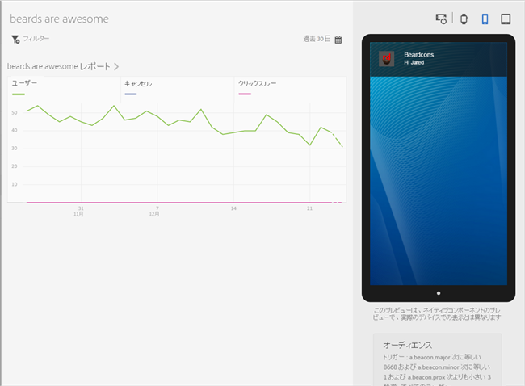
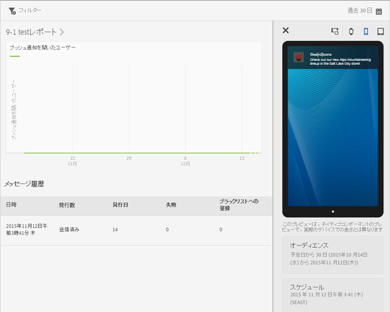

# メッセージレポートの表示{#view-message-reports}

アプリ内およびプッシュメッセージのメッセージレポートを表示できます。

1. メッセージの **[!UICONTROL レポート]** 列のをクリックします。
1. （**オプション**）共通フィルターを作成するか、**[!UICONTROL カレンダー]**&#x200B;アイコンをクリックして期間を変更します。

   共通フィルターの作成について詳しくは、「[共通フィルターの追加](/help/using/usage/reports-customize/t-sticky-filter.md)」を参照してください。

>[!TIP]
>
>表示するメッセージのタイプによって、レポートは異なることがあります。

## アプリ内メッセージ{#section_90B79BA58E8141F78538C187EB1BF8C7}

アプリ内メッセージに関するレポートを表示する場合、レポートは次の図のようになります。

### アプリ内メッセージ指標

アプリ内メッセージで使用できる指標の一覧を次に示します。

* **[!UICONTROL インプレッション]**：メッセージがトリガーされたとき。

* **[!UICONTROL クリックスルー]**：ユーザーがアラートまたはフルスクリーンメッセージの **[!UICONTROL クリックスルー]** ボタンを押したとき、およびユーザーがローカル通知からアプリを開いたとき。

* **[!UICONTROL キャンセル]**：ユーザーがアラートまたはフルスクリーンメッセージの **[!UICONTROL キャンセル]** ボタンを押したとき。

* **[!UICONTROL エンゲージメント率]**：Adobe Analytics の計算指標で、クリックスルー数をインプレッション数で割った結果です。

## プッシュメッセージ {#section_BEAFD858CA194185B6F88903446058E9}

プッシュメッセージに関するレポートを表示する場合、レポートは次の図のようになります。

上部のグラフには、メッセージを開封したユーザーの数が表示されます。

### プッシュメッセージ指標

プッシュメッセージで使用できる指標の一覧を次に示します。

* **[!UICONTROL 時間]**

   メッセージが Mobile Services からデバイスにプッシュされた日時。

* **[!UICONTROL ステータス]**

   メッセージのステータス、および利用可能なステータスは次のとおりです。

   * **[!UICONTROL キャンセル済み]**
   * **[!UICONTROL スケジュール済み]**
   * **[!UICONTROL 実行中]**
   * **[!UICONTROL 実行済み]**

* **[!UICONTROL 発行済み]**

   ユーザーのデバイスにメッセージを送信するために Apple Push Notification Service／Firebase Cloud Messaging（APNS／FCM）に正常に送信されたデバイストークンの数。

* **[!UICONTROL 失敗]**

   APNS／FCM に正常に送信されたデバイストークンの数。考えられる失敗の理由をいくつか紹介します。

   * 無効な pushID

   * プッシュ対象として指定されたプッシュプラットフォーム（APNS、FCM など）がジョブのアプリケーションに存在しない。（例えば、プラットフォームが iOS プッシュトークンを収集したが、APNS サービスが設定されていない。）

   * メッセージが失敗した原因としては、プッシュサービスが正しく設定されていなかったか、Mobile Services システムがダウンしていることが考えられます。
   >[!IMPORTANT]
   >
   >失敗の数がいつになく多い場合は、プッシュサービスの設定を確認してください。プッシュサービスが正しく設定されていると思われる場合は、アドビカスタマーケアにご連絡ください。

* **[!UICONTROL ブラックリストへの登録]**

   APNS または FCM に送信された、有効でなくなったデバイストークンの数。これは、通常、アプリがデバイスからアンインストールされていることや、ユーザーがメッセージを受信するためのオプトイン設定を変更したことを意味します。Android と iOS では、トークンがブラックリストに記載されているものとしてカウントされるタイミングが異なります。Android トークンは、ブラックリストのカウントに即座に表示されます。iOS トークンは、最初は公開されたものとして表示され、APNS からのフィードバックに基づいて、後続のメッセージでブラックリストとして表示されます。
