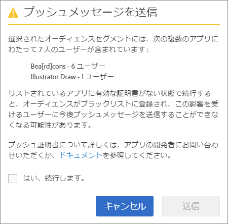

# オーディエンス：プッシュメッセージ{#audience-define-and-configure-audience-segments-for-push-messages}

日付範囲オプション、Analytics セグメントおよびカスタムセグメントを含む、プッシュメッセージのオーディエンスオプションを定義および設定できます。

## オーディエンスセグメントの定義 {#section_7C4D2393CF7441959FE2381A02867CAC}

レポートスイートまたは仮想レポートスイートには 1 つまたは複数のアプリからのデータが含まれるので、プッシュメッセージ用のオーディエンスセグメントが作成されると、そのセグメントには 1 つまたは複数のアプリからのユーザーが含まれます。仮想レポートスイートについて詳しくは、[仮想レポートスイート](/help/using/manage-apps/c-mob-vrs.md)

Adobe Mobile Services では、マーケターは、プラットフォームごとに 1 つのアプリにのみプッシュします。マーケターが複数のアプリからのユーザーを含むセグメントにプッシュしようとすると、処理が深刻なプッシュの失敗を引き起こし、ユーザーがブラックリストに記載される可能性があることを示す警告が表示されます。プッシュの失敗が発生した場合は、「*プッシュメッセージの失敗の解決*」（[プッシュメッセージのトラブルシューティング](/help/using/in-app-messaging/t-create-push-message/c-schedule-push-message.md)）を参照してください。

セグメント定義で Audience Manager データを使用するには、[Audience Analytics](https://docs.adobe.com/content/help/ja-JP/analytics/integration/audience-analytics/mc-audiences-aam.html) を参照してください。

>[!IMPORTANT]
>
>アプリユーザーがブラックリストに記載された場合、マーケターは、それらの影響を受けたユーザーに二度とプッシュメッセージを送信&#x200B;**できません**。

複数のアプリにわたるユーザーを含むオーディエンスセグメントを選択すると、次のアラートが表示される可能性があります。

アプリ名は、Mobile Services SDK によって `<app name> <version number> (<bundle id>)` の形式で Adobe Analytics に自動的に送信される appId（一部省略したもの）に基づいています。

>[!TIP]
>
>&lt;version number&gt; はオプションです。

最大 6 セットのバージョン番号と 5 セットのバンドル ID 番号が削除されます。

以下に例を示します。

* `Bea[rd]cons 1.0 (123)` は `Bea[rd]cons` と表示されます。
* `Bea[rd]cons 1.2 (1.2)` は `Bea[rd]cons` と表示されます。
* `Bea[rd]cons 1.2.3.4.5.6.7 (1111)` は `Bea[rd]cons .7` と表示されます。
* `Bea[rd]cons 1.2.3. (1.2.3.4.5.6)` は `Bea[rd]cons (.6)` と表示されます。

リストされたアプリにプッシュメッセージを送信し続けるには、**[!UICONTROL はい、続行します。]** チェックボックスを選択して、**[!UICONTROL 送信]** をクリックします。

## ベストプラクティス

次に、覚えておくとよいベストプラクティスを紹介します。

* 混乱を減らすために、複数のアプリからのデータを含むモバイルアプリ仮想レポートスイートを定義するのを&#x200B;**避けます**。
* プッシュメッセージを送信する際に、**毎回**、オーディエンスセグメントの一部として一意のアプリ ID を使用します。これにより、1 つのアプリ&#x200B;**のみ**&#x200B;に属するオーディエンスセグメントにプッシュ通知が送信されます。

### 例

次に、セグメントを正しく定義する方法を理解するのに役立ついくつかの例を示します。

**○**：マーケターが、1 つのアプリ（例：Adobe Photoshop）の iOS および Android バージョン用のプッシュ証明書を提供します。マーケターは、両方のプラットフォームにまたがるユーザーセグメントにプッシュ通知を送信することがあります。

**×**：マーケターが、1 つのアプリ（例：Adobe Photoshop）の iOS および Android バージョン用のプッシュ証明書を提供します。マーケターが&#x200B;*最近の 30 日間のすべてのアクティブユーザー*&#x200B;のセグメントを作成およびプッシュすると、Adobe Photoshop iOS および Android アプリのユーザーのみプッシュを受け取り、すべての Adobe Illustrator iOS および Android アプリのユーザーはブラックリストに記載されます。より詳細な例については、「*プッシュメッセージの失敗の解決*」（[プッシュメッセージのトラブルシューティング](/help/using/in-app-messaging/t-create-push-message/c-troubleshooting-push-messaging.md)）を参照してください。

## オーディエンスセグメントの設定 {#section_A92C60885A30421B8150820EC1CCBF13}

1. 新しいプッシュメッセージを表示するには、オーディエンスページに移動します。

   詳しくは、「[プッシュメッセージの作成](/help/using/in-app-messaging/t-create-push-message/t-create-push-message.md)」を参照してください。

   オーディエンスオプションを設定する際には、次の&#x200B;**重要**&#x200B;情報に留意してください。

   * **[!UICONTROL 推定オプトインオーディエンス]**&#x200B;は、Adobe Analytics セグメントに合致するデバイスの数&#x200B;**および**&#x200B;オプトインしたデバイスの数です。

      選択したセグメントにおいて、メッセージの受信に同意（オプトイン）していて、プッシュメッセージを受信すると思われる推定ユーザー数を表示できます。推定数の下には、オプトイン状況を考慮しない、アプリユーザーの合計数が表示されます。

   * **[!UICONTROL 合計]**&#x200B;は、Adobe Analytics セグメントに合致するデバイスの数です。

   * プッシュメッセージは、定義した Adobe Analytics セグメントの一部のデバイス&#x200B;**および**&#x200B;プッシュメッセージをオプトインしたデバイスに送信されます。

      これは、SDK がプッシュメッセージオプトイン eVar に対して `True` の値を送信していることを意味します。

   * デバイスに有効なデバイストークンがあっても、Adobe Analytics にオプトインフラグがない限り、メッセージはデバイスにプッシュされません。

   * プッシュメッセージのトラブルシューティングについては、次を参照してください。

      * [iOS でのプッシュメッセージ](https://docs.adobe.com/content/help/ja-JP/mobile-services/ios/messaging-ios/push-messaging/push-messaging.html)

      * [Android でのプッシュメッセージ](https://docs.adobe.com/content/help/ja-JP/mobile-services/android/messaging-android/push-messaging/push-messaging.html)

1. 次のフィールドに情報を入力します。

   * **[!UICONTROL 期間]**

      推定オーディエンスに使用する期間を入力します。**[!UICONTROL 期間]**&#x200B;ドロップダウンリストから、次のいずれかのオプションを選択します。

   * **[!UICONTROL 最近]**&#x200B;メッセージのプッシュがスケジュールされている日時からの相対期間（最近の 7 日間、最近の 30 日間、最近の 60 日間など）を選択できます。

      例えば、「最近の 30 日間」を選択して、メッセージを 10 月 31 日にプッシュするようにスケジュールした場合、推定オーディエンスは、10 月 31 日の 30 日前にプッシュメッセージの受信に同意していたユーザー数になります。

   * **[!UICONTROL 静的範囲]**&#x200B;推定オーディエンス範囲の開始日付と終了日付を選択することで、静的範囲を選択できます。

      前述の例を使用すると、10 月 1 日に始まり 10 月 15 日に終わる日付範囲を選択しつつ、メッセージをプッシュする日付を 10 月 31 日に設定した場合、推定オーディエンスは、指定した静的日付範囲（10 月 1 日～ 10 月 15 日）にプッシュメッセージの受信に同意していたユーザー数になります。

   * **[!UICONTROL Analytics セグメント]**

      ドロップダウンリストから既存の Adobe Analytics セグメントを選択します。詳しくは、「[セグメントのビルド](https://docs.adobe.com/content/help/ja-JP/analytics/components/segmentation/segmentation-workflow/seg-build.html)」を参照してください。

   * **[!UICONTROL カスタムセグメント]**

      ドロップダウンリストから指標または変数を選択し（**[!UICONTROL 前回使用からの日数]** や **[!UICONTROL 目標地点]** など）、必要に応じてフィルターを設定します。例えば、次のカスタムセグメントは、iOS が動作している携帯電話を所持し、カリフォルニア（米国）地域にいるユーザーをターゲットとしています。
   >[!IMPORTANT]
   >
   >**[!UICONTROL オーディエンスを作成]** セクションで、**[!UICONTROL および]** をクリックすると、リストされた各アプリに有効な証明書が&#x200B;**必要**&#x200B;なことを確認するダイアログが表示されます。**[!UICONTROL または]** をクリックした場合は、デフォルトのダイアログボックスが表示されます。有効な証明書およびレポートスイートについて詳しくは、「[仮想レポートスイート](/help/using/manage-apps/c-mob-vrs.md)」を参照してください。
