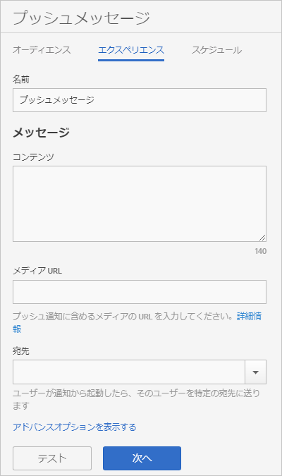

# エクスペリエンス：プッシュメッセージ {#experience-push-message}

名前、メッセージテキストおよび宛先オプションを含む、プッシュメッセージおよびリッチプッシュメッセージのエクスペリエンスオプションを設定できます。iOS デバイス用のペイロードオプションやカスタムオプションなど、高度なオプションを設定することもできます。

1. 新しいプッシュメッセージのオーディエンスページで、「**[!UICONTROL エクスペリエンス]**」をクリックします。

   

1. このメッセージの名前を入力します。
1. 次のフィールドの&#x200B;**[!UICONTROL メッセージ]**&#x200B;セクションに情報を入力します。

   * **[!UICONTROL コンテンツ]**

      メッセージのテキストを指定します。最大 140 文字まで指定できます。

   * **[!UICONTROL メディア URL]**

      プッシュ通知メッセージで使用するメディアファイルの URL を入力します。リッチプッシュ通知を使用する場合の要件については、以下の「*リッチプッシュ通知の要件*」を参照してください。

      >[!IMPORTANT]
      >
      >プッシュ通知で画像またはビデオを表示するには、次に留意してください。
      > * `attachment-url` データは、プッシュペイロードで処理されます。
      > * メディア URL は、リクエストのスパイクを処理できる必要があります。

   * **[!UICONTROL 宛先]**

      メッセージをクリックスルーしたら、ユーザーを送る特定の宛先（Web、ディープまたはハイブリッドリンク）を選択します。詳しくは、「[宛先](/help/using/acquisition-main/c-create-destinations.md)」を参照してください。

      >[!TIP]
      >
      >宛先のタイプに **[!UICONTROL Web リンク]**&#x200B;または&#x200B;**[!UICONTROL カスタムリンク]**&#x200B;を使用すると、宛先のタイプは追跡されません。**[!UICONTROL ディープリンク]**&#x200B;のみが追跡されます。

## リッチプッシュ通知の要件

リッチプッシュ通知を送信するための要件を次に示します。

* **サポートされているバージョン**

   リッチプッシュ通知は、次のバージョンでサポートされています。
   * Android 4.1.0 以降
   * iOS 10 以降

      >[!IMPORTANT]
      >
      >次の情報に留意してください。
      >* 以前のバージョンに送信されたリッチプッシュメッセージは、依然として送信されますが、テキストのみが表示されます。
      >* 現時点では所要時間のサポートはありません。

* **ファイル形式**

   次に、サポートされるファイル形式を示します。
   * 画像：JPG および PNG
   * アニメーション（iOS のみ）：GIF
   * ビデオ（iOS のみ）：MP4

* **URL 形式**
   * HTTPS のみ

* **サイズ調整**
   * 画像は、2：1 の形式である必要があります。そうしないと、切り抜かれます。

リッチプッシュ通知の設定について詳しくは、次のコンテンツを参照してください。

* [プッシュ通知の受信（Android）](/help/android/messaging-main/push-messaging/c-set-up-rich-push-notif-android.md)
* [リッチプッシュ通知の受信（iOS）](/help/ios/messaging-main/push-messaging/c-set-up-rich-push-notif-ios.md)

エクスペリエンスページでプッシュメッセージを設定するには、次の手順を実行します。

1. （**オプション**）**[!UICONTROL アドバンスオプションを表示する]**&#x200B;リンクをクリックして、その他のオプションを設定します。

   * **[!UICONTROL ペイロード：データ]**

      プッシュ通知またはローカル通知経由でアプリに送信される JSON 形式のカスタムプッシュペイロードを指定します。Android および iOS の上限は 4 KB です。

   * **[!UICONTROL Apple オプション：カテゴリ]**

      プッシュおよびローカル通知のカテゴリを指定します。詳しくは、*iOS Developer Library* の [Managing Your App’s Notification Support](https://developer.apple.com/library/content/documentation/NetworkingInternet/Conceptual/RemoteNotificationsPG/SupportingNotificationsinYourApp.html#//apple_ref/doc/uid/TP40008194-CH4-SW9) を参照してください。

   * **[!UICONTROL Apple オプション：サウンド]**

      再生するアプリバンドルのサウンドファイルの名前を指定します。指定しない場合、デフォルトのアラートサウンドが再生されます。詳しくは、*iOS Developer Library* の [Managing Your App’s Notification Support](https://developer.apple.com/library/content/documentation/NetworkingInternet/Conceptual/RemoteNotificationsPG/SupportingNotificationsinYourApp.html#//apple_ref/doc/uid/TP40008194-CH4-SW10) を参照してください。

   * **[!UICONTROL Apple オプション：利用可能なコンテンツ]**

      このオプションを選択して、メッセージが届くと、iOS はバックグラウンドでアプリを起動し、アプリがメッセージのペイロードに基づいてコードを実行できるようにします。詳しくは、[iOS Developer Library](https://developer.apple.com/library/content/documentation/NetworkingInternet/Conceptual/RemoteNotificationsPG/APNSOverview.html#//apple_ref/doc/uid/TP40008194-CH8-SW1) の *Apple Push Notification Service* を参照してください。

1. （オプション）次のアイコンをクリックして、メッセージのレイアウトをプレビューします。

   * **[!UICONTROL x 概要]**

      プレビューパネルを非表示にします。プレビューパネルをもう一度表示するには、「」をクリックします。

   * **[!UICONTROL 向きを変更]**

      プレビューの向きを縦から横に変更するには、「」をクリックします。腕時計の場合、丸い盤面から四角い盤面に向きが変わります。

   * **[!UICONTROL ユーザーの腕時計でのプレビュー]**

      メッセージがユーザーの腕時計に表示される状態をプレビューするには、をクリックします。

   * **[!UICONTROL ユーザーの携帯電話でのプレビュー]**

      ユーザーの携帯電話に表示されるメッセージをプレビューするには、をクリックします。

   * **[!UICONTROL ユーザーのタブレットでのプレビュー]**

      ユーザーのタブレットでメッセージをプレビューするには、をクリックします。
   プレビューパネルの下部に、前の手順で選択したオーディエンスの説明を表示できます。

1. （**オプション**）「**[!UICONTROL テスト]**」をクリックして、指定したデバイスにテスト用のメッセージをプッシュします。
1. サービスを選択し、メッセージのプッシュ先となる少なくとも 1 つのデバイスのプッシュトークンを入力します。

   複数のデバイスにメッセージをプッシュするには、トークンをコンマ区切りリストで指定します。

1. スケジュールオプションを設定します。

   詳しくは、「[スケジュール：プッシュメッセージ](/help/using/in-app-messaging/t-create-push-message/c-schedule-push-message.md)」を参照してください。
