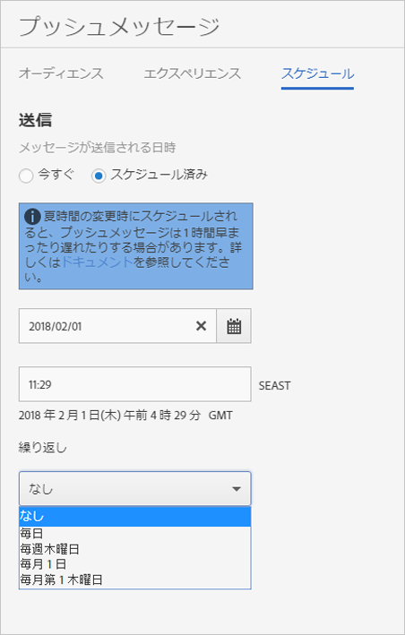

# スケジュール：プッシュメッセージ {#schedule-push-message}

Adobe Mobile Services UI では、プッシュイベントをすぐに配信する、後で配信する、および定期的なメッセージとして配信されるようにスケジュールできます。これらのイベントは、日別、週別、月別にスケジュールできます。

>[!TIP]
>
>ユーザーは、いつでもプッシュメッセージジョブのスケジュール設定を変更できます。定期的なメッセージを送信する該当日がない場合（例えば、毎月 31 日に発生する月次の定期ジョブの場合、2 月 31 日や、月の第 5 火曜日）、メッセージは送信されません。

次の情報に留意してください。

* 正しい日付と時刻の形式は、`hh:mm` および `mm/dd/yyyy` です。

* スケジュールされたメッセージは次の方法で編集できます。

   * 日付を後の日付に変更します。
   * 繰り返し間隔を別の間隔に変更します。

      例えば、毎日送信されるメッセージが最初にあった場合は、繰り返し間隔を毎週に切り替えることができます。

## 繰り返し発生するプッシュメッセージをスケジュールする前に

繰り返しのプッシュメッセージをスケジュールする前に、次の情報を&#x200B;**理解する必要があります**。

* **[!UICONTROL 繰り返し]**&#x200B;ドロップダウンリストに表示されるオプションは、入力または選択した日付によって異なります。

   例えば、`Saturday, October 7` と入力すると、次 のオプションが表示されます。

   * **[!UICONTROL なし]**
   * **[!UICONTROL 毎日]**
   * **[!UICONTROL 毎週土曜日]**
   * **[!UICONTROL 毎月 7 日]**
   * **[!UICONTROL 毎月第 1 土曜日]**

* プッシュメッセージは、グリニッジ標準時（GMT）に基づいてスケジュールされ、送信されます。

   たとえば、毎週土曜日の午後 12:00（正午）（**PST**）に繰り返しメッセージを送信するように設定している場合、10 月 8 日以降、メッセージは実際には土曜日の午後 7 時（**GMT**）に送信されます。
* メッセージの送信方法は、米国、ヨーロッパ、アジアのどこに居住しているかによって異なります。

   例えば、カリフォルニアのサンノゼにいる場合で、***10 月 31 日***&#x200B;の午後 5：30 **PST** にメッセージをスケジュールする場合、メッセージは、実際には&#x200B;***11月 1 日***&#x200B;の午前 12：30 **GMT** に送信されます。東京にいる場合で、***1 月 1 日***&#x200B;の午前 5：30 にメッセージをスケジュールする場合、***2 月 31 日***&#x200B;の午後 8：30 **GMT**&#x200B;に送信されます。
* サマータイム時間が適用されている稼働かに応じて、プッシュメッセージは 1 時間前または 1 時間後に送信されます。
* プッシュメッセージレポートを見ると、システムのローカルタイムゾーンにメッセージが表示されます。

   例えば、開始時刻が **PST** の午後 12:00 の場合、メッセージは **GMT** の午後 7 時に送信されますが、メッセージレポートには送信時刻が **PST** の午後 12:00 と表示されます。

## 繰り返しのプッシュメッセージのスケジュール設定 {#section_675BD754E5A04423A1751193698A978F}

1. 新しいプッシュメッセージのスケジュールページで、「**[!UICONTROL スケジュール済み]**」または「**[!UICONTROL 今すぐ]**」を選択します。

   詳しくは、「[プッシュメッセージの作成](/help/using/in-app-messaging/t-create-push-message/t-create-push-message.md)」を参照してください。

   「**[!UICONTROL 今すぐ]**」を選択すると、メッセージは直ちにプッシュされます。メッセージをすぐにスケジュールしない場合は、「**[!UICONTROL ドラフトとして保存]**」をクリックします。

   

1. 「**[!UICONTROL スケジュール済み]**」を選択した場合、カレンダーアイコンをクリックして、開始日を選択または入力します。
1. 時刻を入力します。 
1. **[!UICONTROL 繰り返し]** で、次のいずれかのオプションを選択します。

   * **[!UICONTROL なし]**
   * **[!UICONTROL 毎日]**
   * **[!UICONTROL 毎週火曜日]**
   * 毎月 **`<Day x>`日**

      表示されるオプションは、開始日として選択または入力した日付によって異なります。
   * 毎月 **`<nth day>`日**

      表示される値は、開始日として選択または入力した日付によって異なります。

1. 「**[!UICONTROL 繰り返しを終了]**」で、終了日時を入力します。
1. 次のいずれかのオプションをクリックします。

   * **[!UICONTROL ドラフトとして保存]**

      このオプションは、メッセージをドラフト形式で保存します。このオプションを選択して、完成していないメッセージを保存したり、メッセージを保存して他の誰かがそのメッセージを編集および承認してからアクティブ化したりできます。

      前の手順で「**[!UICONTROL 今すぐ]**」を選択した場合、アクティブ化すると直ちにドラフトメッセージが送信されます。メッセージをプッシュする日付および時刻を選択した場合、メッセージはこのスケジュールに従ってプッシュされます。

   * **[!UICONTROL 保存してスケジュール]**

      このオプションは、スケジュールされた日時にメッセージを送信します。

後でドラフトメッセージをプッシュするには、次のいずれかのタスクを実行します。

* 「**[!UICONTROL メッセージを管理]**」をクリックして、メッセージの横にあるチェックボックスを選択し、「**[!UICONTROL 選択項目をアクティブ化]**」をクリックします。
* 「**[!UICONTROL 保存して送信]**」をクリックしてメッセージを保存し、送信します。
