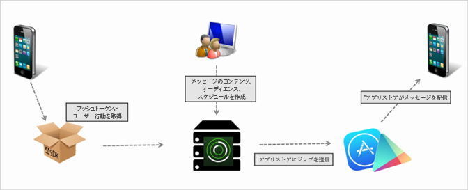

# プッシュメッセージの作成 {#create-a-push-message}

Mobile Services UI から Analytics で作成されたセグメントに対してプッシュメッセージを送信できます。

>[!IMPORTANT]
>
>プッシュメッセージを作成する前に、「[プッシュメッセージを有効にするための前提条件](/help/using/c-manage-app-settings/c-mob-confg-app/configure-push-messaging/prerequisites-push-messaging.md)」を参照してください。

プッシュメッセージは、アプリを使用していないユーザーに対しては、通知の受信をオプトインしているユーザーに対して表示されます。 これらの通知は、新しい更新、オファーおよびリマインダーに関してユーザーに警告します。 これらの通知を使用することで、1 つの効率的なワークフローで、プッシュメッセージの作成、テスト、管理、レポートを実行できます。

プッシュメッセージは、AdobeのMobile Servicesからではなく、アプリストアによってサーバー側で送信されます。

プッシュメッセージを作成するには：

1. ***your_app_name*** / **[!UICONTROL Messaging]** / **[!UICONTROL Manage Messages]**********/Manage Messagesの作成/Create PushPushをクリックします。
1. オーディエンスオプションを設定します。

   詳しくは、「[オーディエンス：プッシュメッセージ用のオーディエンスセグメントの定義および設定](/help/using/in-app-messaging/t-create-push-message/c-audience-push-message.md)」を参照してください。
