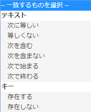

# オーディエンス：アプリ内メッセージ {#audience-in-app-message}

{#eol}

表示、トリガーおよび特徴オプションを含む、アプリ内メッセージのオーディエンスオプションを設定できます。

1. アプリで、**[!UICONTROL メッセージング]**／**[!UICONTROL メッセージを管理]**／**[!UICONTROL メッセージを作成]**／**[!UICONTROL アプリ内メッセージを作成]**&#x200B;をクリックします。
1. オーディエンスページで、次のフィールドに情報を入力します。

   * **[!UICONTROL 表示]**

      メッセージの表示をトリガーするオプションを選択します。

      * **[!UICONTROL 常に]**

         このオプションは、トリガーが発生するたびにメッセージが表示されることを意味します。

      * **[!UICONTROL 1 回]**

         このオプションは、初めてトリガーが発生したときだけメッセージが表示されることを意味します。

      * **[!UICONTROL クリックスルーまで]**

         このオプションは、ユーザーがクリックスルーするまで、トリガーが発生するたびにメッセージが表示されることを意味します。このトリガーは、フルスクリーンおよびアラートメッセージに適用されます。ほとんどのメッセージは、リダイレクトが必要であるか、またはインターネットからのリソースを使用するので、オフラインの場合に表示されません。ネットワーク接続に関係なく常にメッセージを表示するには、「**[!UICONTROL オフラインを表示]**」チェックボックスを選択します。
   * **[!UICONTROL トリガー]**

      ドロップダウンリストからオプションを選択して、条件を選択します。例えば、最初のドロップダウンリストで「**[!UICONTROL 起動済み]**」を選択し、2 番目のドロップダウンリストで「**[!UICONTROL 存在する]**」を選択します。トリガー条件に適合し、メッセージを表示するヒットに含まれている必要があるカスタムのコンテキストデータを指定することもできます。

      >[!IMPORTANT]
      >
      >複数のトリガーを選択する場合、すべてのトリガーは、メッセージを表示するために、同じヒットで発生する必要があります。

   * **[!UICONTROL 特性]**
オーディエンスをフィルタリング（セグメント化）して指定したデータを持つヒットに絞り込む際に、どのユーザーにアプリ内メッセージを表示するかを決定できます。例えば、目標地点にデンバーが含まれるルールを定義できます。このフィルターを使用すると、トリガー時に、名前に「デンバー」が入ったいずれかの目標地点にいる顧客に、メッセージを表示できます。

## 特性およびトリガーに関する追加情報 {#section_48C39EFB8CAA4F62B994FCC91DF588E6}

>[!IMPORTANT]
>
>トリガーと特性は、アプリケーションから Analytics に渡されたデータを使用します。これらの値は、コンテキストデータ、マッピングされた変数および指標として渡されます。変数はテキストベースの値で、指標は数値です。

Mobile Services UI でこれらのキー値ペアのマッピングを表示して、トリガーの値を検証するには、**[!UICONTROL アプリ設定]**／**[!UICONTROL 変数と指標の設定]**&#x200B;をクリックします。以下のタブが表示されます。

* **[!UICONTROL 標準変数および指標]**
* **[!UICONTROL カスタム変数]**
* **[!UICONTROL カスタム指標]**

マッピングを検証したら、適切に一致するものまたは論理演算子を選択してメッセージのオーディエンスを設定します。

### 指標と変数の選択 {#example_AB126F03BD1C4094B791E230B3DB1189}

以下のシナリオを参考にして、指標と変数のどちらかをトリガーとして選択します。

### 指標

指標は数値であり、例は購入の回数です。

1. **[!UICONTROL メッセージを管理]**／**[!UICONTROL メッセージを作成]**&#x200B;をクリックします。
1. 「**[!UICONTROL オーディエンス]**」タブの「**[!UICONTROL トリガー]**」セクションで以下の手順を実行します。

   1. 「**[!UICONTROL 起動済み]**」などの標準イベントを選択し、「**[!UICONTROL 存在する]**」を選択します。
   1. カスタムのデータポイントであり、指標にマッピングされている 2 番目のトリガーを選択します。
   1. 「**[!UICONTROL 数値]**」の下で、一致するもののオプションを選択します。

### 変数

変数はテキスト文字列からなる一意の ID であり、例には国、空港などがあります。

1. **[!UICONTROL メッセージを管理]**／**[!UICONTROL メッセージを作成]**&#x200B;をクリックします。
1. 「**[!UICONTROL オーディエンス]**」タブの「**[!UICONTROL トリガー]**」セクションで以下の手順を実行します。

   1. 「**[!UICONTROL 起動済み]**」などの標準イベントを選択し、「**[!UICONTROL 存在する]**」を選択します。
   1. カスタムのデータポイントであり、変数にマッピングされている 2 番目のトリガーを選択します。
   1. 「**[!UICONTROL テキスト]**」の下で、一致するもののオプションを選択します。

コンテキストデータ、変数、指標について詳しくは、「[アプリの管理](/help/using/manage-apps/manage-apps.md)」を参照してください。
