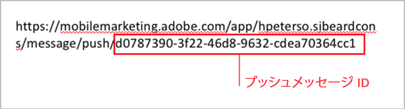

# プッシュメッセージからアプリを開いたときにアプリ内メッセージをトリガー{#trigger-an-in-app-message-when-the-app-is-opened-from-a-push-message}

アプリ内メッセージのトリガーは、ユーザーがプッシュメッセージからアプリを開いたときに送信されるプッシュメッセージ ID に設定できます。

1. ユーザーに送信されるプッシュメッセージのプッシュメッセージ ID を入手します。

   メッセージ作成ワークフローの中で、URLにプッシュメッセージIDが表示されます。

   次に例を示します。

   

1. 次のトリガーを設定したアプリ内メッセージを保存してから、アクティブ化します。

   `“a.push.payloadID” =`

   >[!TIP]
   >
   >プッシュメッセージ ID は手順 1 で見つけた ID です。

   このトリガーは手動で追加する必要があります。**[!UICONTROL トリガー]**&#x200B;ドロップダウンリストには含まれていません。

   

1. 手順 1 で見つけたプッシュ ID を持つプッシュメッセージを保存してから、送信します。
1. プッシュメッセージをクリックスルーしてアプリを開き、アプリが開いたときにアプリ内メッセージが表示されることを確認します。

   テスト中は、次の情報に注意してください。

   * アプリ内メッセージを保存すると、ホストされている設定ファイルが新しいメッセージで更新されるまで、約45秒かかります。
   * アプリは、 **** 新たな起動がある場合に設定ファイルの更新（新しいアプリ内メッセージ）を探すので、プッシュメッセージをクリックした場合に、アプリが新しい起動を実行していることを確認する必要があります。

   これは、通常、セッションのタイムアウトが発生したことを確認する必要があることを意味します。 デフォルトのタイムアウトは5分です。

