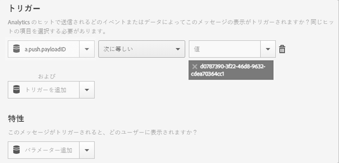

# プッシュメッセージからアプリを開いたときにアプリ内メッセージをトリガー{#trigger-an-in-app-message-when-the-app-is-opened-from-a-push-message}

{#eol}

アプリ内メッセージのトリガーは、ユーザーがプッシュメッセージからアプリを開いたときに送信されるプッシュメッセージ ID に設定できます。

1. ユーザーに送信されるプッシュメッセージのプッシュメッセージ ID を入手します。

   プッシュメッセージ ID は、メッセージ作成ワークフロー中に URL 内で確認できます。

   次に例を示します。

   

1. 次のトリガーを設定したアプリ内メッセージを保存してから、アクティブ化します。

   `"a.push.payloadID" =`

   >[!TIP]
   >
   >プッシュメッセージ ID は手順 1 で見つけた ID です。

   このトリガーは手動で追加する必要があります。**[!UICONTROL トリガー]**&#x200B;ドロップダウンリストには含まれていません。

   

1. 手順 1 で見つけたプッシュ ID を持つプッシュメッセージを保存してから、送信します。
1. プッシュメッセージをクリックスルーしてアプリを開き、アプリが開いたときにアプリ内メッセージが表示されることを確認します。

   テスト中は、次の情報に留意してください。

   * アプリ内メッセージを保存した後、ホストされている設定ファイルが新しいメッセージで更新されるまで、約 45 秒かかります。
   * 設定ファイルの更新（新しいアプリ内メッセージ）が **新規** 起動するので、プッシュメッセージをクリックする際に、アプリが新しい起動を実行するようにする必要があります。
   これは、通常、セッションタイムアウトが発生したことを確認する必要があることを意味します。 デフォルトのタイムアウトは 5 分です。
