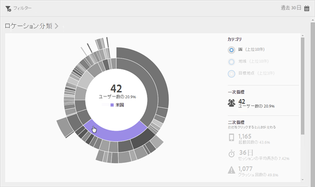
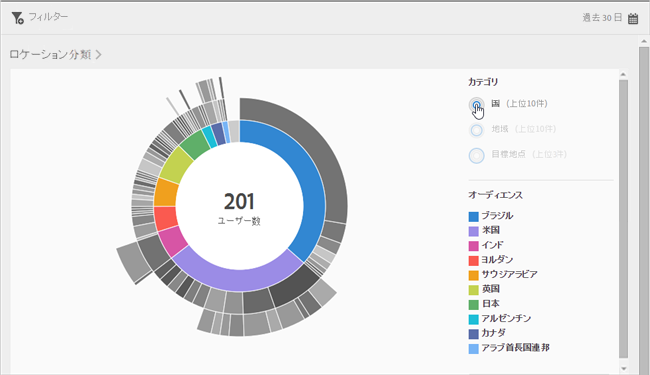
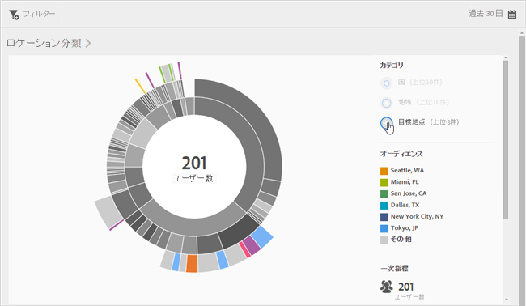
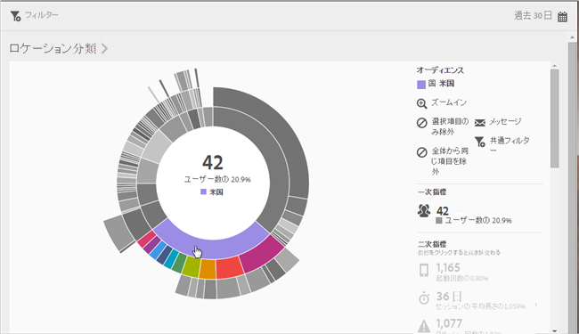
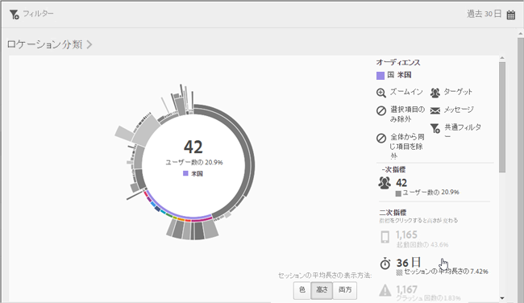
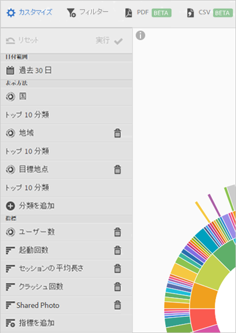

# 概要（ロケーション）{#overview-location}

The **[!UICONTROL Location Overview]** report lets you see the different countries, regions, and points of interest (POI) where your app is being used.

このレポートには、既存のデータのサンバーストチャートが表示されます。このレポートを使用して、ターゲティングすべきオーディエンスセグメント（訪問者の集まり）を見つけることができます。オーディエンスを作成して管理することは、セグメントを作成して使用することと似ていますが、例外は、オーディエンスを Experience Cloud で使用できるようになることです。

このレポートに関する追加情報を次に示します。

## Navigation and usage {#section_4A88C3849B5847BF8CF433CCFD99FDC3}

このビジュアライゼーションでは、例えば、分類と共にベースレポートが表示されます。指標や、指標間のパフォーマンスの違いが高さで示されます。各リングは、リングのカテゴリ内のオーディエンスセグメントを表します。オーディエンスに対して、共通フィルターの適用、指標の非表示、指標の表示などのアクションを実行できます。

>[!TIP]
>
>この情報に加えて、サンバーストグラフの操作方法を説明する製品内チュートリアルも表示できます。 チュートリアルを起動するには、レポートのタイトルバーの「**[!UICONTROL ロケーション分類]**」をクリックして、**i]アイコンをクリックします。[!UICONTROL **

このサンバーストグラフはインタラクティブです。右上隅にある&#x200B;**[!UICONTROL カレンダー]アイコンをクリックして、期間を変更できます。**&#x200B;グラフの任意の部分にマウスポインターを置くと、詳細情報が表示されます。例えば、次の図では、米国でアプリを使用した合計数およびパーセンテージを確認できます。

In this illustration, the **[!UICONTROL Categories]** buttons in the upper right corner allow you to toggle between viewing information about the top ten countries, regions, and the top three **[!UICONTROL Points of Interest]**.

Here is the visualization when you select **[!UICONTROL Country]**:

Here is the visualization when you select **[!UICONTROL Points of Interest]**:

リングのスライスをクリックしてオーディエンスを選択し、ズームイン、オーディエンスの非表示、アプリ内メッセージや共通フィルターの作成などのアクションを実行できます。

右側の二次指標をクリックして、そのビジュアライゼーションをグラフに追加し、色、高さまたはその両方を使用して指標を表示できます。

## Add breakdowns and metrics {#section_15833511E82648869E7B1EFC24EF7B82}

分類および二次指標を追加して、グラフ内の他のオーディエンスに対する各オーディエンスの高さを変更できます。

>[!TIP]
>
>サンバーストに追加するリングの数が多いほど、処理に時間がかかります。

分類および二次指標を追加するには、レポートのタイトルバーの「**[!UICONTROL ロケーション分類]**」をクリックし、「**カスタマイズ]」をクリックして、右側のパネルを開きます。[!UICONTROL **

When you click **[!UICONTROL Add Breakdown]** or **[!UICONTROL Add Metric]**, a new item displays with the same name as the previous item in the respective list. 新しく作成された分類または指標をクリックしてドロップダウンリストにアクセスし、そこから新しいアイテムを選択します。

## Create a sticky filter {#section_365999D49FC744ECBF9273132497E06C}

Click a slice in the ring to select the audience for which you want to create a sticky filter and click **[!UICONTROL Sticky Filter]**. 共通フィルターを使用すると、現在のフィルターを適用して、フィルターに基づく新しいレポートを実行できます。

## レポートの共有 {#section_F8AF2AA73D4C4C008976D45847F82D0B}

レポートを作成した後、設定を使用してカスタム URL を作成し、その URL をコピーして共有できます。

## 追加情報

ロケーションについて詳しくは、次のコンテンツを参照してください。

* [マップ](/help/using/location/c-map-points.md)
* [目標地点の設定](/help/using/location/t-manage-points.md)