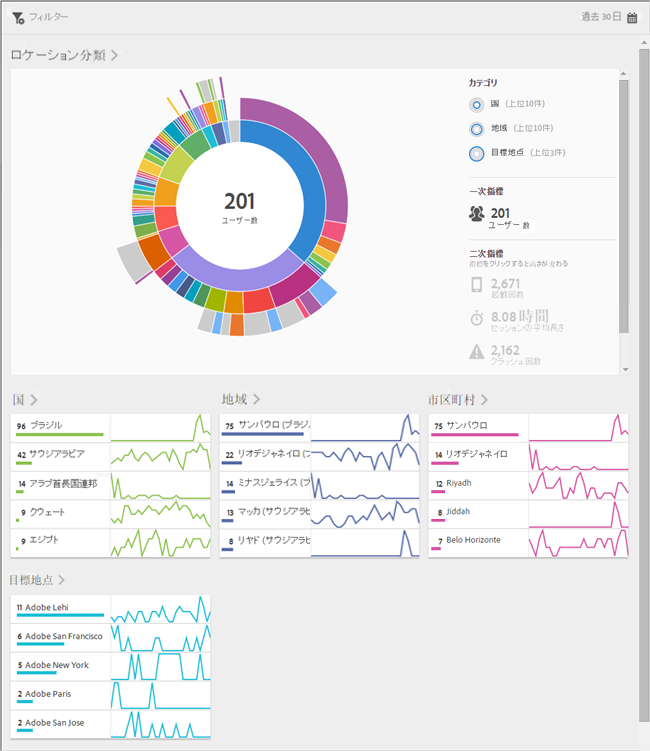

# 概要（ロケーション） {#overview-location}

**[!UICONTROL ロケーション概要]**&#x200B;レポートでは、アプリが使用されている様々な国、地域、目標地点（POI）を確認できます。

このレポートには、既存のデータのサンバーストチャートが表示されます。このレポートを使用して、ターゲティングすべきオーディエンスセグメント（訪問者の集まり）を見つけることができます。オーディエンスを作成して管理することは、セグメントを作成して使用することと似ていますが、例外は、オーディエンスを Experience Cloud で使用できるようになることです。

このレポートに関する追加情報を以下に示します。

## ナビゲーションと使用方法 {#section_4A88C3849B5847BF8CF433CCFD99FDC3}

このビジュアライゼーションは、分類を使用したベースレポートなど提供します。ビジュアライゼーションでは、高さを使用して、焦点となっている指標や、指標間のパフォーマンスの違いを示します。各リングは、リングのカテゴリー内のオーディエンスセグメントを表します。共通フィルターの適用、指標の非表示、指標の確認など、オーディエンスに対するアクションを実行できます。

>[!TIP]
>
>この情報に加えて、サンバーストグラフの使用方法についてのチュートリアルを製品内で参照できます。チュートリアルを起動するには、レポートのタイトルバーの&#x200B;**[!UICONTROL ロケーション分類]**／**[!UICONTROL i]** アイコンをクリックします。

このサンバーストグラフはインタラクティブです。右上隅にある&#x200B;**[!UICONTROL カレンダー]**&#x200B;アイコンをクリックして、期間を変更できます。グラフの任意の部分にカーソルを合わせる、詳細情報が表示されます。例えば、次の図では、米国でアプリを使用しているユーザーの合計数と割合を確認できます。

この図では、右上隅の **[!UICONTROL カテゴリー]** ボタンを使用すると、上位 10 の国および地域と、上位 3 つの&#x200B;**[!UICONTROL 目標地点]**&#x200B;についての情報の表示を切り替えることができます。

次に、「**[!UICONTROL 国]**」を選択した場合のビジュアライゼーションを示します。

次に、「**[!UICONTROL 目標地点]**」を選択した場合のビジュアライゼーションを示します。

リングのスライスをクリックしてオーディエンスを選択し、ズームイン、オーディエンスの非表示、アプリ内メッセージや共通フィルターの作成などのアクションを実行できます。

右側の二次指標をクリックして、そのビジュアライゼーションをグラフに追加し、色、高さまたはその両方を使用して指標を表示できます。

## 分類と指標の追加 {#section_15833511E82648869E7B1EFC24EF7B82}

分類および二次指標を追加して、グラフ内の他のオーディエンスに対する各オーディエンスの高さを変更できます。

>[!TIP]
>
>サンバーストに追加するリングの数が増えると、処理に掛かる時間が長くなります。

分類および二次指標を追加するには、レポートのタイトルバーの&#x200B;**[!UICONTROL ロケーション分類]**／**[!UICONTROL カスタマイズ]**&#x200B;をクリックして、右側のパネルを開きます。

「**[!UICONTROL 分類を追加]**」または「**[!UICONTROL 指標を追加]**」をクリックすると、各リストの前のアイテムと同じ名前の新しいアイテムが表示されます。新しく作成された分類または指標をクリックしてドロップダウンリストにアクセスし、そこから新しいアイテムを選択します。

## 共通フィルターの作成 {#section_365999D49FC744ECBF9273132497E06C}

リングのスライスをクリックし、共通フィルターを作成するオーディエンスを選択して、「**[!UICONTROL 共通フィルター]**」をクリックします。共通フィルターを使用すると、現在のフィルターを適用し、フィルターに基づいて新しいレポートを実行できます。

## レポートの共有 {#section_F8AF2AA73D4C4C008976D45847F82D0B}

レポートを作成した後、設定を使用してカスタム URL を作成し、その URL をコピーして共有できます。

## 追加情報

ロケーションについて詳しくは、次のコンテンツを参照してください。

* [マップ](/help/using/location/c-map-points.md)
* [目標地点の設定](/help/using/location/t-manage-points.md)