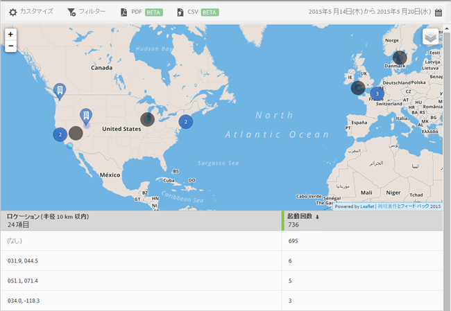

# マップ {#map}

目標地点およびその他のデータのマーカーを示すインタラクティブマップを表示できます。

覚えておく必要がある重要な情報を以下に示します。

* マップのサイズは増減できます。

   この機能は、2 つの目標地点が近い場合などに便利です。マップを拡大すると、詳細を表示できます。
* 目標地点は青色で表示されます。

   その他のデータのマーカー（起動回数など）は黒で表示されます。マーカーをクリックすると詳細が表示されます。

をクリックして、次のオプションを選択します。

* **[!UICONTROL マップ]**

   単一のマップを表示します。

* **[!UICONTROL サテライト]**：マップをサテライトモードで表示します。

* **[!UICONTROL データのマーカー]**

   黒のデータのマーカーを表示するかどうかを選択します。

* **[!UICONTROL ヒートマップ]**

   ヒートマップマーカーを表示するかどうかを選択します。色が濃いほど、条件（起動など）を満たした頻度が高くなります。

* **[!UICONTROL 目標地点]**

   目標地点を表示するかどうかを選択します。

このレポートでは、次のオプションを設定できます。

* **[!UICONTROL 期間]**

   **[!UICONTROL カレンダー]**&#x200B;アイコンをクリックしてカスタムの期間を選択するか、またはドロップダウンリストからあらかじめ設定されている期間を選択します。

* **[!UICONTROL カスタマイズ]**

   「**[!UICONTROL 表示方法]**」オプションを変更したり、指標およびフィルターを追加したり、追加のシリーズ（指標）を追加したりして、レポートをカスタマイズします。詳しくは、「[レポートのカスタマイズ](/help/using/usage/reports-customize/t-reports-customize.md)」を参照してください。

* **[!UICONTROL フィルター]**

   「**[!UICONTROL フィルター]**」をクリックし、様々なレポートにわたるフィルターを作成して、すべてのモバイルレポートにおけるセグメントのパフォーマンスを確認します。共通フィルターを定義すると、パス（画面遷移）レポート以外のすべてのレポートに適用できます。詳しくは、「[共通フィルターの追加](/help/using/usage/reports-customize/t-sticky-filter.md)」を参照してください。

* **[!UICONTROL ダウンロード]**

   「**[!UICONTROL PDF]**」または「**[!UICONTROL CSV]**」をクリックして、ドキュメントをダウンロードするか開いて Mobile Services へのアクセス権を持たないユーザーと共有したり、プレゼンテーションで使用したりします。
