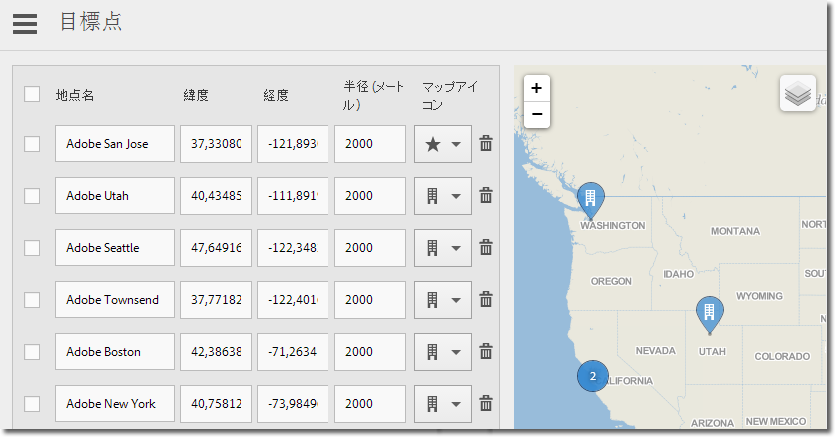

# 目標地点の設定 {#manage-points-of-interest}

{#eol}

目標地点（POI）を作成および管理できます。目標地点では、地理的な場所を定義して、相関関係を分析したり、アプリ内メッセージを使用してターゲット設定したりするのに使用できます。ヒットが目標地点内で送信されると、その目標地点がヒットに追加されます。

場所を使用する前に、次の要件を確認します。

* Analytics モバイルアプリまたは Analytics Premium のご契約が必要です。
* アプリの&#x200B;**[!UICONTROL ロケーションレポート]**&#x200B;を有効にする必要があります。
* バージョン 4.2 より前の iOS SDK または Android SDK を使用している場合は、新しい&#x200B;**[!UICONTROL 目標地点]**&#x200B;を追加してから、新しい設定ファイルをダウンロードして、アプリ開発者に提供する必要があります。

   iOS SDK または Android SDK のバージョン 4.2 以降を使用している場合は、ストアにアプリのアップデートを送信して&#x200B;**[!UICONTROL 目標地点]**&#x200B;を更新する必要はありません。目標地点の管理ページで、**[!UICONTROL 保存]** をクリックすると、変更は&#x200B;**[!UICONTROL 目標地点]**&#x200B;リストにパッケージ化され、ライブアプリの設定ファイルが更新されます。また、アプリが更新された SDK とリモート目標地点 URL の設定を使用している限り、保存するとユーザーデバイス上のアプリの地点のリストも更新されます。

ユーザーのデバイス上で、ヒットを&#x200B;**[!UICONTROL 目標地点]**&#x200B;に割り当てるには、アプリに対してロケーション機能を有効にする必要があります。

場所を使用するには、次のタスクを実行します。

1. 目的のアプリの名前をクリックして、そのアプリのアプリ設定ページに移動します。
1. **[!UICONTROL 場所]**／**[!UICONTROL 目標地点の管理]**&#x200B;をクリックします。

   

1. 次の各フィールドに情報を入力します。

   * **[!UICONTROL 地点名]**

      **[!UICONTROL 目標地点]**&#x200B;の名前を入力します。

      都市、国、地域の名前を設定できます。競技場や企業など、特定の場所の近くに&#x200B;**[!UICONTROL 目標地点]**&#x200B;を作成することもできます。

   * **[!UICONTROL 緯度]**

      **[!UICONTROL 目標地点]**&#x200B;の緯度を入力します。この情報は、インターネットなど他のソースから取得できます。

   * **[!UICONTROL 経度]**

      **[!UICONTROL 目標地点]**&#x200B;の経度を入力します。この情報は、インターネットなど他のソースから取得できます。

   * **[!UICONTROL 半径（m）]**

      含める&#x200B;**[!UICONTROL 目標地点]**&#x200B;の周囲の半径（メートル単位）を入力します。例えば、コロラド州デンバーに対して目標地点を作成する場合、デンバーの市街と周辺地域を含むがコロラドスプリングスは除外する大きさの半径を指定できます。

   * **[!UICONTROL マップアイコン]**

      [概要](/help/using/location/c-location-overview.md)レポートと[マップ](/help/using/location/c-map-points.md)レポートに表示するアイコンを選択します。

1. 必要に応じて目標地点を追加します。

   追加する目標地点は 5,000 個以下にすることをお勧めします。5,000 個を超える目標地点を追加した場合、保存することはできますが、目標地点は 5,000 個未満にすることがベストプラクティスであると知らせる警告メッセージを受け取ることになります。

1. 「**[!UICONTROL 保存]**」をクリックします。

1 つまたは複数の目標値点を削除するには、該当するチェックボックスを選択して、「**[!UICONTROL 選択項目を削除]**」をクリックします。

Adobe Mobile ユーザーインターフェイスを使用する代わりに **[!UICONTROL ファイルを使用してデータを処理するには、「]**&#x200B;読み込み&#x200B;**[!UICONTROL 」または「]**&#x200B;書き出し`.csv`」をクリックします。
