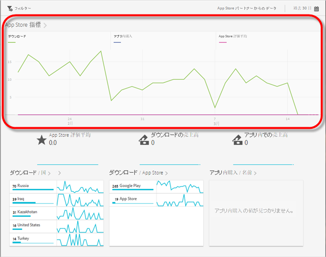
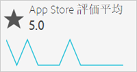
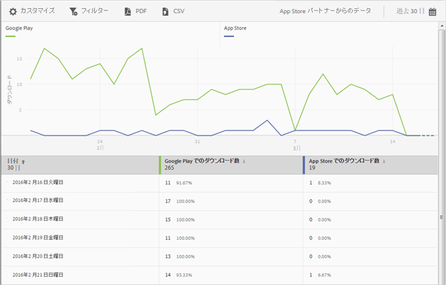
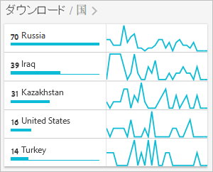
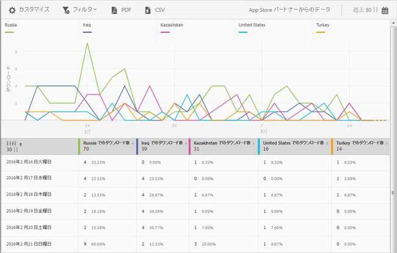
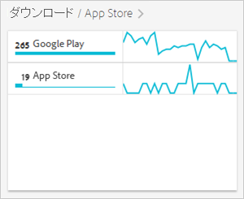

# アプリストアの概要レポート {#app-store-overview-report}

**[!UICONTROL アプリストアの概要]**&#x200B;レポートは、アプリストア指標のスナップショットを提供します（アプリストア指標には、ダウンロード数、アプリ内購入、アプリストア評価平均、ダウンロードの売上高、アプリ内での売上高、国別ダウンロード数、アプリストア別ダウンロード数、名前別アプリ内購入数が含まれます）。

>[!TIP]
>
>Mobile Services UI では、**[!UICONTROL アプリストア]**&#x200B;メニュー項目および&#x200B;**[!UICONTROL 概要]**&#x200B;レポートは、統合を設定した後、左側のナビゲーションメニューに表示されます。

**[!UICONTROL 概要]**&#x200B;レポートには、アプリストアのダウンロード数、アプリを使用したアプリ内購入およびアプリの評価平均についての情報を表示する時系列のグラフが含まれます。

任意の指標をクリックして、対応する行の表示と非表示を切り替えることができます。ある日のデータを表示するには、その日の上にマウスポインターを置きます。

>[!IMPORTANT]
>
>ダウンロード数、ランク、売上高、評価などの Adobe Analytics のアプリストア指標を使用するには、適切なベンダーとの Data Connector 統合が必要です。`appFigures` で現在提供されている統合の場合は、統合を有効にする&#x200B;**前に**、適切な製品やサービスを `appFigures` から購入する必要があります。Data Connector の統合について詳しくは、[Adobe Exchange](https://www.adobeexchange.com/experiencecloud.html) を参照してください。

>[!TIP]
>
>レポートの右上隅のカレンダーアイコンをクリックしてレポートの日付範囲を変更することに加えて、一部のドリルダウンレポートをカスタマイズしたり、フィルターやシリーズ（指標）を追加したり、共通フィルターを追加したり、PDF や CSV 形式でレポートをダウンロードしたりできます。詳しくは、「[レポートのカスタマイズ](/help/using/usage/reports-customize/reports-customize.md)」を参照してください。

## アプリストア評価平均 {#section_60D0D21824AE4450BC3E34D7ACA12A7A}

このレポートには、アプリストア機能を使用してユーザーがアプリに対して与えた評価の平均が表示されます。

**[!UICONTROL アプリストア評価平均]**&#x200B;ウィジェットの任意の場所をクリックすると、日別評価平均を示すグラフおよび表を表示できます。ある日のデータを表示するには、その日の上にマウスポインターを置きます。

## ダウンロードの売上高 {#section_34F05998E8444544A1B507C1B852C4EE}

このレポートには、アプリのダウンロードによって生み出された売上高が表示されます。

## アプリ内での売上高 {#section_58792ED9C4B54B7D836E30CF09E8E204}

このレポートには、アプリを使用したアプリ内購入による売上高が表示されます。

## 国別ダウンロード数 {#section_10373CD28CA94BA5859DFDEED7D548C6}

このレポートには、国ごとにグループ化したアプリのダウンロード数が表示されます。

国ごとの日別ダウンロード数を示すグラフおよび表を表示するには、**[!UICONTROL 国別ダウンロード数]** をクリックします。日付の上にマウスポインターを置くと、その日のデータを表示できます。

## App Store 別のダウンロード数 {#section_F1CD1A3F0105469D879E4F280CE32484}

このレポートには、アプリストアごとにグループ化したアプリのダウンロード数が表示されます。

日別にグループ化されたアプリストアごとのダウンロード数を示すグラフおよび表を表示するには、**[!UICONTROL アプリストア別ダウンロード数]** をクリックします。日付の上にマウスポインターを置くと、その日のデータを表示できます。

## 名名前別アプリ内購入数 {#section_D747A64F9F6449E0A02EF31D56C92F83}

このレポートには、すべてのアプリ内購入が名前ごとに表示されます。
