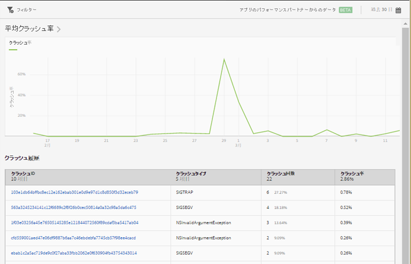

# クラッシュレポート{#crashes}

**[!UICONTROL クラッシュ]**&#x200B;レポートには、アプリのクラッシュのスナップショットが表示されます。クラッシュ回数、クラッシュ率および Apteligent ユーザーインターフェイスへのログインを確認できます。

>[!IMPORTANT]
>
>左側のナビゲーションに&#x200B;**[!UICONTROL クラッシュ]**&#x200B;レポートを表示するには、最初にアプリを Apteligent と統合する必要があります。

**[!UICONTROL 平均クラッシュ率]**&#x200B;グラフには、日別のクラッシュ率が表示されます。日付の上にマウスポインターを置くと、その日のクラッシュ率を表示できます。

**[!UICONTROL クラッシュ履歴]**&#x200B;の表には、クラッシュ ID、クラッシュタイプ、クラッシュ回数およびクラッシュした日を含む、各アプリのクラッシュに関する情報が表示されます。Apteligent にログインしてクラッシュに関する詳細を表示するには、**[!UICONTROL クラッシュ ID]** 列のリンクをクリックします。

このレポートでは、次のオプションを設定できます。

* **[!UICONTROL 期間]**

   **[!UICONTROL カレンダー]**&#x200B;アイコンをクリックしてカスタムの期間を選択するか、またはドロップダウンリストからあらかじめ設定されている期間を選択します。

* **[!UICONTROL フィルター]**

   「**[!UICONTROL フィルター]**」をクリックし、様々なレポートにわたるフィルターを作成して、すべてのモバイルレポートにおけるセグメントのパフォーマンスを確認します。共通フィルターを定義すると、パス（画面遷移）レポート以外のすべてのレポートに適用できます。

   詳しくは、「[共通フィルターの追加](/help/using/usage/reports-customize/t-sticky-filter.md)」を参照してください。