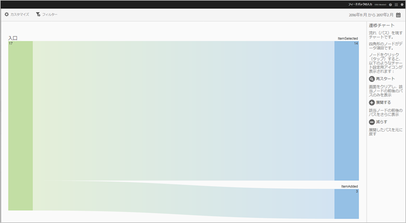
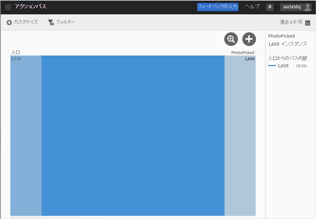
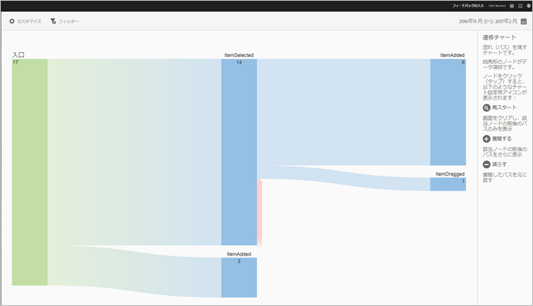
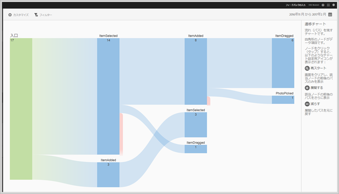
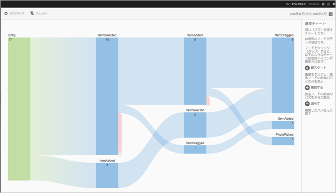

# アクションパスレポート{#action-paths}

パス分析に基づくアクションパスレポートには、アプリ内の状態間の移行時にたどったパスを表す遷移チャートが表示されます。

**[!UICONTROL ビューパス]**&#x200B;および&#x200B;**アクションパス[!UICONTROL レポートは、両方ともパスレポートです。]****[!UICONTROL ビューパス]レポートは、アプリにおけるユーザーの画面間の遷移を表示します。****[!UICONTROL ビューアクション]レポートは、ユーザーがアプリでおこなう一連のアクションおよびイベント（クリック、選択、サイズ変更など）を表示します。**

>[!TIP]
>
>ファネルレポートを使用すると、ナビゲーションとアクションを1つのレポートで組み合わせることができます。 For more information, see [Funnel](/help/using/usage/reports-funnel.md).

ボックスのような形状をした各ノードは、ユーザーがアプリを操作したときにたどったパスの特定の状態を表しています。例えば、上の図では、一番上のノードはアプリを起動し、ギャラリーから写真を選択したユーザー数を表しています。

To display the options to modify the chart, click a node and click **[!UICONTROL Focus]** or **[!UICONTROL Expand]**. 例えば、一番上のノードの「**[!UICONTROL PhotoPicked]**」状態をクリックすると、「**[!UICONTROL フォーカス]」アイコンと「**&#x200B;展開]」アイコンが表示されます。**[!UICONTROL **

To expand, click the **[!UICONTROL +]** icon. このオプションには、ノードに入る、またはノードから出る追加のパスが表示されます。次の図では、状態 1 でアプリを起動し、状態 2 で写真を選択しています（先ほど展開した項目）。状態 3 には、ユーザーがたどった異なるパスが含まれています。

* 項目の選択
* 項目の追加
* 項目のドラッグ
* 項目の拡大／縮小

状態の展開は、ファネルと似ています。

To isolate the node and show paths that come into, and go out of the selected node, click the   icon. 次の図では、ユーザーが写真を選択する&#x200B;**前に**&#x200B;次のパスが完了します。

* 項目の回転
* 項目の拡大／縮小
* 項目のドラッグ
* 項目の削除

写真を選択したユーザーは、写真が選択された&#x200B;**後に**&#x200B;次のパスが完了します。

* 項目の選択
* 項目の追加
* 項目のドラッグ
* 項目の拡大／縮小

複数のノードを再スタートまたは展開することで、ユーザーがアプリ内でたどったパスを詳細に把握できます。以下に例を示します。

このレポートでは、次のオプションを設定できます。

* **[!UICONTROL 期間]**

   **[!UICONTROL カレンダー]アイコンをクリックしてカスタムの期間を選択するか、またはドロップダウンリストからあらかじめ設定されている期間を選択します。**

* **[!UICONTROL カスタマイズ]**

   Customize your reports by changing the **[!UICONTROL Show By]** options, adding metrics and filters, and adding additional series (metrics), and more. For more information, see [Customize reports](/help/using/usage/reports-customize/reports-customize.md).

* **[!UICONTROL フィルター]**

   「**[!UICONTROL フィルター]」をクリックし、様々なレポートにわたるフィルターを作成して、すべてのモバイルレポートにおけるセグメントのパフォーマンスを確認します。**&#x200B;共通フィルターを定義すると、パス（画面遷移）レポート以外のすべてのレポートに適用できます。For more information, see [Add a sticky filter](/help/using/usage/reports-customize/t-sticky-filter.md).

* **[!UICONTROL ダウンロード]**

   Click **[!UICONTROL PDF]** or **[!UICONTROL CSV]** to download or open documents and share with users who do not have access to Mobile Services or to use the file in presentations.