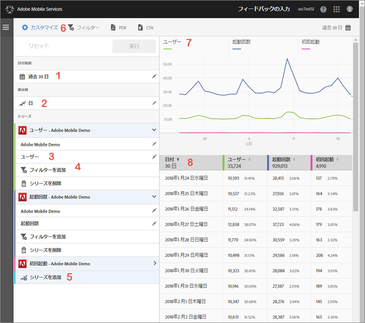

# レポートのカスタマイズ {#customize-reports}

この情報は、組み込みのレポートを理解し、カスタマイズするのに役立ちます。

日付範囲や「**[!UICONTROL 表示方法]**」オプション（期間またはディメンションによるグラフおよび表のデータの表示）を変更することによってレポートをカスタマイズしたり、指標やフィルターを追加したり、追加のシリーズ（指標）を追加したりします。

カスタマイズパネルを表示するには、アプリの名前をクリックして概要ページに移動し、「**[!UICONTROL カスタマイズ]**」をクリックします。

次の例では、**[!UICONTROL カスタマイズ]**&#x200B;パネルが表示されたユーザーとセッションレポートを示しています。この例では、過去 30 日間のデータを日別に 4 つのアクティブなシリーズで表示しています。

* **[!UICONTROL ユーザー]**
* **[!UICONTROL 起動回数]**
* **[!UICONTROL 初回起動]**
* **[!UICONTROL App Store でのダウンロード数]**

次に、レポートおよび&#x200B;**[!UICONTROL カスタマイズ]**&#x200B;パネルの各領域について説明します。

| 数値 | 説明 |
|--- |--- |
| 1 | **[!UICONTROL 日付範囲]**&#x200B;では、ドロップダウンリストを使用して、レポートに対して様々な日付範囲を選択できます。グラフ（9）と対応する表（10）のすべてのデータは、選択した日付範囲に対応しています。 |
| 2 | **[!UICONTROL 表示方法]**&#x200B;では、ドロップダウンリストを使用して、レポートの時間に基づく表示とディメンションに基づく表示を選択できます。例えば、この図では、「日」が選択されています。グラフ（7）の下の日付、および表（8）の行を見ると、時系列レポートに日別のデータが表示されています。レポートにシリーズを追加することによって、時系列レポートには最大で 6 つの指標を表示できます。ライフサイクルディメンションを選択すると、ランクリストの上位 50 件の値、日または週別のトレンド上位 5 件の値、上位 10 件の値の分類を表示できます。 |
| 3 | **[!UICONTROL シリーズ]**&#x200B;は、前述の例のユーザー、起動回数、初回起動、App Store でのダウンロード数など、個別の指標を表しています。各シリーズは色分けされ、グラフ（7）と表（8）にデータが表示されます。追加のシリーズ（指標）や、異なるレポートスイートの様々なアプリを追加して、データを比較できます。詳しくは、「[レポートへのシリーズ（指標）の追加](/help/using/usage/reports-customize/t-reports-series.md)」を参照してください。 |
| 4 | **[!UICONTROL フィルターを追加]**&#x200B;することで、フィルター（セグメント）を追加して、組み込みのレポートをカスタマイズできます。詳しくは、「[レポートへのフィルターの追加](/help/using/usage/reports-customize/t-reports-customize.md)」を参照してください。 |
| 5 | **[!UICONTROL シリーズを追加]**&#x200B;することで、追加のシリーズ（指標）や、異なるレポートスイートのアプリを追加して組み込みのレポートをカスタマイズし、データを比較できます。詳しくは、「[レポートへのシリーズ（指標）の追加](/help/using/usage/reports-customize/t-reports-series.md)」を参照してください。 |
| 6 | **[!UICONTROL 共通フィルター]**&#x200B;を使用して、様々なレポートにわたるフィルターを作成できます。例えば、すべてのモバイルレポートにおいて、特定のセグメントのパフォーマンスを確認することもできます。共通フィルターを定義すると、パス（画面遷移）レポート以外のすべてのレポートに適用されます。詳しくは、「[共通フィルターの追加](/help/using/usage/reports-customize/t-sticky-filter.md)」を参照してください。 |
| 7 | **[!UICONTROL データのグラフ]**&#x200B;には、選択した指標に基づく適切なグラフでデータが表示されます。グラフの種類には、折れ線グラフ、棒グラフ、ドーナツグラフなどがあります。 |
| 8 | **[!UICONTROL データの表]**&#x200B;には、データが表形式で表示されます。列ヘッダーをクリックして、昇順または降順でデータを並べ替えることができます。 |
