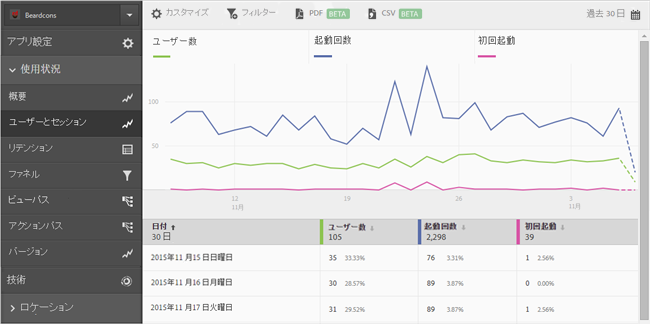
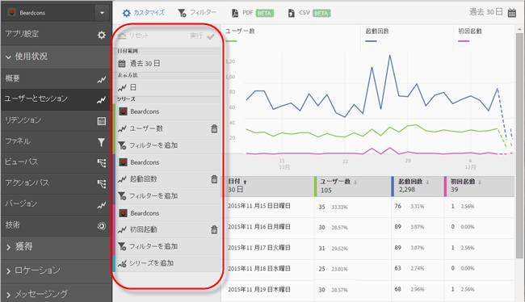
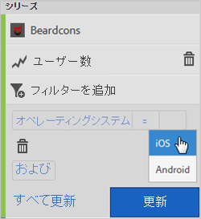
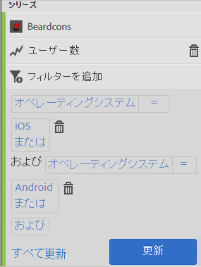
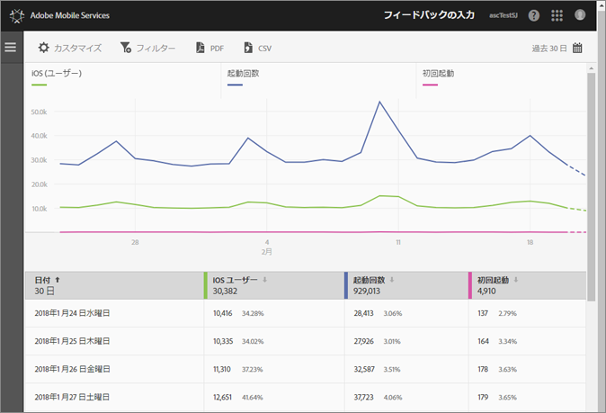
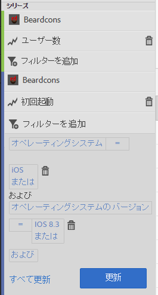
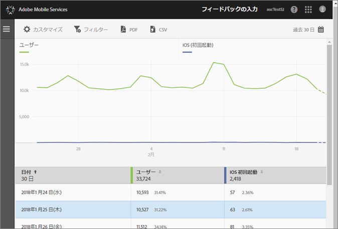

# Add filters to reports{#add-filters-to-reports}

この情報は、フィルター（セグメント）を追加して組み込みのレポートをカスタマイズするのに役立ちます。

>[!IMPORTANT]
>
>モバイルアプリ指標は、Reports&amp; Analytics、ad hoc analysis、data warehouseおよびその他のAnalyticsレポートインターフェイスでも使用できます。分類やレポートタイプが Adobe Mobile で使用できない場合、別のレポートインターフェイスを使用して生成できます。

この例では、**[!UICONTROL ユーザーとセッション]レポートをカスタマイズしますが、説明はどのレポートにも当てはまります。**

1. Open your app and click **[!UICONTROL Usage]** &gt; **[!UICONTROL Users &amp; Sessions]**.

   

   このレポートは、アプリのユーザー数を時系列で表示します。例えば、iOS バージョンと Android バージョンの両方のアプリの指標が同じレポートスイートで収集されている場合、ユーザー指標にカスタムフィルターを追加して、モバイル OS 別にユーザーをセグメント化できます。

1. Click **[!UICONTROL Customize]**.

   

1. **[!UICONTROL 「ユーザー]**」の下の「フィルター **[!UICONTROL を追加」をクリック]** し、「ルールを追加」をクリック ****&#x200B;します。

1. **[!UICONTROL オペレーティングシステム]**&#x200B;を選択し、ドロップダウンリストから **[!UICONTROL "iOS]**」を選択します。

   

   Androidをフィルターとして追加するには、この手順を繰り返す必要があります。

1. Click **[!UICONTROL And]**, select **[!UICONTROL Operating Systems]** from the drop-down list, and select **[!UICONTROL Android]**.

   フィルターは次の例のようになります。

   

1. Click **[!UICONTROL Update]**.
1. To regenerate the report, click **[!UICONTROL Run]**.

   このレポートには、ユーザーがオペレーティングシステムごとに分類された形で表示されます。レポートのタイトルも、レポートに適用したフィルターに合わせて変更されます。

   

   このレポートはさらにカスタマイズできます。iOS8.3から、最初の起動指標をiOS8.3オペレーティングシステムのバージョンフィルターと共に追加して、iOS8.3のユーザーがアプリケーションをアップグレードし、初回起動を実行したことを確認できます。
1. **[!UICONTROL 「初回起動]**」で「フィルターを追加」をクリック ****&#x200B;し、「ルール **[!UICONTROL を追加»をクリック??して、ドロップダウンリストから??«オペレーティングシステム??»を選択し、??«iOS??]**********
1. **[!UICONTROL "AND]**»をクリックし、ドロップダウンリストから??«オペレーティングシステムのバージョン??»を選択して、??«iOS8.3??********

   フィルターはこの例のようになります。

   

1. **[!UICONTROL 「更新]** し **[!UICONTROL て実行]**」をクリックします。

   このレポートには、アプリを初回起動した iOS 8.3 のユーザーが表示されます。

   

   レポートのカスタマイズメニューでいくつかのオプションをテストしてみてください。お気に入りのレポートは、ブックマークできます。Adobe MobileのレポートURLは機能し、電子メールまたはお気に入りに追加できます。
