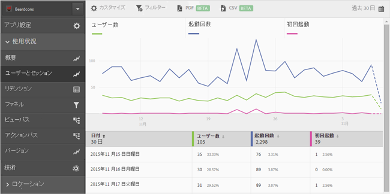

# Add series (metrics) to reports{#add-series-metrics-to-reports}

この情報は、追加のシリーズ（指標）や、異なるレポートスイートのアプリを追加して組み込みのレポートをカスタマイズし、データを比較するのに役立ちます。

>[!IMPORTANT]
>
>モバイルアプリ指標は、Reports&amp; Analytics、ad hoc analysis、data warehouseおよびその他のAnalyticsレポートインターフェイスでも使用できます。分類やレポートタイプが Adobe Mobile で使用できない場合、別のレポートインターフェイスを使用して生成できます。

In this example, we will customize the **[!UICONTROL Users &amp; Sessions]** report, but the instructions can apply to any report.

1. Open your app and click **[!UICONTROL Usage]** &gt; **[!UICONTROL Users &amp; Sessions]**.

   

   このレポートは、アプリのユーザー数を時系列で表示します。例えば、アプリのクラッシュ回数に関するレポートにシリーズを追加してみましょう。

1. Click **[!UICONTROL Customize]**.

   

1. Scroll down and click **[!UICONTROL Add Series]**.

   シリーズの名前が、リストの中の最後のシリーズと同じ名前で設定されます。In the previous illustration, the latest series is **[!UICONTROL App Store Downloads]**, so a new series is added and is also titled **[!UICONTROL App Store Downloads]**.

1. 次のどちらかのタスクを実行します。

   * 新しいシリーズ（指標）を追加するには、作成したばかりのシリーズの名前をクリックして、ドロップダウンリストから新しいライフサイクル指標を選択します。

      

   * 異なるアプリスイートに新しいアプリを追加して、アプリ間でデータを比較できるようにするには、新しく作成したシリーズでアプリ名をクリックし、目的のアプリを選択します。

      

1. （条件付き）新しいシリーズにフィルターを追加します。

   詳しくは、レポートへのフィルターの [追加](/help/using/usage/reports-customize/t-reports-customize.md)を参照してください。
1. **[!UICONTROL 「更新]** し **[!UICONTROL て実行]**」をクリックします。
